YABITEME (Yet Another Belt-In-Tube Elevator - Made Easy) was my summer design project for 2025. The design goal was to create a Belt-in-Tube style elevator that leveraged 3D printing and would be manufacturable by novice builders with basic hand tools and standard FRC COTS parts. Much was stolen from previous published designs, and industrial espionage conducted at 2025 Worlds was immensely helpful in identifying the pain points of these mechanisms (though whether this design in any way alleviates them remains to be seen).

The prototype was (mostly) constructed in Fall 2025 by a group that mostly consisted of rookie builders; the final published design has minor tweaks based on lessons learned during construction. We didn't get it completely finished before 2026 Kickoff so we can't be sure everything works, but it was looking good. So your mileage may vary...

I've only uploaded a set of fully parametric [Fusion Project Files](Files); if you need other formats let me know. In addition to the master file, files for the main subcomponent assemblies are also provided.

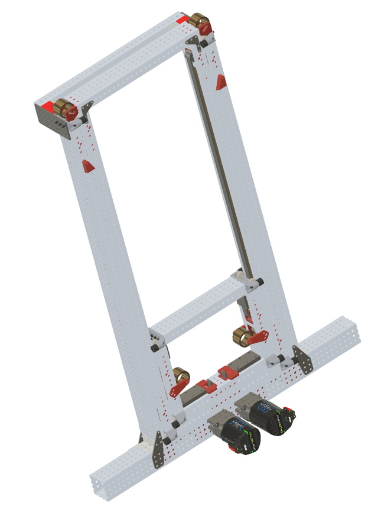

The elevator can be driven by a single motor if desired; the two belts are mechanically linked by standard [60T hex-shaft gears](https://www.revrobotics.com/20DP-Gears-0.5-Hex/). It could also be easily redesigned to decouple the motors (syncronizing them in software). Motors are mounted using [MaxPlanetary gearboxes](https://www.revrobotics.com/maxplanetary-system-kit/).

The rolling structure is made from [SDS Elevator Bearing Blocks](https://www.swervedrivespecialties.com/products/billet-elevator-bearing-block) and [Tube Plugs](https://www.swervedrivespecialties.com/products/tube-plug). Since most of our stock of these was still on the 2024 robot, we quickly printed some placeholders out of PLA that integrated the blocks and their associated plugs.

# Belt Idlers

The design uses 15mm HTD-5 Kevlar-reinforced belting (steel-reinforced belt is not flexible enough) running on 15T HTD Idlers. The Idlers (both toothed and untoothed variants) accept common [R188-2RS](https://www.amazon.com/dp/B0CLVDH6CJ) (0.50 OD"/0.25" ID) bearings. These are sized to be identical to 15T metal hex-shaft pulleys, and later we learned that these can also accept the bearings. A Fusion project for this option is also included that has an internal spacer to keep the bearings in the correct position.

# Rail Idlers

A design motif that is repeatedly used in this design is printed inserts that fit inside the 2x1 tubing and hold parts in the correct orientation for assembly. They are designed so that all the mechanical stresses pass through the metal parts. They also serve as guides for the belt.

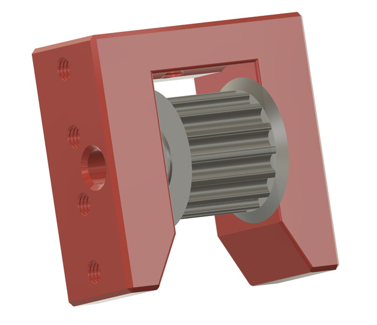

These parts also include printable tube cutting and drilling guides (removed at the end of the timelines, just back up and export the relevant bodies).

# Inner Carriage Construction

The central carriage consists of a top bar, a bottom bar, and two side bars that are mirrors of each other (however, they are symmetric so they can be made identically and just rotated). All tubes are [West Coast Products 2x1 perforated tubing](https://wcproducts.com/collections/featured-products/products/punched-tubing) (which has 10-32 bolt holes on a 1/2" grid).

The top tube is just an unmodified section of tubing; SDS Tube plugs are placed in the ends and Elevator Bearing blocks are attached to them.

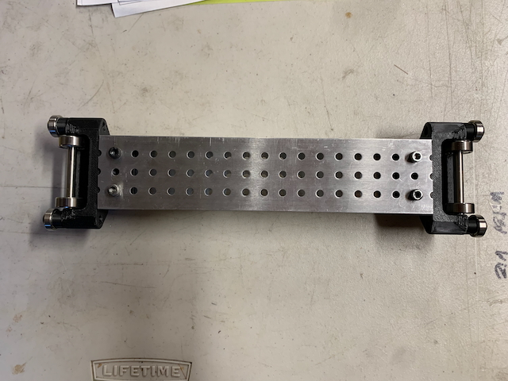

The base tube has two rectangular slots cut through both faces of the tubing using the perforated holes as a guide; the required cuts always go on the outer perimeter of the holes, resulting in rounded rectangles. These can be hand-cut with a dremel; we also experimented with adapting a [Harbor Freight Mini Cut-off Saw](https://www.harborfreight.com/09-amp-2-in-mini-cut-off-saw-70478.html) so it could be used to make cleaner slots; details of that can be found on the [Useful Parts](/Useful/Useful.md) page.

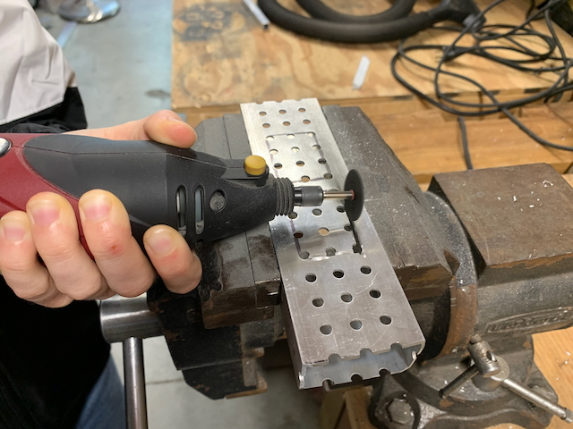

Two Horizontal Tube Belt Guides are prepared by inserting 10-32 locknuts into the provided recesses (these are used to mount a belt clamp if you decide to use a single length of belt) and are inserted into the tubes between the slots. The outside faces are marked, and the locknuts would be closest to the center of the tube. The guides can be locked in place with one or two 1/4" 10-32 cap screws or buttonheads. These locking bolts are never under any stress, they are just there to keep things from sliding around. This technique is used with all the other inserted guides.

Many parts of the design use small printed Nut Capture Inserts. Locknuts can be pressed into them and they are then positioned to permit other components to be connected to the tubes; just as with the Belt Guides, one or two 1/4" 10-32 cap screws keep them in place.

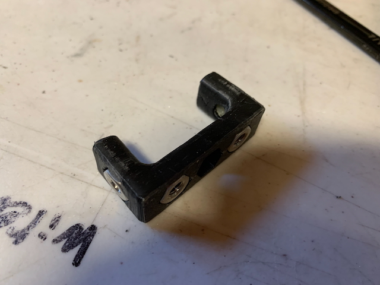

If you are using two separate belts, four of these are inserted into the bottom tube, two on each side, facing upwards; these are used to mount TBCS-type Rail Belt Clamps. These (and the TBCR-type the design also uses) are readily available in many places including [Ebay](https://www.ebay.com/itm/396901422839) and AliExpress; the 5mm pitch 20mm belt-width variants have a mounting hole pitch of 25mm, so if you drill out the mounting holes to 10-32 loose fit, they'll work with the .5"/25.4mm pitch of the tube holes.

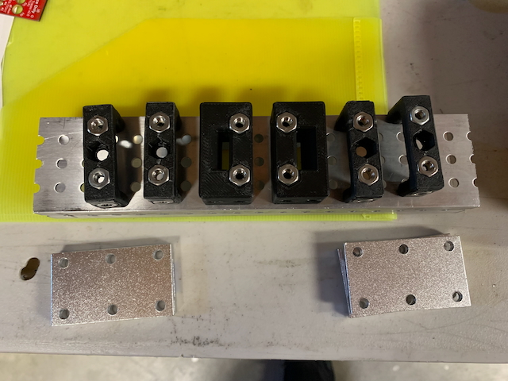

In this case, they are mounted 1.5" and 2.5" in from the ends of the tube. Then some longer 10-32 bolts can be used to mount a pair of TBCS Rail Belt Clamps. The other two mounting holes in the clamps will align with holes in the SDS Tube Plugs.

Note that depending on your design you may find it useful to include extra Nut Capture Inserts in specific places.

The two side tubes have two larger (but identically sized) slots cut into them; the top of the upper slot is 2" below the end of the tube. They also have 1/4" holes drilled in the side of the tube on both sides, one pair per slot. Use the Axle Template to drill these holes -- you will need to print a second, mirrored version of this Template.

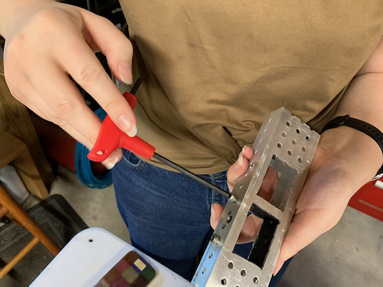

The upper slot is for a Carriage Rail Belt Clamp. The main part of this accepts a captured locknut; this is used to (hopefully) provide some extra tension adjustment. The Constant Force Spring (CFS) Idler insert goes in the lower slot. Once in position, stacks of [R4-2RS](https://www.amazon.com/dp/B0B5XPDLDD) 0.75" OD x 0.25 ID bearings can be inserted into them and pinned in place by a 2.375" x 0.25" 1/4-20 cap screw and a locknut. If you use low-profile locknuts, you can use inexpensive 2.25" hex head bolts.

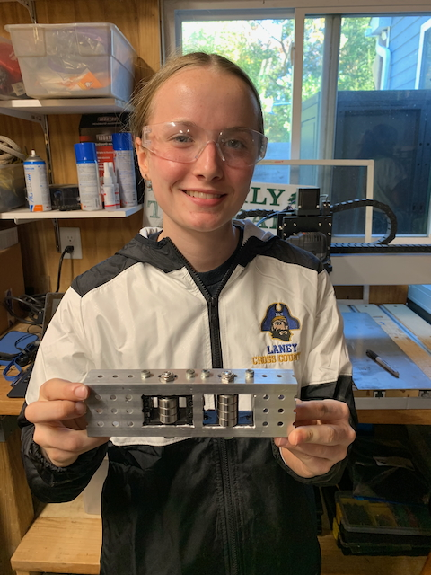

A Nut Capture Insert is placed just above the Carriage Rail Belt Clamp; that plus the Tube Plug permits the mounting of a TBCR belt clamp.

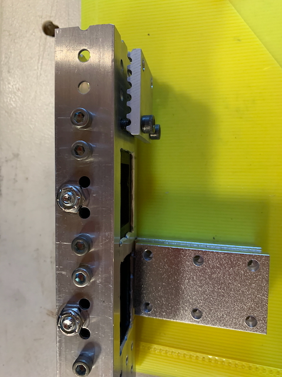

The tubes are then connected using the Tube Plugs and 10-32 bolts. Don't forget the threadlock!

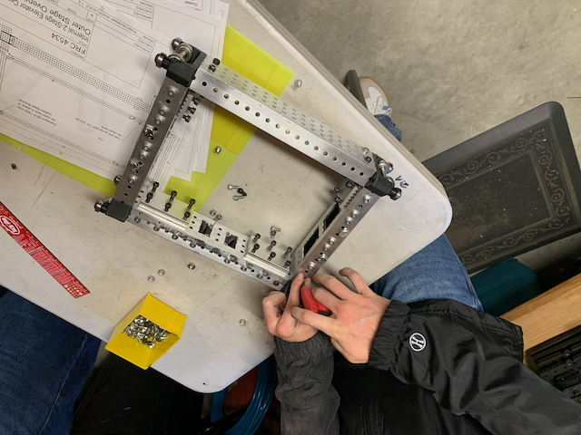

The carriage is now completely assembled.

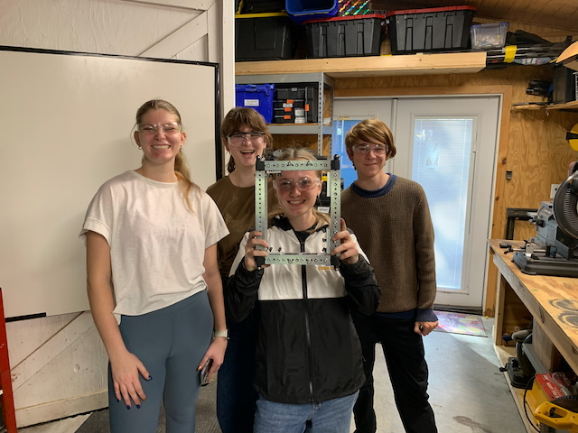

# Inner Stage

The Carriage rides within the Inner Stage. The assembly of the Inner stage is quite straightforward. The Top Tube is a simple length of 2x1 tubing that has Tube Plugs inserted into it (we printed some for our test build). Note that it is wider than the Bottom Tube.

The Bottom Tube has two slots cut through it to permit passage of the belts. These are made by drilling existing perforated holes to 1/2" and then cutting two slits between the holes to form 1/2"-wide slots with rounded tips. Two Base Belt Guides are inserted into the tube and aligned with the slots to guide the belts through the tube and (famous-last-words) prevent it from snagging on the tube. The tube ends are capped by Tube Plugs.

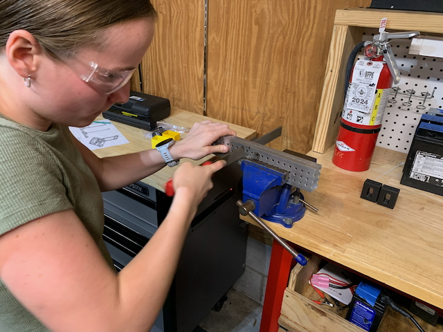

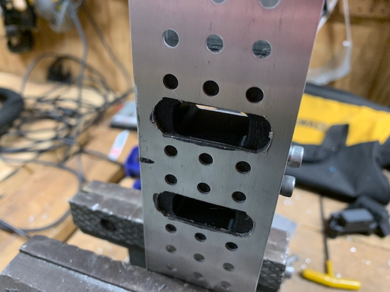

Each of the vertical Rail Tubes has two openings cut into it on opposite ends and opposite sides. Axle Templates are used to drill the 1/4" holes in the tube -- again, opposite each other. The holes are 1.75" from the ends of the tubes.

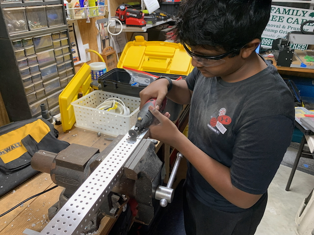

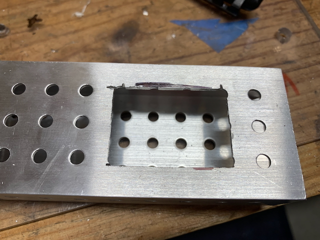

The orientation of these tubes is important. The top opening faces the inside of the assembly, and the bottom opening faces outwards. Two Nut Capture Inserts are positioned inside the tubes; one 4" from the top with its flat face pointing towards the inside, and one 3" from the bottom with its flat face pointing outwards. Only the central nut recess needs to be populated; these inserts will be used to anchor the constant force springs.

Then two Rail Idler assemblies are positioned in the tubes with their open ends pointing away from the tube ends. The bottom assembly uses the standard Rail Idler, but the top one uses the Threaded Axle variant (this is the only place this is used). The reason for this is that using a regular 1/4-20 bolt and Locknut in the top assembly would interfere with the travel of the Carriage.

To avoid this, a 2 1/2" or longer 1/4-20 bolt is cut down to exactly 2" and a slot is cut into the end, creating a headless bolt (extra bonus points if you manufacture them with only 1/4" or so of thread). The Threaded Axle Rail Idler has a printed thread on one side; the headless bolt can be inserted on the other side and screwed into the printed threads with a flathead screwdriver; since it is 2" long, when fully inserted the ends of the bolt will be flush with the outer faces of the tubing and all stresses will go through the tubing; the threads on the printed part act as a locknut.

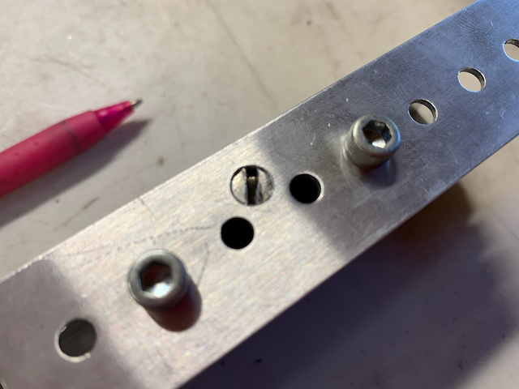

The top Idlers use a 15T Idler, and the bottom ones use an equivalently-sized untoothed Idler. Metal 15T pulleys with inserted bearings can be substituted for these (and all the other Idlers) if desired.

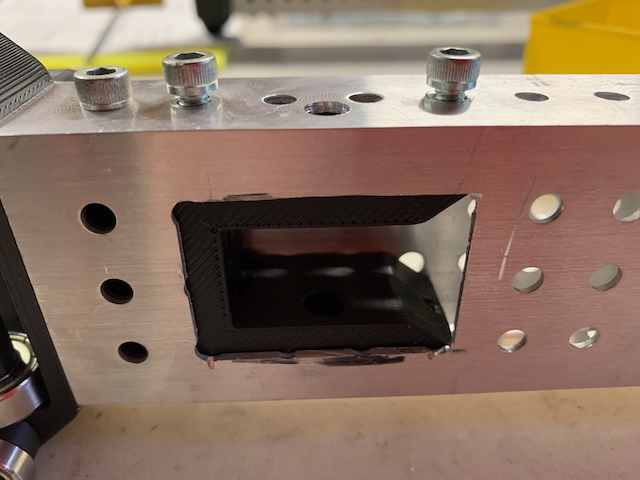

These idlers can be printed and are assembled by press-fitting two R188-2RS bearings.

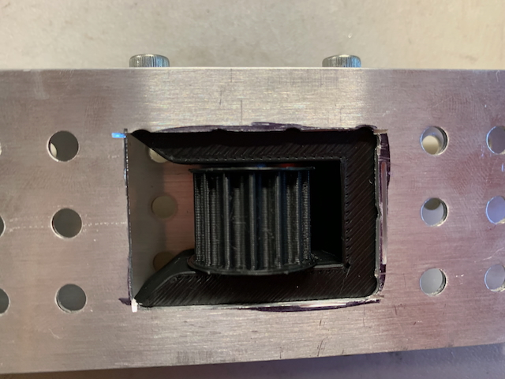

The ends of the tubes are capped with Tube Plugs. The Rails are connected to the Bottom Tube by Elevator Blocks.

The Top Tube is attached to the Rails using some custom aluminum gussets. These are shaped so that they allow the Carriage to travel until it contacts the Top Tube. We CNC'd ours, but they can also be hand-shaped by printing a template and using it to cut down and shape a stock Corner gusset. Another alternative is to slightly trim down a [WCP-1409 Elevator Corner](https://wcproducts.com/products/gussets). If you don't need full Carriage travel, then a stock Corner gusset can be used.

Because the Tube Plugs are threaded, these gussets are attached with a combination of bolts and rivets. For extra rigidity, a pair of [WCP-0609](https://wcproducts.com/products/gussets) angle brackets can be bolted and riveted on the inside corners; they will not impede the movement of the Carriage.

When correctly assembled, belts can be threaded from the outside of the Inner Stage at the bottom, around the 15T Idler, up through the Rail, around the untoothed Idler, and out of the tube to the inside.

The Carriage can be inserted into the Inner Stage by removing some of the bearings on the Elevator Blocks and everything can be tested for fit.

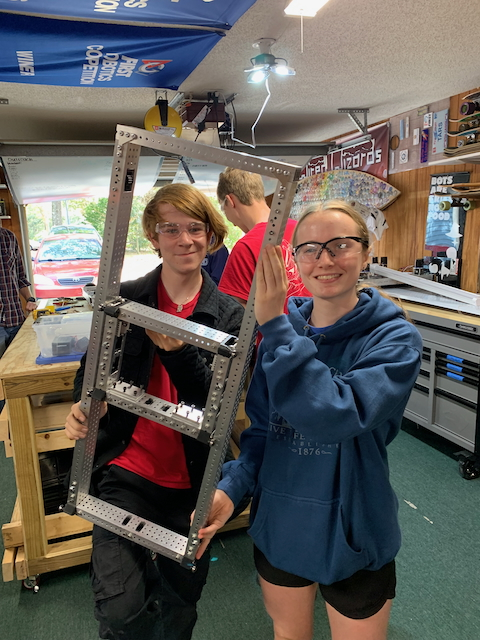

# Outer Stage

The Outer Stage is the most complicated assembly. In our case, we made the base tube 28" wide to match our standard drive chassis, but made the actual elevator as compact as possible. This means that the actual components that drive and guide the belt are deep inside the 2x2" base tube.

The base tube has numerous holes for shafts, belt passage, and access for belt threading. Each side has unique features, so consult the drawings carefully. The only new process is using a 1 1/4" hole saw to cut the mounting holes for the Thunderhex bearings used in the drive shafts.

*Note*: Based on our experience testing the threading of the belts, there have been some design changes to the printed parts and hole placement/size, but these do not affect the overall process described below.

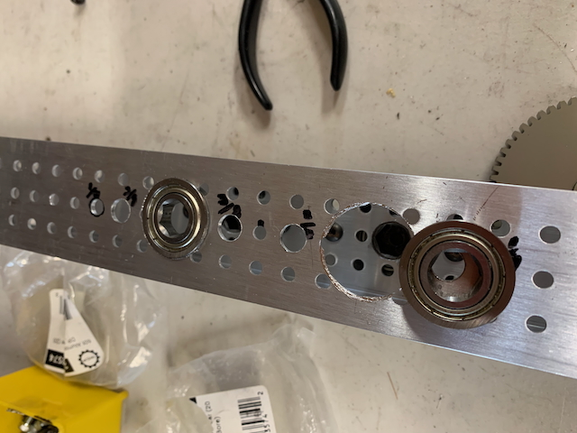

Once the tube is prepared, the two MaxPlanetary Output Stages can be mounted; there are enlarged holes on the opposite tube face big enough for the 10-32 buttonhead screws used to mount them.

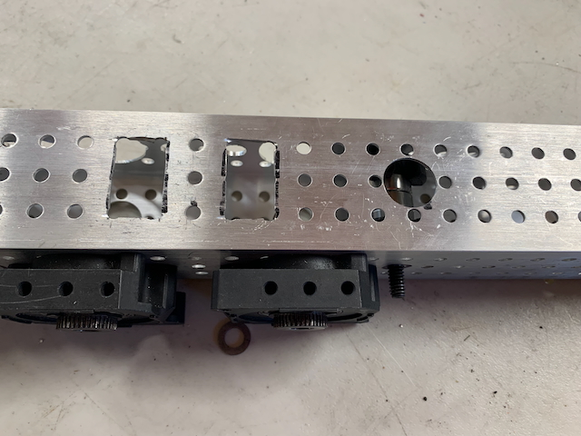

The above photo shows an earlier iteration of the belt idlers (visible through one of the holes that makes it easier to later thread the belt). The team found these difficult to mount deep inside the tube, prompting a redesign.

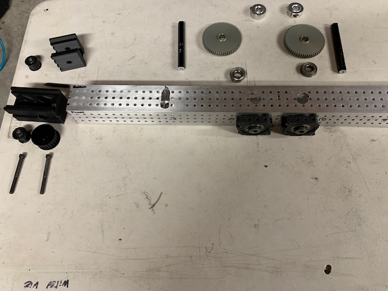

The solution was two printed parts, the Inner Drive Cassette and the Outer Idler Cassette, that loosely hold the [WCP-0992 24T Hex Drive Pulley](https://wcproducts.com/products/htd-timing-pulleys) and the two Idlers. The Cassettes are then slid into position inside the tube, and the components they convey are then easily locked into their final positions by either Hex shaft or 2 1/4" or 2 1/2" 1/4-20 bolts.

The Cassette design also includes plastic pins that secure the idlers during insertion, and which get pushed out when the bolts are inserted. No such help is needed for the Hex Drive Pulley since there is ample access before the Thunderhex Bearings are inserted.

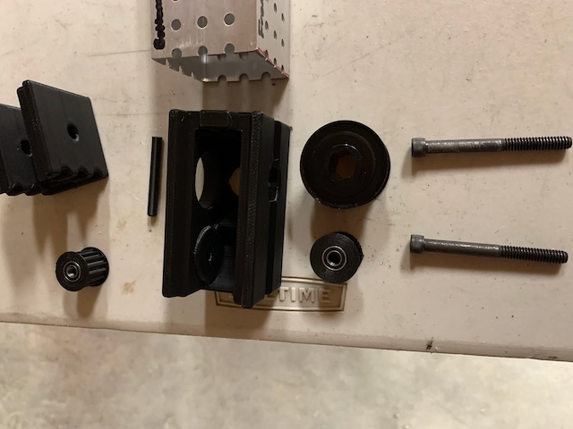

The Inner Drive Cassette contains the 24T Drive Pulley and an Untoothed Idler.

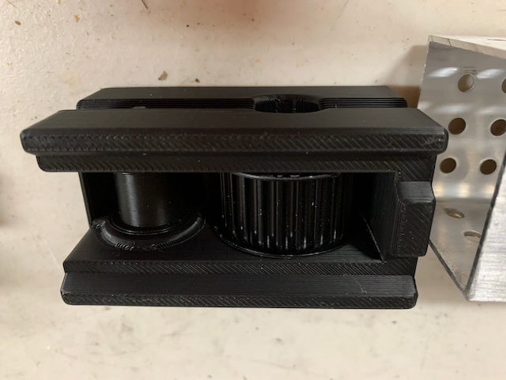

The Outer Idler Cassette just has a 15T Idler.

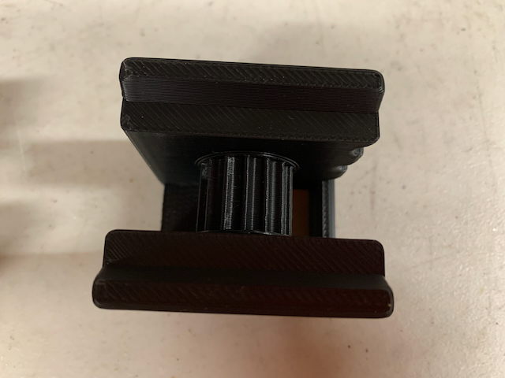

The opposite side of the base tube will require **mirrored** versions of the cassettes.

Once in place, a section of hex shaft that is 10-32 tapped on the end can be passed through the Drive Pulley and secured to the MaxPlanetary output shaft.

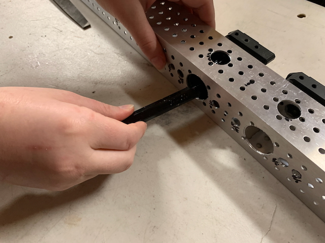

The Untoothed Idler is secured in place by a 1/4-20 bolt (nut on the MaxPlanetary side).

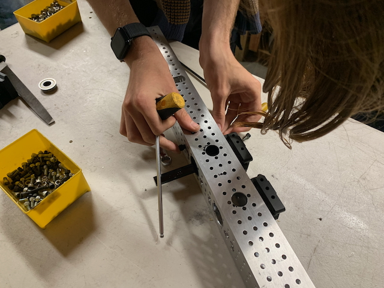

A [WCP-0785 Thunderhex bearing](https://wcproducts.com/products/ball-bearings) is placed on the hex shaft and pressed into place. It is supported by both the tubing and the Cassette. Then the Outer Idler Cassette is inserted and the Idler is secured by another 1/4-20 bolt.

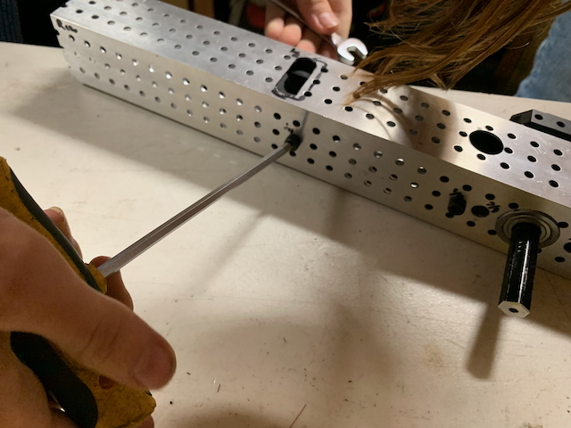

The two outer rails have slots cut at the top for the Rail Idler, plus holes for its axle. Note there is also a hole drilled through the 2" faces near the bottom of the tube that provides access to the buttonhead on the Inner Stage that secures a Constant Force Spring.

Each rail also has a Nut Capture Insert positioned 1" below the Rail Idler with the flat side facing inside; this is used to secure some endstops that limit the travel of the Inner Stage. We printed these out of TPU.

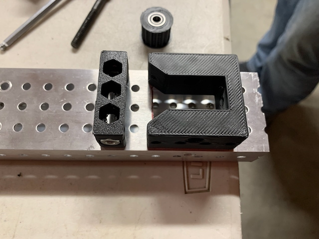

The top of each rail contains the Nut Capture Insert, Rail Idler, Tube Plug (flush with the top of the tube) and topped with an Elevator Bearing block. An Outer Rail CFS Mount is clicked into the Elevator Bearing Block before it is attached to the Tube Plug (in our case, it was printed as a single part). Note: There is an updated CFS mount design in my [repo dedicated to parts that can be manufactured in a 3-axis CNC mill](https://github.com/RJWoodhead/FRC3AM) that is probably superior and would probably hold up if printed.

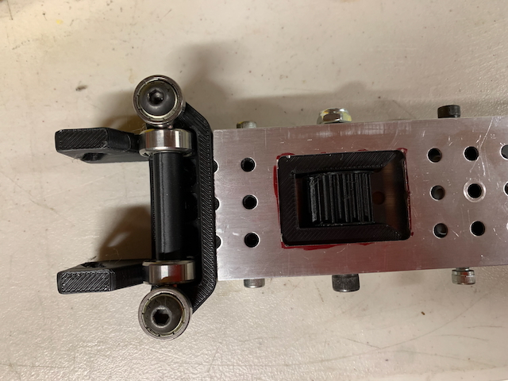

The Crossbar is capped with Tube Plugs, and Crossbar Spacers are bolted to the Tube Plugs using 1/2" to 3/4" 10-32 bolts. This Spacer conforms to the Elevator Bearing Block and gives the final assembly a little more stiffness. The size of the Spacer is parametrically defined so the clearance between the Crossbar and the Inner Stage can be adjusted as desired.

Those with access to a CNC router may wish to replace the Crossbar with a flat "U" bracket sandwiched between the Tube Plugs and Bearing Blocks.

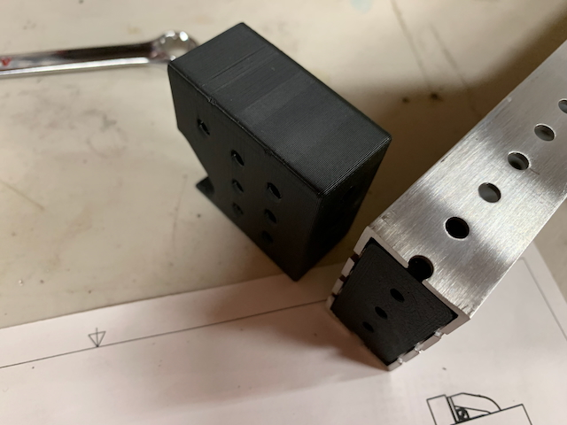
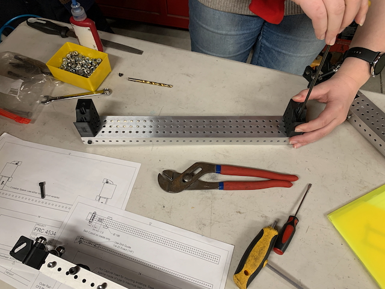

The bottom threaded holes in the Tube Plugs (the ones that don't already have bolts in them) are drilled out, and 3.5" 10-32 bolt are inserted into them and bolted to the Tube Plugs in the Rails.

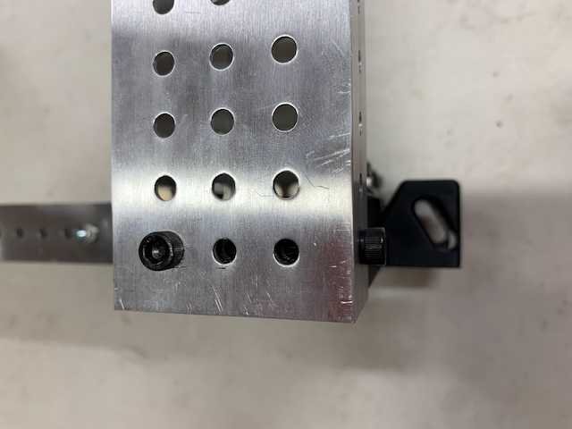

[AM-5250 2" Joining Plates](https://andymark.com/products/1-2-in-pitch-gussets) are attached to the outer sides of the assembly (connecting the two Tube Plugs, the Elevator Bearing Block and the Spacer) with 1/2" 10-32 bolts. We didn't have any Joining Plates in stock so we printed some placeholder replacements.

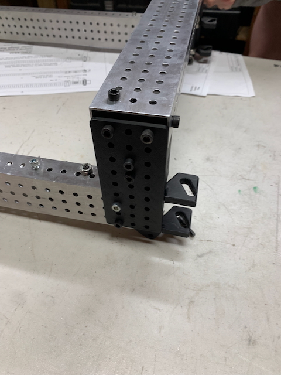

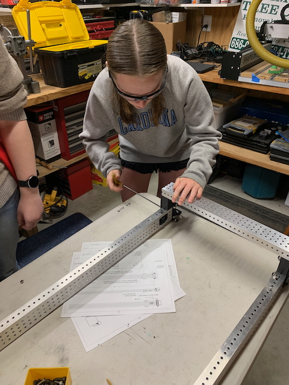

In our design, the Crossbar was attached on the side opposite the motors but it can be flipped if your design requires it.

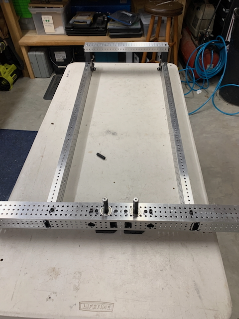

Before the Base is attached to the two rails, two Rail Belt Guides are inserted into the the bottom of the Rails. These are embossed with "RBG" and the embossing should always be on the outside face of the rail. A rivet can be temporarily inserted on one of the 2" rail faces to hold them in position.

The rails and base are clamped into position and custom Base Brackets are riveted in place to join them. We CNC'd these, but they could be made by templating, or replaced by WCP-1409 Elevator Corners.

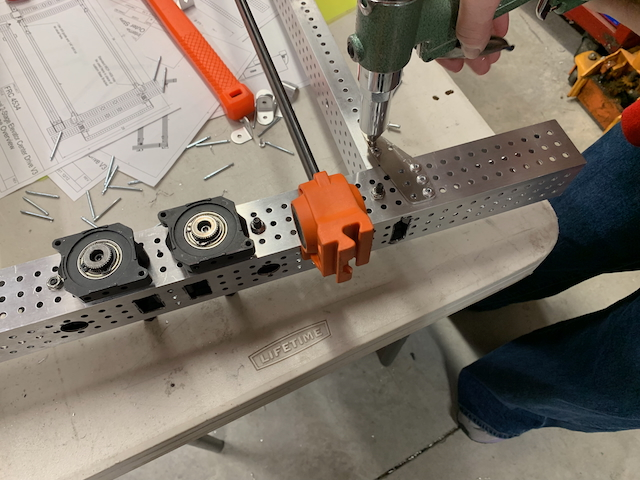

The assembly is stiffened by adding riveting in WCP-0609 angle brackets (one centered on the inside, two on the outside).

*Note*: one drawback of the current design is that if the Cassettes have to be removed for any reason, some of these rivets will have to be drilled out.

The Outer Stage is now assembled.

# Final Assembly

The final assembly involves mating all the parts and installing the belts and (optional) constant force springs. We did not complete this process before the end of our last 2025 team meeting, so this document will be finalized in early 2026.

Lessons learned so far:

* Where possible, a few printed parts need to be redesigned to make it easier to thread the belts through them.

* Useful tools: [Fish Rod](https://www.amazon.com/dp/B07G9FNTLB) for pulling the belt through the long rail tubes and a [USB Endoscope](https://www.amazon.com/dp/B0CTK6H91J) for interior inspections to ensure nothing got snagged or twisted.

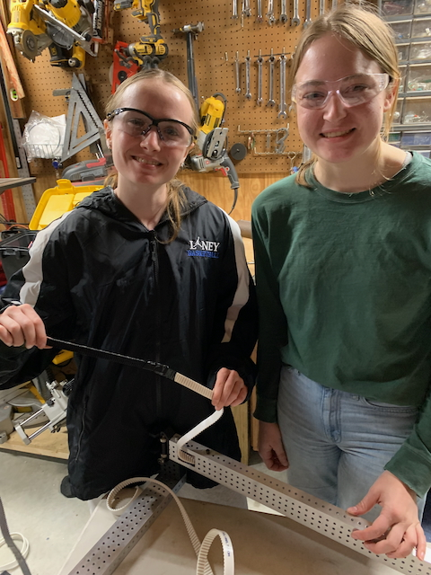