YABITEME (Yet Another Belt-In-Tube Elevator - Made Easy) was my summer design project for 2025. The design goal was to create a Belt-in-Tube style elevator that leveraged 3D printing and would be manufacturable by novice builders with basic hand tools and standard FRC COTS parts. Much was stolen from previous published designs, and industrial espionage conducted at 2025 Worlds was immensely helpful in identifying the pain points of these mechanisms (though whether this design in any way alleviates them remains to be seen).

The prototype was partially constructed in Fall 2025 by a group that mostly consisted of rookie builders; the final published design has iterations based on lessons learned during construction. We didn't get it completely finished before 2026 Kickoff, so work was suspended until the post-season.

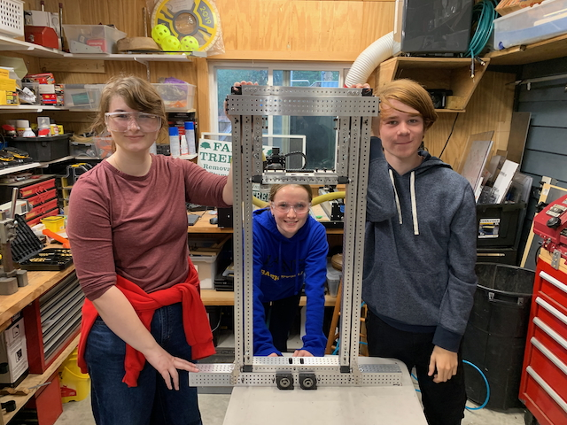

I've only uploaded a set of fully parametric [Fusion Project Files](Files); if you need other formats let me know. In addition to the master file, files for the main subcomponent assemblies are also provided.

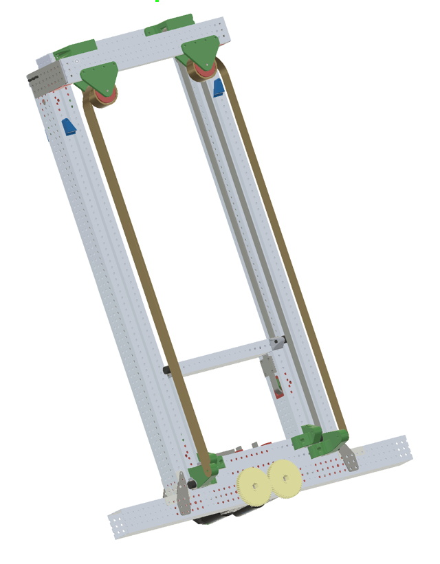

The elevator can be driven by a single motor if desired; the two belts are mechanically linked by standard [60T hex-shaft gears](https://www.revrobotics.com/20DP-Gears-0.5-Hex/). It could also be easily redesigned to decouple the motors (syncronizing them in software). Motors are mounted using [MaxPlanetary gearboxes](https://www.revrobotics.com/maxplanetary-system-kit/).

The rolling structure is made from [SDS Elevator Bearing Blocks](https://www.swervedrivespecialties.com/products/billet-elevator-bearing-block) and [Tube Plugs](https://www.swervedrivespecialties.com/products/tube-plug). Since most of our stock of these was still on the 2024 robot, we quickly printed some placeholders out of PLA that integrated the blocks and their associated plugs.

After the 2026 season, the placeholders were replaced with the actual SDS components for final assembly and testing. Other parts were also refined, so they will not exactly match some of the earlier assembly photos, but unless noted the differences are minor and should not cause any confusion.

# Parametric Size Constraints

The elevator can be resized using Fusion Parameters. The minimum width (outside of Outer rail to outside of Outer rail) is 10", but this will require using a single long belt instead of two belts (one for each side) in order to eliminate the TCBS belt clamps at the bottom of the carriage. Additionally, the idler in the Inner Drive Cassette will have to be replaced with a simple stack of R188-2RS bearings in order to eliminate an interference. Using TCBR belt clamps instead of TCBS ones but retaining the two belts results in a minimum width of 14".

The minimum carriage height is 6.5". This could be squeezed down to 5.5" by using the compact variant of the Carriage Rail Belt Tensioner (more details below).

# Design Variants

If you have access to more advanced tools like a CNC router, you may wish to explore variants to the design. For example, many teams like to use a custom "[" bracket as the Top Rail that connects the side rails of a stage.  The [SDS Elevator Bearing Blocks](https://www.swervedrivespecialties.com/products/billet-elevator-bearing-block) page has some example configurations that show how these might be assembled.

# Belt Idlers

The design uses 15mm HTD-5 Kevlar-reinforced belting (steel-reinforced belt is not flexible enough) running on 15T HTD Idlers. The Idlers (both toothed and untoothed variants) accept common [R188-2RS](https://www.amazon.com/dp/B0CLVDH6CJ) (0.50 OD"/0.25" ID) bearings. These are sized to be identical to 15T metal hex-shaft pulleys, and later we learned that these can also accept the bearings (they just fit into the hex, who knew?!). A Fusion project for this option is also included that has an internal spacer to keep the bearings in the correct position.

# Rail Idlers

A design motif that is repeatedly used in this design is printed inserts that fit inside the 2x1 tubing and hold parts in the correct orientation for assembly. They are designed so that all the mechanical stresses pass through the metal parts. They also serve as guides for the belt. Most can be printed in PLA with basic settings because they are not load-bearing; in a few cases, printing with high-strength settings or stronger filament may be prudent; these will be noted.

Whenever possible, threaded holes are modeled so the threads will be printed. However, when a part has to be mirrored, the threads cannot be modeled and the holes will have to be tapped (though in our experience, just using a bolt to self-tap them works fine).

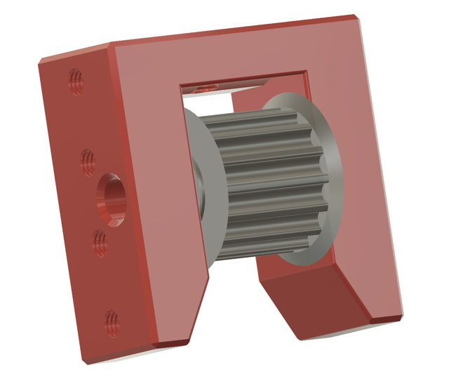

These parts also include printable tube cutting and drilling guides (removed at the end of the timelines, just back up and export the relevant bodies).

# Inner Carriage Construction

The central carriage consists of a top bar, a bottom bar, and two side bars that are mirrors of each other (however, they are symmetric so they can be made identically and just rotated). All tubes are [West Coast Products 2x1 perforated tubing](https://wcproducts.com/collections/featured-products/products/punched-tubing) (which has 10-32 bolt holes on a 1/2" grid).

The top tube is just an unmodified section of tubing; SDS Tube plugs are placed in the ends and Elevator Bearing blocks are attached to them.

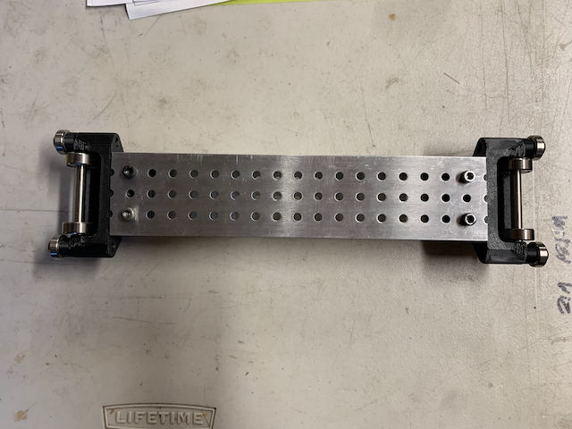

The base tube has a rectangular slot cut through both faces of the tubing using the perforated holes as a guide; the required cuts always go on the outer perimeter of the holes, resulting in rounded rectangles. These can be hand-cut with a dremel; we also experimented with adapting a [Harbor Freight Mini Cut-off Saw](https://www.harborfreight.com/09-amp-2-in-mini-cut-off-saw-70478.html) so it could be used to make cleaner slots; details of that can be found on the [Useful Parts](/Useful/Useful.md) page.

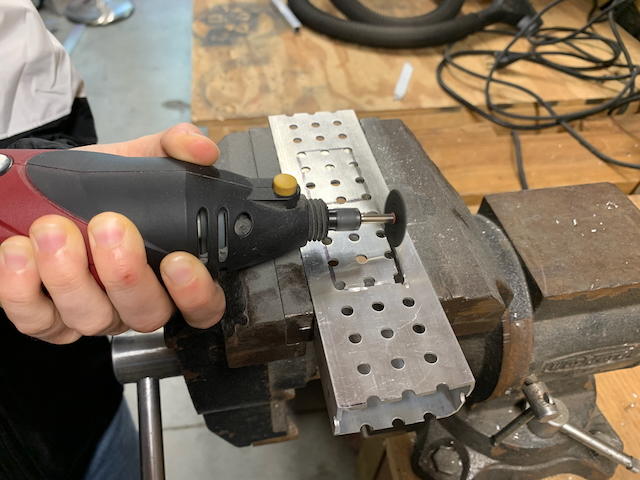

Two Horizontal Tube Belt Guides are prepared by inserting 10-32 locknuts into the provided recesses (these are used to mount a belt clamp if you decide to use a single length of belt) and are inserted into the tubes between the slots. The outside faces are marked, and the locknuts would be closest to the center of the tube. The guides can be locked in place with one or two 1/4" 10-32 cap screws or buttonheads. These locking bolts are never under any stress, they are just there to keep things from sliding around. This technique is used with all the other inserted guides.

Many parts of the design use small printed Nut Capture Inserts. Locknuts can be pressed into them and they are then positioned to permit other components to be connected to the tubes; just as with the Belt Guides, one or two 1/4" 10-32 cap screws keep them in place. These should be printed with high-strength settings, and when used, should be tightened by hand to minimize the torque on the nuts -- if the nut starts rotating in the insert, it is annoyingly difficult to replace (ask us how we know this...)

As with other inserts, these are typically pinned in place with a couple of cap screws to hold them in position during assembly. Theoretically many of these could be removed after assembly is complete as other structural components will hold them in place.

Aside: in this build we defaulted to socket head cap screws because they are higher profile than buttonheads and so would highlight any interference issues. However, buttonheads are fine if you prefer them and would probably be our choice for a competition build.

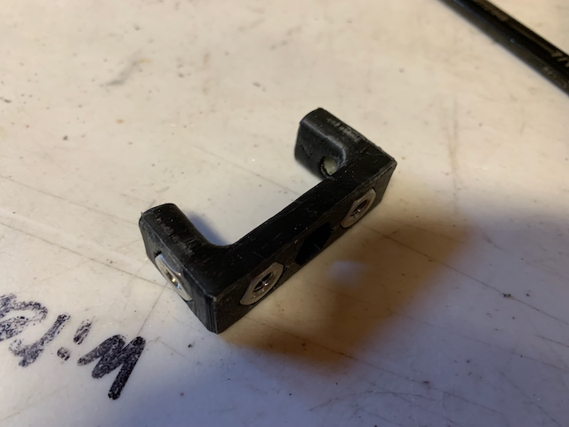

If you are using two separate belts, four of these are inserted into the bottom tube, two on each side, facing upwards; these are used to mount TBCS-type Rail Belt Clamps. These (and the TBCR-type the design also uses) are readily available in many places including [Ebay](https://www.ebay.com/itm/396901422839) and AliExpress; the 5mm pitch 20mm belt-width variants have a mounting hole pitch of 25mm, so if you drill out the mounting holes to .250", they'll work with the .5"/25.4mm pitch of the tube holes.

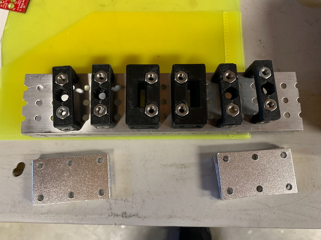

In this case, they are mounted 1.5" and 2.5" in from the ends of the tube. Then some longer 10-32 bolts plus washers can be used to mount a pair of TBCS Rail Belt Clamps. The other two mounting holes in the clamps will align with holes in the SDS Tube Plugs.

Depending on your design you may find it useful to include extra Nut Capture Inserts here and there to provide extra mounting points, but once again, keep in mind these are for keeping the nuts in place and can only be hand-tightened.

If you go with a single belt (for example, you need a very skinny elevator), then the Horizontal Tube Belt Guides should be inserted so that the captured nuts are on the outside, with a Nut Capture Insert between them. Then the toothed plate of a TBCS Rail Belt Clamp can be used to secure the center of the belt.

The two side tubes have a larger slots cut into them; the top of the slot is at least 2" below the end of the tube but it can be adjusted vertically if needed. They also have 1/4" holes drilled in the side of the tube on both sides, one pair per slot. Use the Axle Template to drill these holes -- you will need to print a second, mirrored version of this Template.

Note: in our original design, there were two of these slots. In a subsequent iteration, we relocated the optional constant force springs that balance the carriage, thus removing the need for one of the slots. In some of the later photos from Summer 2026, deleted features like this have been covered by tape.

The slot is for a Carriage Rail Belt Tensioner. It has a small Insert that guides the belt from the outside of the rail to the inside and pinned in place by a 2.375" x 0.25" 1/4-20 cap screw and a locknut. If you use low-profile locknuts, you can use 2.25" bolts.

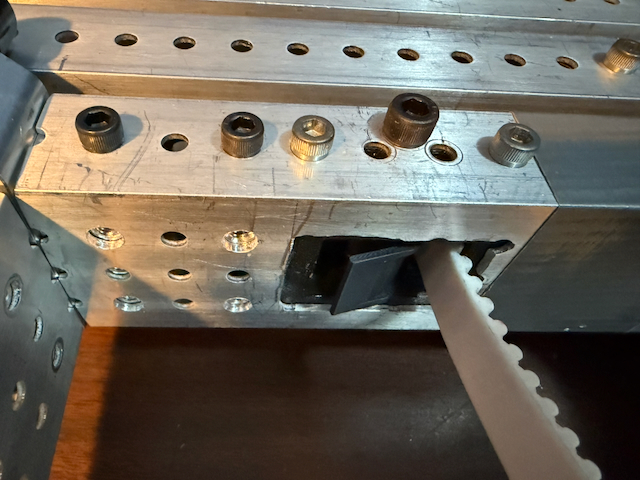

A Tube Plug is slid down the tube to a position just above the Belt Tensioner to provide threaded holes for mounting a belt clamp. This is one of the few places where a Nut Capture Insert is not ideal, since the bolts that are used with the belt clamp are under shear stress due to the belt tension. 

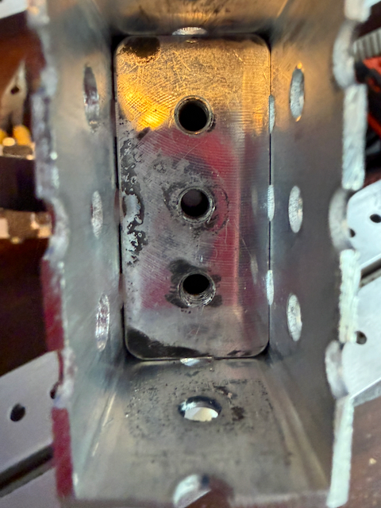

Note: included is a more compact variant of the Belt Tensioner that eliminates the need for the extra Tube Plug, replacing it with captured nuts. This cuts an inch off the minimum height of the carriage, and moves the cutout in the tube up one inch. Because of the issue noted above, I'd only use it if absolutely necessary.

The tubes are then connected using the Tube Plugs and 10-32 bolts. Don't forget the threadlock!

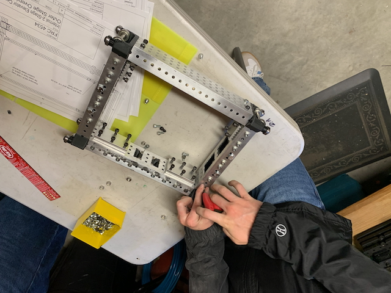

Check that the carriage is properly square by measuring between diagonal corners. The most common reason for it being off square is that one of the tubes is slighly too long, resulting in a Tube Plug being slightly recessed -- just file it down flush to fix the problem.

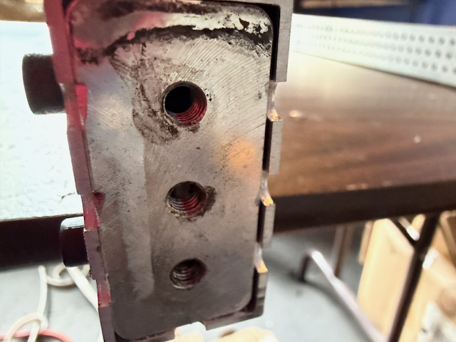

The carriage is now completely assembled.

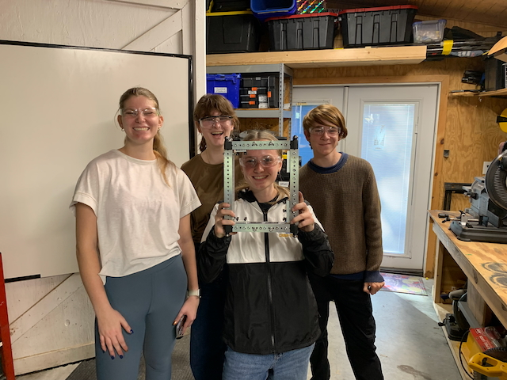

# Inner Stage

The Carriage rides within the Inner Stage. The assembly of the Inner stage is quite straightforward. The Top Tube is a simple length of 2x1 tubing that has Tube Plugs inserted into it (we printed some for our test build). Note that it is wider than the Bottom Tube.

The Bottom Tube has two slots cut through it to permit passage of the belts. These are made by drilling existing perforated holes to 1/2" and then cutting two slits between the holes to form 1/2"-wide slots with rounded tips. Two Base Belt Guides are inserted into the tube and aligned with the slots to guide the belts through the tube and (famous-last-words) prevent it from snagging on the tube. The tube ends are capped by Tube Plugs.

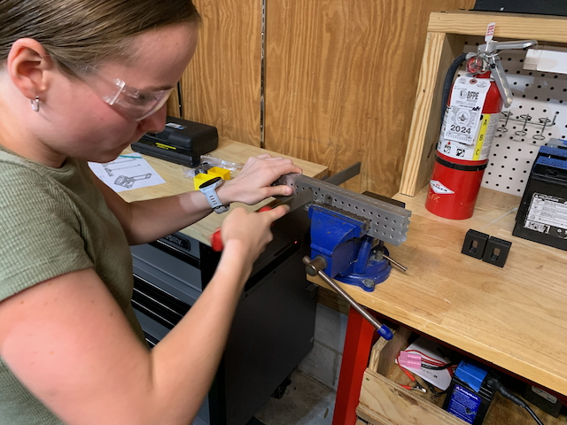

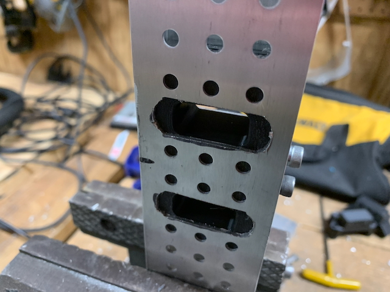

Each of the vertical Rail Tubes has two openings cut into it on opposite ends and opposite sides. Axle Templates are used to drill the 1/4" holes in the tube -- again, opposite each other. The holes are 1.75" from the ends of the tubes.

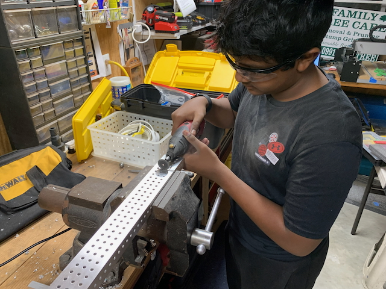

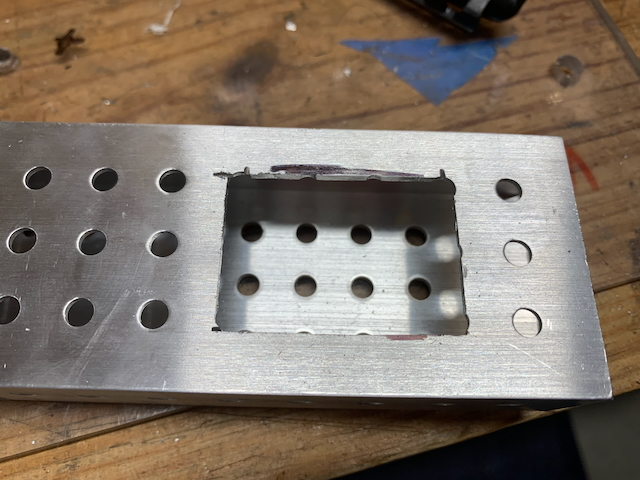

The orientation of these tubes is important. The top opening faces the inside of the assembly, and the bottom opening faces outwards.

Note: an earlier version of the design had some Nut Capture Inserts in the Rails, which explains the presence of some extra bolts on their sides.

Then two Rail Idler assemblies are positioned in the tubes with their open ends pointing away from the tube ends. The bottom assembly uses the standard Rail Idler, but the top one uses the Threaded Axle variant (this is the only place this is used). The reason for this is that using a regular 1/4-20 bolt and Locknut in the top assembly would interfere with the travel of the Carriage.

To avoid this, a 2 1/2" or longer 1/4-20 bolt is cut down to exactly 2" and a slot is cut into the end, creating a headless bolt (extra bonus points if you manufacture them with only 1/4" or so of thread). The Threaded Axle Rail Idler has a printed thread on one side; the headless bolt can be inserted on the other side and screwed into the printed threads with a flathead screwdriver; since it is 2" long, when fully inserted the ends of the bolt will be flush with the outer faces of the tubing and all stresses will go through the tubing; the threads on the printed part act as a locknut.

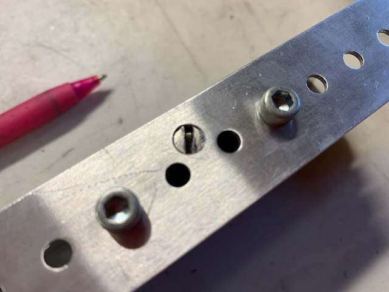

The top Idlers use a 15T Idler, and the bottom ones use an equivalently-sized untoothed Idler. Metal 15T pulleys with inserted bearings can be substituted for these (and all the other Idlers) if desired.

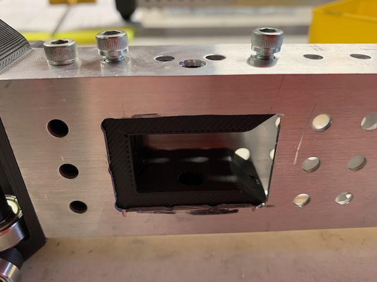

These idlers can be printed and are assembled by press-fitting two R188-2RS bearings.

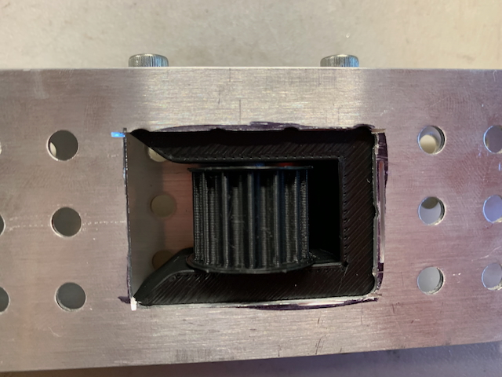

The Rails are connected to the Bottom Tube by Elevator Blocks.

The Top Tube is attached to the Rails using two pairs of Tube Plugs and optionally, some custom aluminum gussets.

One of each pair of Tube Plugs must be modified to drill out the threads on the top face.

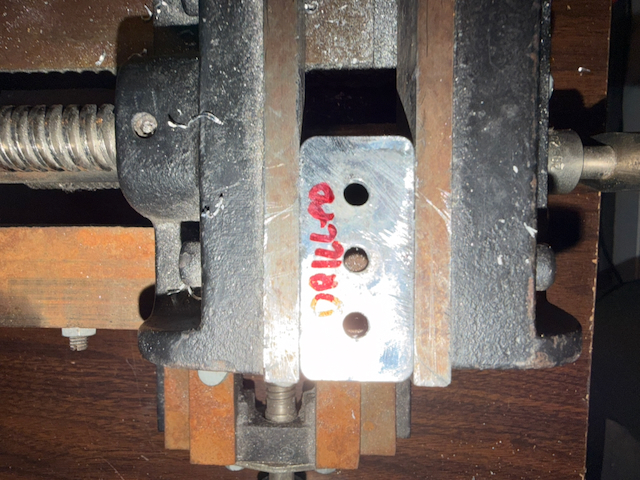

Then the other Tube Plugs can be inserted into the ends of the Top Tube as usual, and the modified Tube Plugs can be bolted to them from underneath.

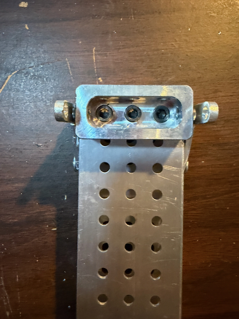

Note: in the above photo the custom aluminum gussets have already been attached, since this photo was taken at a later stage of assembly.

The two modified Tube Plugs can then be inserted into the top of the Rails and bolted in place on the outside and the sides.

The custom gussets are shaped so that they allow the Carriage to travel until it contacts the Top Tube. We CNC'd ours, but they can also be hand-shaped by printing a template and using it to cut down and shape a stock Corner gusset. Another alternative is to slightly trim down a [WCP-1409 Elevator Corner](https://wcproducts.com/products/gussets). If you don't need full Carriage travel, then a stock Corner gusset can be used.

Because the Tube Plugs are threaded, these gussets are attached with a combination of bolts (bolting into the Tube Plugs) and rivets (elsewhere), however, don't rivet just yet. For extra rigidity, a pair of [WCP-0609](https://wcproducts.com/products/gussets) angle brackets can be bolted to the inside corners; they will not impede the movement of the Carriage. This can also be done in other places as desired -- once nice thing about the WCP Elevator Blocks is that they permit this without causing an interference!

Note: if you are going to be using constant force springs, do not install the custom gussets on the top side (side facing the outer stage crossbar) as this is where the constant force spring mounts will be installed. 

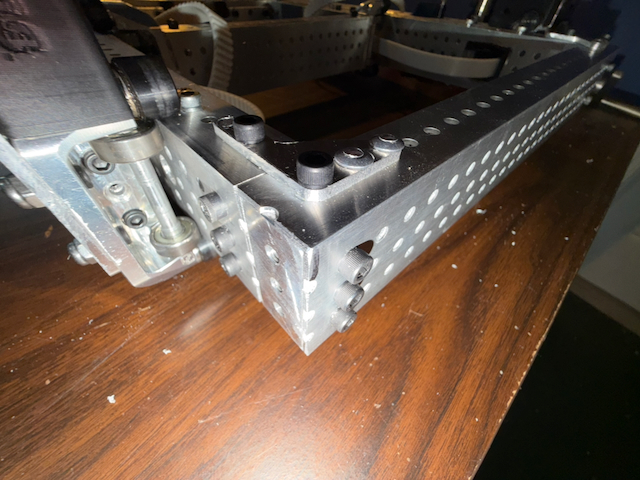

When correctly assembled, belts can be threaded from the outside of the Inner Stage at the bottom, around the 15T Idler, up through the Rail, around the untoothed Idler, and out of the tube to the inside. More about how to do that later...

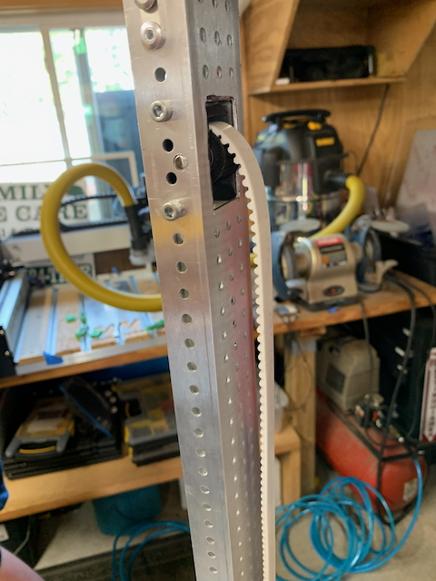

The Carriage can be inserted into the Inner Stage by removing some of the cam follers on the Elevator Blocks and everything can be tested for fit. Ensure that the two stages are exactly square and aligned with no gap between them when the Carriage is fully at either end of the Inner Stage. Any slight misalignment can be tweaked out by loosening and retightening the bolts locking the various Tube Plugs in place.

When everything is perfect, if you are using the custom gussets any remaining holes not occupied by bolts can be locked down with rivets.

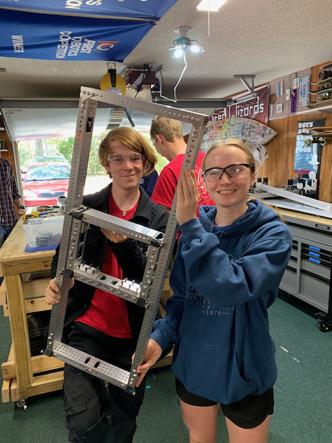

# Outer Stage

The Outer Stage is the most complicated assembly. In our case, we made the base tube 28" wide to match our standard drive chassis, but made the actual elevator as compact as possible. This means that the actual components that drive and guide the belt are deep inside the 2x2" base tube.

The base tube has numerous holes for shafts, belt passage, and access for belt threading. Each side has unique features, so consult the drawings carefully. The only new process is using a 1 1/4" hole saw to cut the mounting holes for the Thunderhex bearings used in the drive shafts. Alternately, you can drill holes big enough for the hex shaft and mount the bearings in 1.125" bearing mount plates such as the [WCP-0476](https://wcproducts.com/collections/systems-structure/products/bearing-mounts-retention-plates), which can be riveted to the outside of the 1x2 tube

*Note*: Based on our experience testing the threading of the belts, there have been some design changes to the printed parts and hole placement/size, but these do not affect the overall process described below.

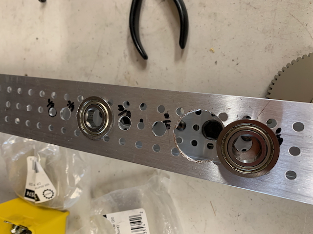

Once the tube is prepared, the two MaxPlanetary Output Stages can be mounted; there are enlarged holes on the opposite tube face big enough for the 10-32 buttonhead screws used to mount them.

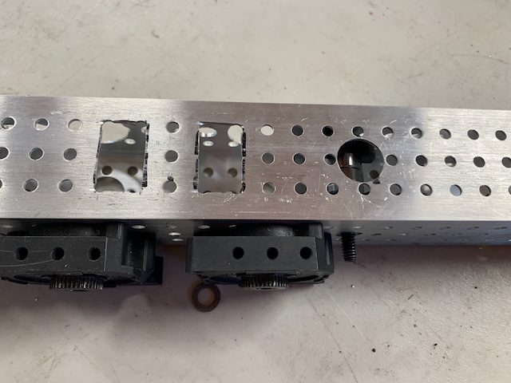

The above photo shows an earlier iteration of the belt idlers (visible through one of the holes that makes it easier to later thread the belt). The team found these difficult to mount deep inside the tube, prompting a redesign.

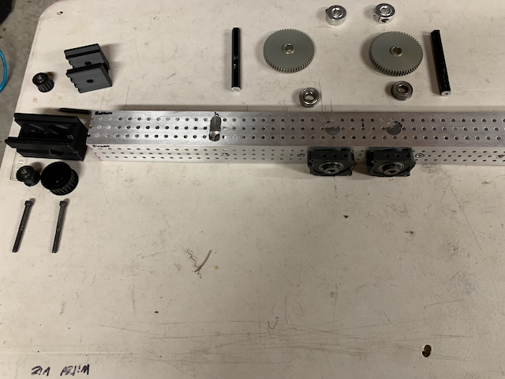

The solution was two printed parts, the Inner Drive Cassette and the Outer Idler Cassette, that loosely hold the [WCP-0992 24T Hex Drive Pulley](https://wcproducts.com/products/htd-timing-pulleys) and the two Idlers. The Cassettes are then slid into position inside the tube, and the components they convey are then easily locked into their final positions by either Hex shaft or 2 1/4" or 2 1/2" 1/4-20 bolts.

The Cassette design also includes plastic pins that secure the idlers during insertion, and which get pushed out when the bolts are inserted. No such help is needed for the Hex Drive Pulley since there is ample access before the Thunderhex Bearings are inserted.

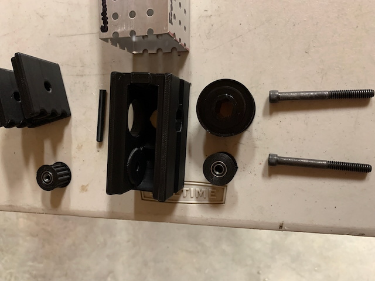

The Inner Drive Cassette contains the 24T Drive Pulley and an Untoothed Idler.

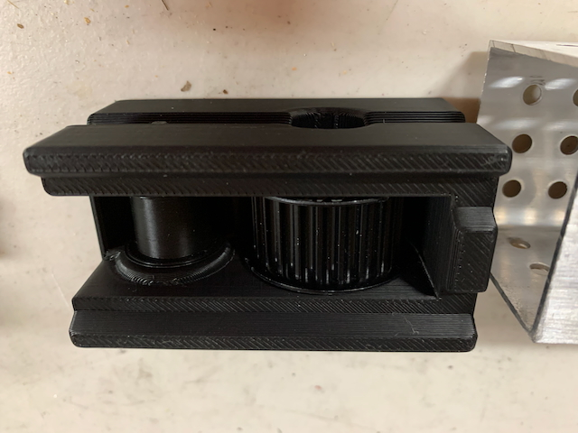

The Outer Idler Cassette just has a 15T Idler.

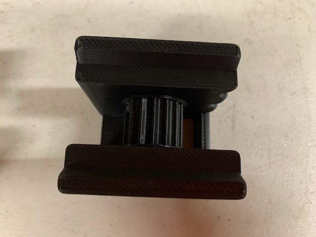

Once in place, a section of hex shaft that is 10-32 tapped on the end can be passed through the Drive Pulley and secured to the MaxPlanetary output shaft.

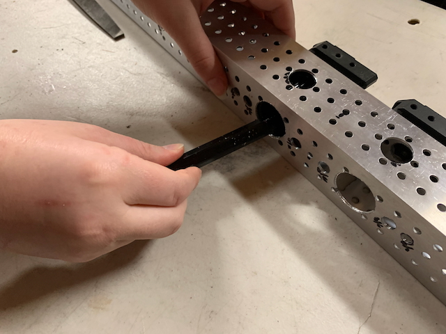

The Untoothed Idler is secured in place by a 1/4-20 bolt (nut on the MaxPlanetary side).

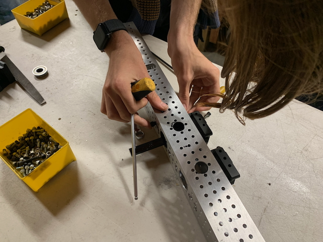

A [WCP-0785 Thunderhex bearing](https://wcproducts.com/products/ball-bearings) is placed on the hex shaft and pressed into place. It is supported by both the tubing and the Cassette. Test fit the Outer Idler Cassette by inserting it and securing the Idler with another 1/4-20 bolt. You should be able to slide it in and out freely, and once this is confirmed, you can remove it and set it aside for now.

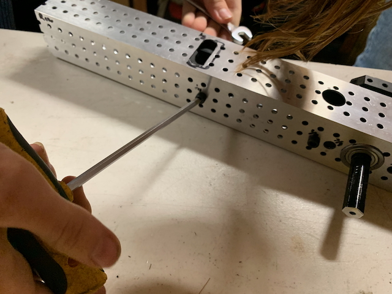

The two outer rails have slots cut at the top for the Rail Idler, plus holes for its axle.

Each rail also has a Nut Capture Insert positioned 1" below the Rail Idler with the flat side facing inside; this is used to secure some endstops that limit the travel of the Inner Stage. We printed these out of TPU.

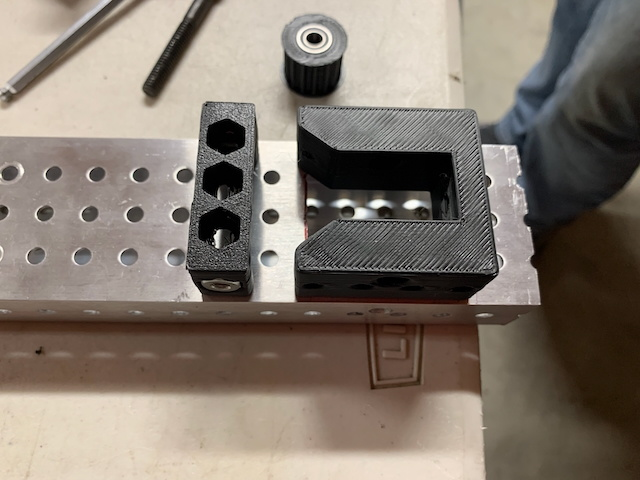

The top of each rail contains the Nut Capture Insert, Rail Idler, Tube Plug (flush with the top of the tube) and topped with an Elevator Bearing Block. The extra printed component on the end of the Elevator Bearing Block is no longer part of the design and can be ignored.

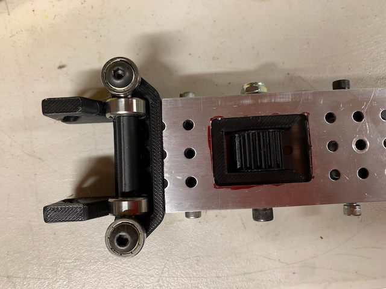

The Crossbar is capped with Tube Plugs, and Crossbar Spacers are bolted to the Tube Plugs using 1/2" to 3/4" 10-32 bolts. This Spacer conforms to the Elevator Bearing Block and gives the final assembly a little more stiffness. The size of the Spacer is parametrically defined so the clearance between the Crossbar and the Inner Stage can be adjusted as desired.

Those with access to a CNC router may wish to replace the Crossbar with a flat "U" bracket sandwiched between the Tube Plugs and Bearing Blocks.

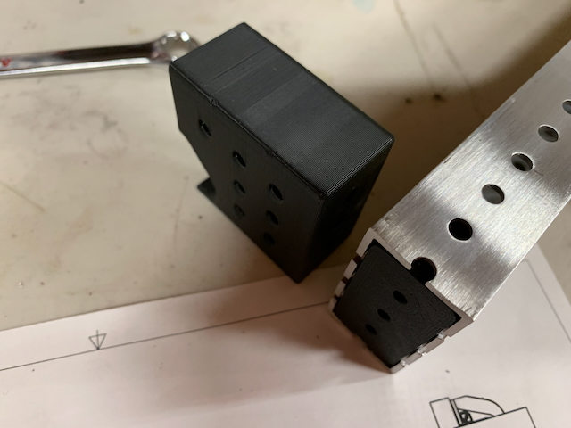
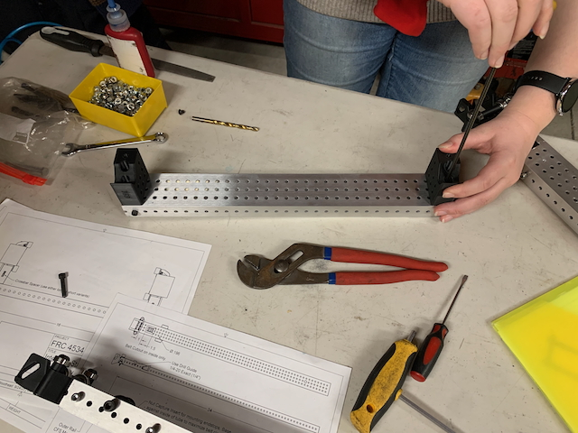

If desired, the bottom threaded holes in the Tube Plugs (the ones that don't already have bolts in them) can be drilled out, and 3.5" 10-32 bolt can be inserted into them and bolted to the Tube Plugs in the Rails.

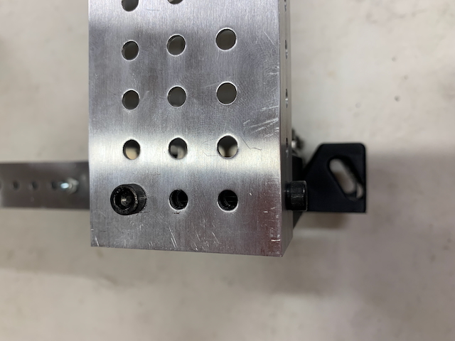

[AM-5250 2" Joining Plates](https://andymark.com/products/1-2-in-pitch-gussets) are attached to the outer sides of the assembly (connecting the two Tube Plugs, the Elevator Bearing Block and the Spacer) with 1/2" 10-32 bolts. We didn't have any Joining Plates in stock at the time these photos were taken so we printed some placeholder replacements.

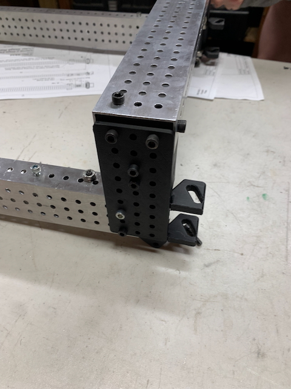

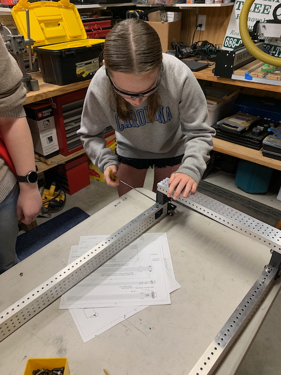

In our design, the Crossbar was attached on the side opposite the motors but it can be flipped if your design requires it.

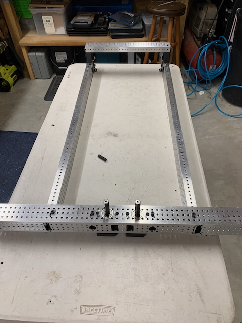

Before the Base is attached to the two rails, two Rail Belt Guides are inserted into the the bottom of the Rails. These are embossed with "RBG" and the embossing should always be on the outside face of the rail. A rivet can be temporarily inserted on one of the 2" rail faces to hold them in position.

The rails and base are clamped into position and custom Base Brackets are riveted in place to join them. We CNC'd these, but they could be made by templating, or replaced by WCP-1409 Elevator Corners. The rivets that connect them to the 2x2" tubing should not be placed in the center row, only the top and bottom rows (see second photo below). This will permit the Outer Idler Cassette to be inserted and removed.

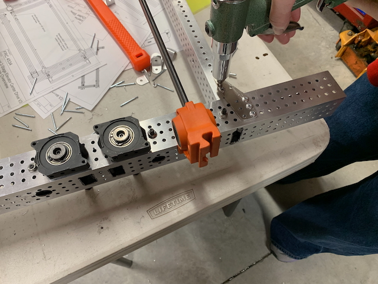

The assembly is stiffened by riveting in WCP-0609 angle brackets (one centered on the inside, two on the outside).

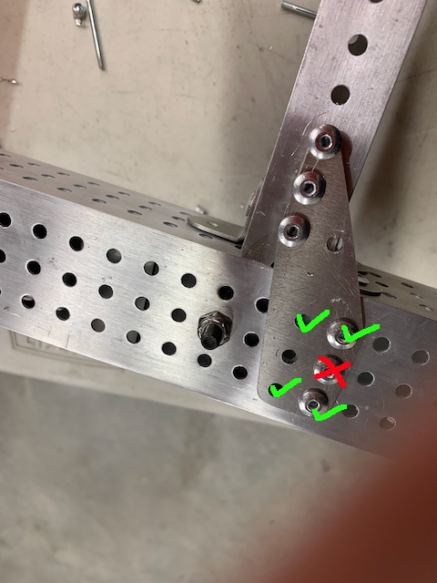

The Outer Stage is now assembled. Remove 2 cam followers from the Outer Stage (at the top) and the Inner Stage (at the bottom), insert the Inner Stage + Carriage into the Outer Stage, and replace the cam followers to complete the assembly of the Elevator. 

This is as far as we got in Fall 2025. We had the tube part, now we just need to add the "belt in" part.

# Threading Belts

Thanks to a lot of testing (aka "This sucks! Why is this so hard?!") threading the belts is a fairly straightforward process; we estimate that replacing a broken belt (probably the worst-case scenario for a belt-in-tube design) can be performed in about 20 minutes by a single person.

We decided to go with two individual belts rather than a single shared belt.

## Tool Time

Before we begin, we need to manufacture a custom Tube Snake, which is used to pull the belts through the tubes. Procure a cheap keychain tape measure -- one of the tiny ones with a metal tape about 1/4" wide and 36"/1 meter long. Disembowel the keychain and remove the tape and the associated spring; typically there is a central screw holding everything together, possibly hidden beneath a label.

The tape and the spring are connected via a tab and slot arrangement; disconnect them then put them back together to form a longer device, then secure the connection with some tape.

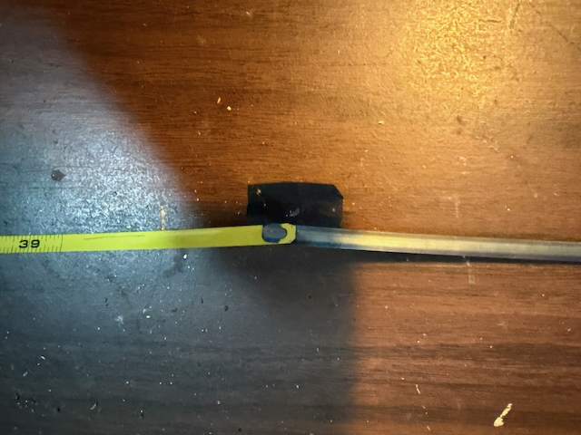

Cut the spring part at the point where it becomes excessively curly, and cut the tab off the end of the tape. Then cut the ends so they are roughly semi-circular.

You will also need a magnetic grabber. If you don't have a magnetic grabber, get a strong magnet and glue it to a stick. Now you have a magnetic grabber.

Additionally, sturdy paperclips can easily be bent into tools for poking, prodding, or hooking onto uncooperative belts. Have a few handy.

## Snaking the Belt

The first step is to thread the belt through the Carriage and Inner Stage and into the 2x2" tube. The teeth of the belt should be pointed to the outside of the elevator. Cut the end of the belt so it has a pointed tip.

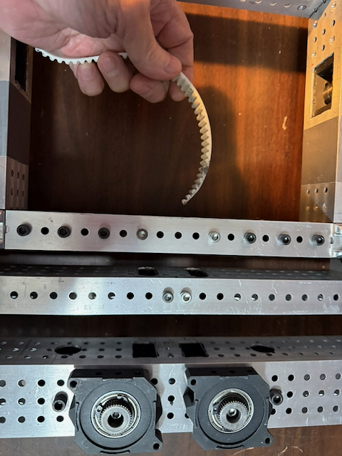

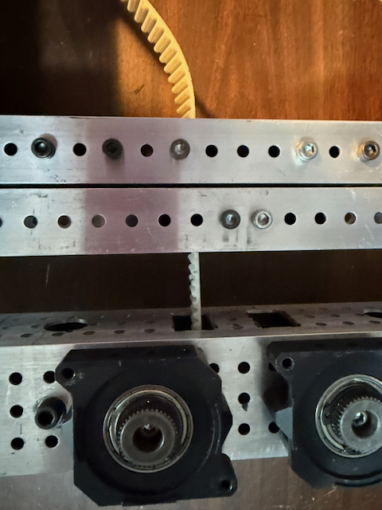

Pushing the belt while rotating the shaft of the drive pulley will cause the belt to appear in the hole below the pulley.

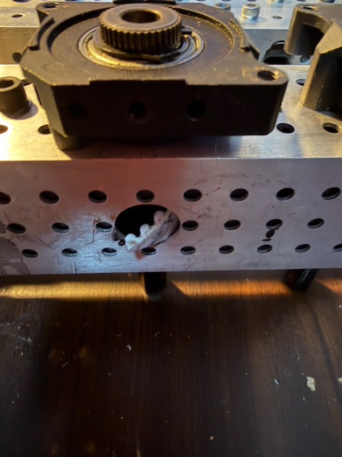

Use a screwdriver to guide the belt up towards the untoothed pulley while continuing to feed the belt. It will appear in the access hole on the top of the 2x2" tube.

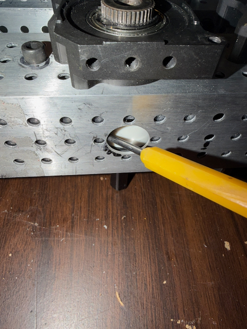

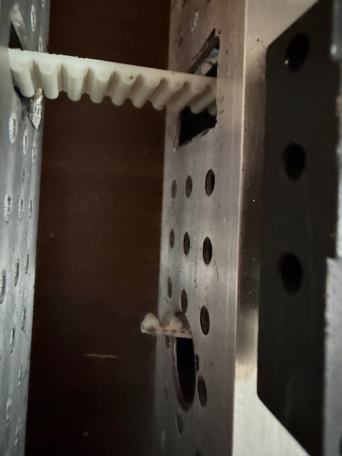

Use the screwdriver to push the belt down over the top of the untoothed pulley while continuing to feed the belt until you can grab it with some forceps and pull it out of the end of the tube.

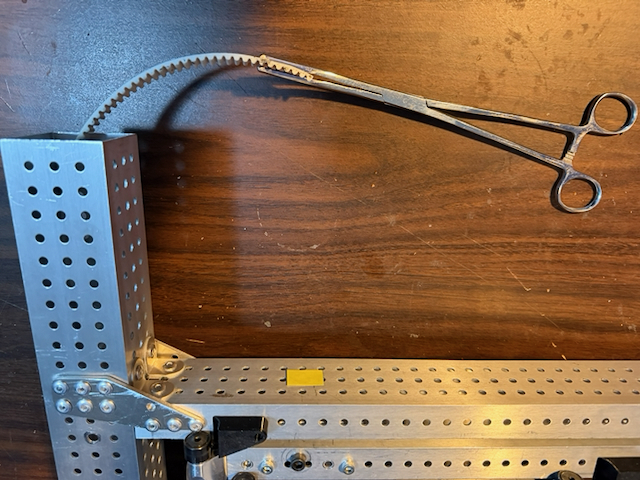

Continue to feed the belt until about 6 inches remains in the carriage, then use a belt clamp to secure the end to the carriage. Be gentle tightening the bolts; snug is good.

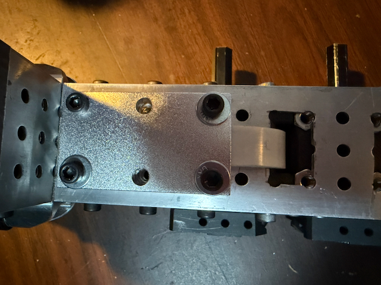

Insert the Tube Snake into the access hole in the top of the Outer Stage Rail and thread it down the tube to the Base 2x2 tube. Use a magnetic grabber to guide the Snake out of the hole in the bottom of the tube. (Note: in our original design, this was a slot, but a hole is all you need).

Always feed the tape measure part first, that way you can use the printing to check on whether things have gotten twisted.

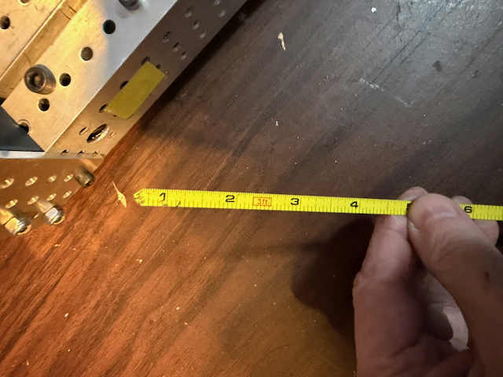

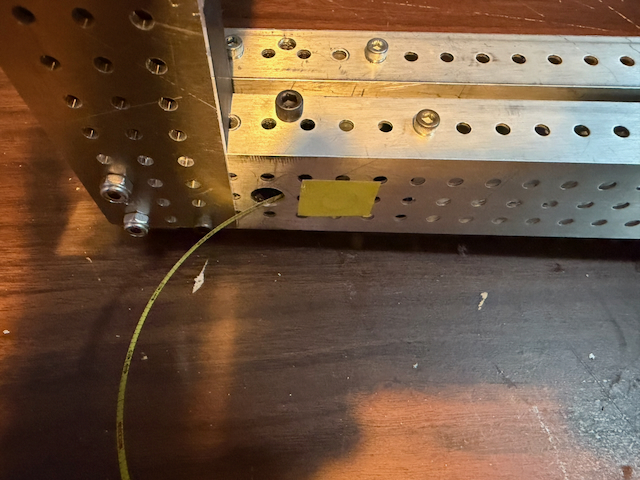

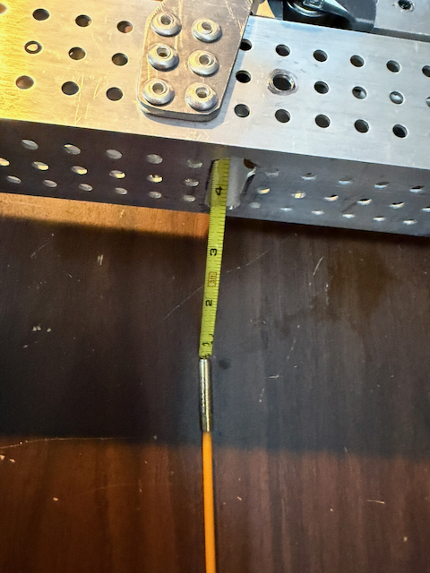

Feed the Snake back into the hole and out the end of the Base 2x2 tube. Make sure the Snake hasn't become twisted -- it's hard for this to happen, but take nothing for granted.

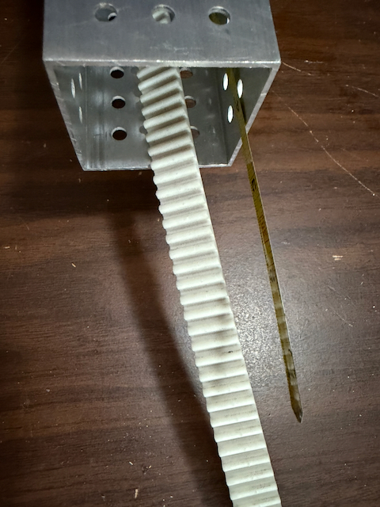

Run your hands along the belt making sure it hasn't become twisted either, then attach it to the end of the Snake such that, when it is pulled through the tube, the treads of the belt will be oriented towards the inside. Take your time and double-check this, it's easy to make a mistake.

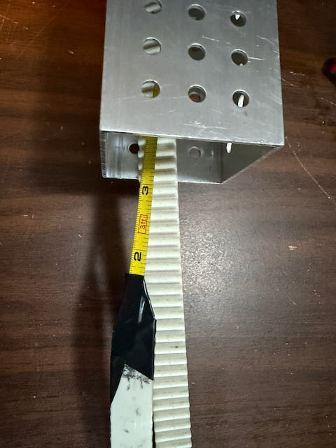

Moving to the other end of the Tube Snake, insert the other end into the access hole pointed upwards until it appears above the idler pulley on the inside face of the tube. Continue pushing until the tip of the Tube Snake touches the Inner Rail.

Now, while maintaining gentle pressure, move the Inner Rail upwards a few inches and then down again. This will cause the Tube Snake to curve down over the Idler. Continue pushing until the Snake is almost completely inside the tube, then twist the snake so that the end that is currently in the gap between the Outer and Inner Rails pops up above them; grab it and pull the Snake completely inside the Outer Rail.

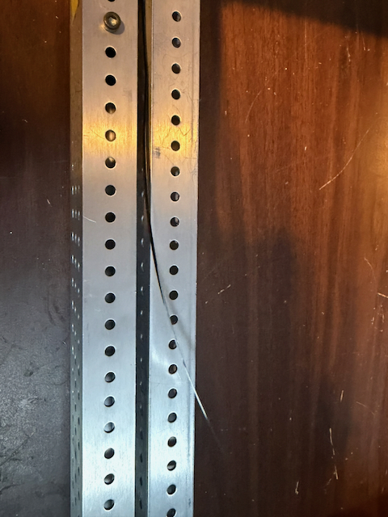

Gently pull on the Snake to guide the belt through the 2x2 Base Tube into the Outer Rail, up the Rail, around the Idler, and into the gap between the two rails. It helps to provide slack by pushing on the other end of the belt to reduce the stress on the tape connecting the Snake to the belt, in particular when navigating bends. Gentle pushing with tools into the various access holes can also be helpful.

The most difficult part is bending the belt over the Idler, because of the bulk of the tape and the stiffness of the Snake. Rotating the Idler to provide some frictional assistance can help. Worst-case you can insert a pair of 10-32 bolts into the Outer Rail just below the Idler and on either side of the belt to trap the Idler, then remove the Idler Axle bolt, which will let the Idler move partially out of the way.

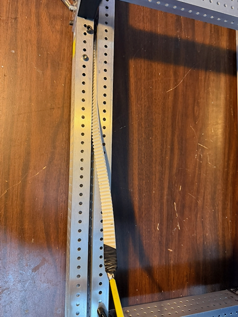

Continue pulling the belt through until only a small loop remains outside the Base 2x2 tube.

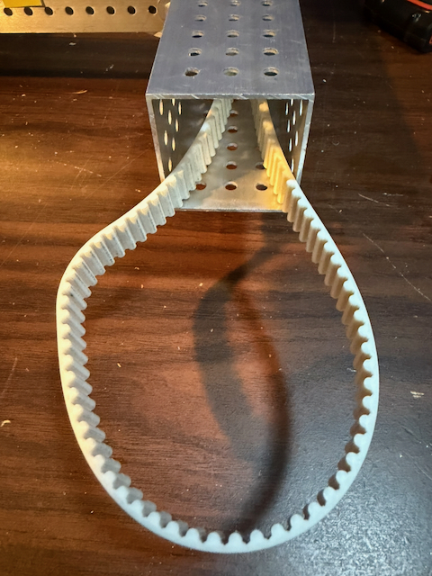

Insert an Idler into the belt loop, and then insert both into the Outer Idler Cassette, securing the Idler with the plastic Assembly Pin.

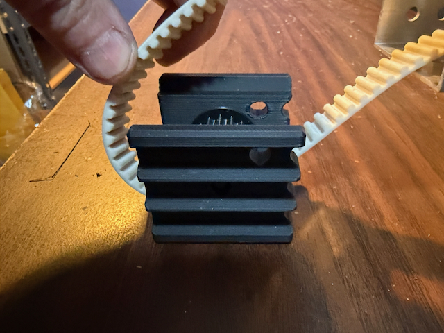

Insert the Outer Idler Cassette into the Base 2x2 tube and gently move it into place by pulling on both ends of the belt alternately. When in the right position, the Assembly Pin will be visible through the bolt hole that was previously drilled out.

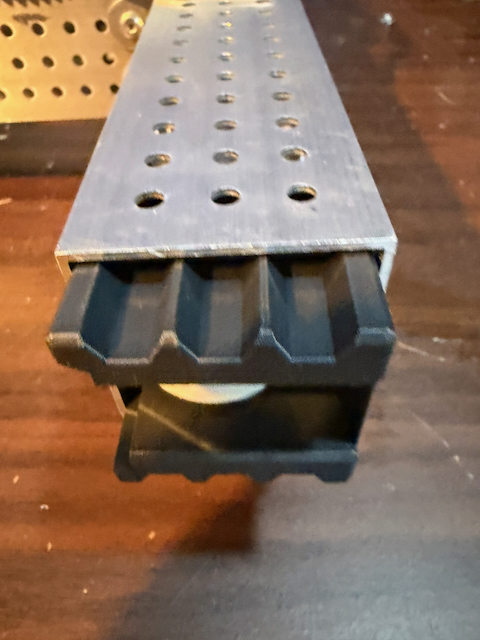
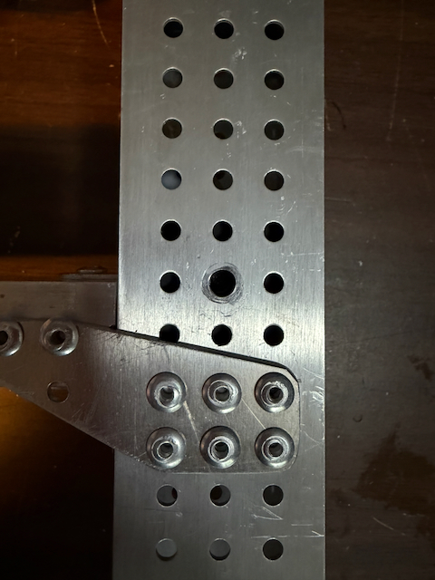
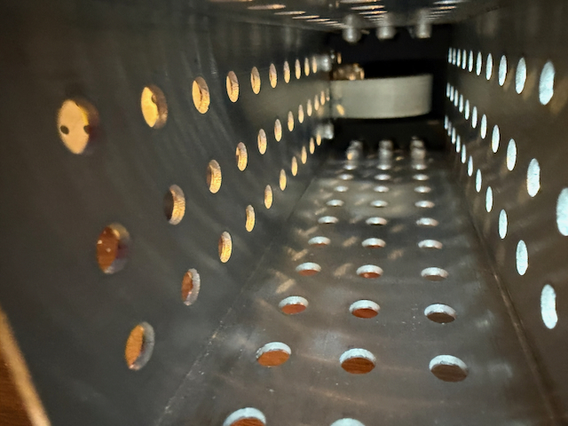

Note: it was at this point that we discovered that this process is a lot easier if the center row of rivets connecting the gusset to the Base 2x2 were removed. But if you're following the instructions, you won't have installed them!

Insert another 1/4-20 bolt into the bolt hole, pushing out the assembly pin, and secure with a locknut. This will secure the Cassette into place.

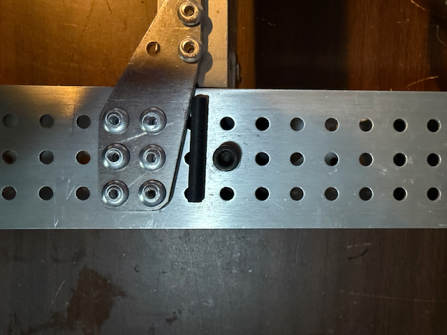

Remove the Tube Snake from the belt. Remove the Idler from the top of the Inner Stage and thread the Tube Snake down the Inner Rail.

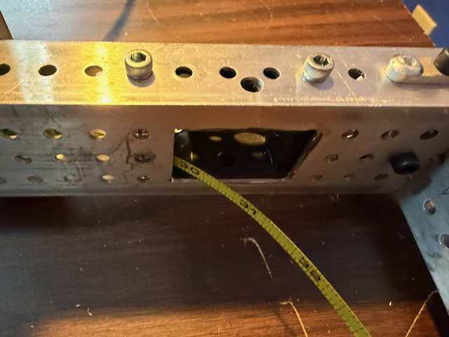

Use the grabber to pull the Snake out of the access hole in the bottom of the Inner Rail, then thread it back in, around the Idler, and into the gap between the Inner and Outer Rails using the techniques you learned above. Reconnect the Snake to the Belt.

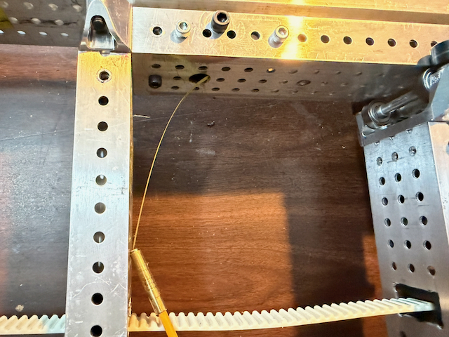

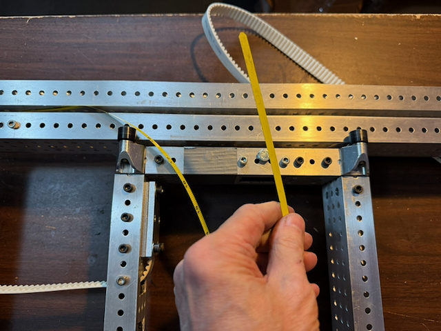

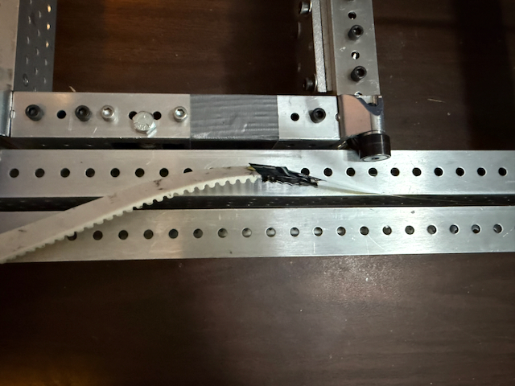

Gently feed the belt around the Idler, up the Inner Rail, and out of the Idler assembly at the top of the Inner Rail. It helps to keep a little tension on the belt and help keep it evenly fed into the gap between the rails.

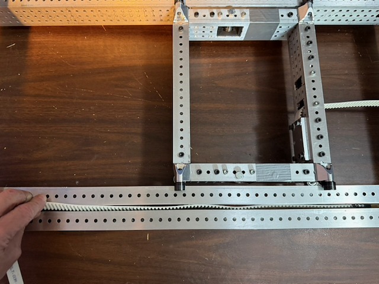

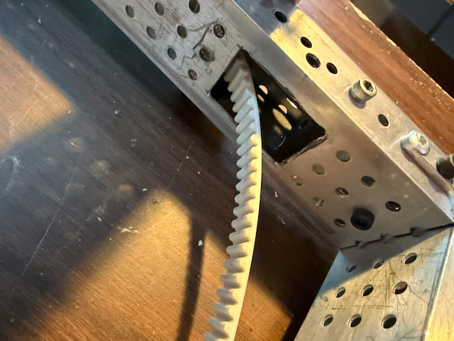

Reinstall the Idler and gently pull the belt taut. Check for snarls where the belt has gotten caught and isn't properly wrapping around an Idler. These can usually be fixed by gently moving the Inner Stage up and down.

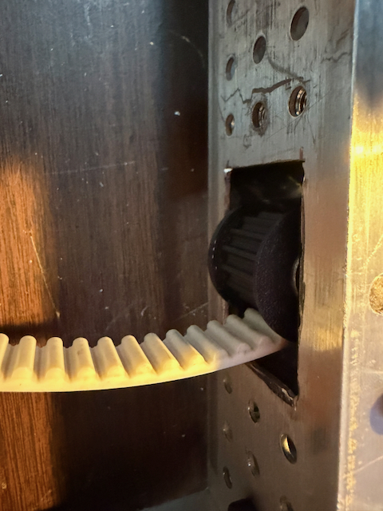

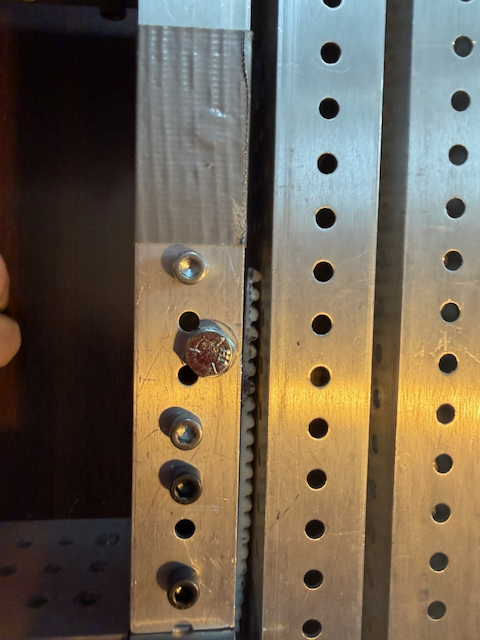

Feed the belt by hand between the Inner Stage and the Carriage and fish it out of the Tensioner assembly. Then pull the belt through as far as it will go.

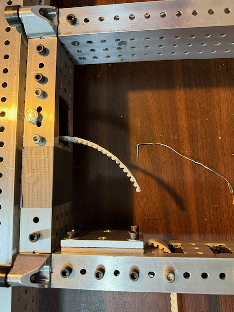

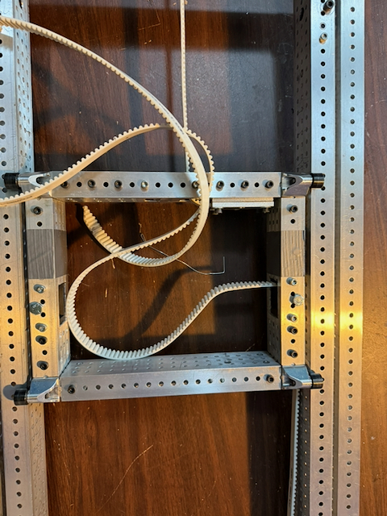

Congratulations, you're halfway there! As a reward, you can repeat the process for the other belt!

## Tensioning the Belts

For each belt, insert the Tensioner into the Carriage Rail Belt Tensioner and pin in place with a 1/4-20 bolt. Then stretch the belt taut (pushing with your thumb on the belt against the inner side of the Inner Rail helps with this). Grab a Belt Clamp and press it onto the Belt, then stretch the belt upwards, pinning it against the inside of the Carriage Rail.

The idea is to find the position of the Clamp on the belt where it'd still have to stretch a small amount more (but less than one full belt tooth) for the bolts to be able to easily be installed.

Mark this position on the belt with a Sharpie.

Now simply remove the bolt from the Tensioner. With the Tensioner free to move, you can easily install the Belt Clamp with the belt in the desired position.

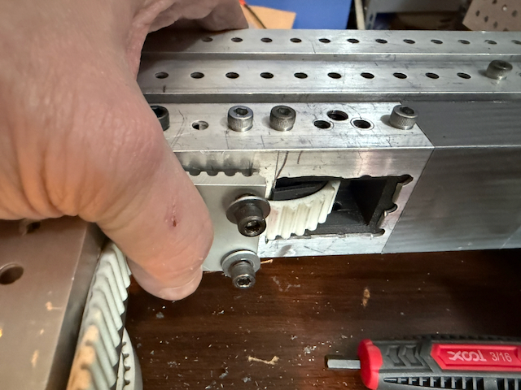

Once the Belt Clamp is installed, push the belt with your thumb against the inner side of the Inner Rail as before, while using a screwdriver in the bolt hole to lever the Tensioner back into position. Then reinstall the bolt to lock the Tensioner in place (add a nut this time).

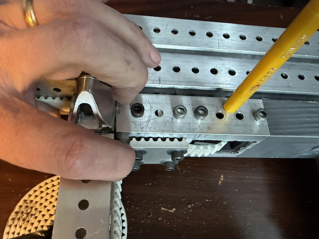

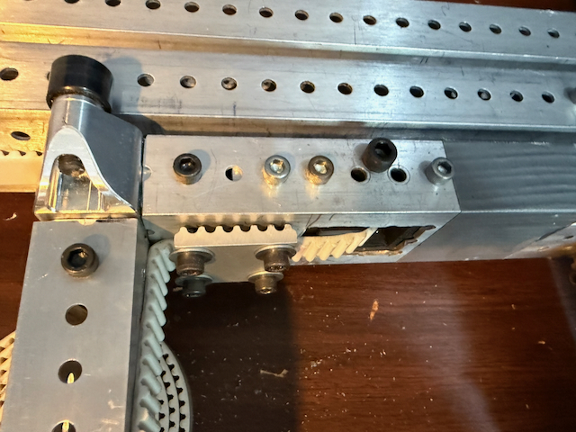

Repeat the procedure for the other belt. The reason why our belts are much longer is that we reused belts from the 2024 season and didn't want to cut them to size for a test build.

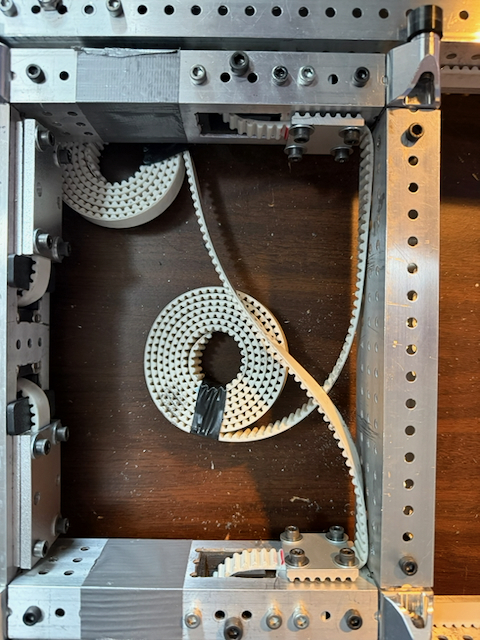

And finally, install the two 60T 20DP hex shaft gears to link the two belts together.

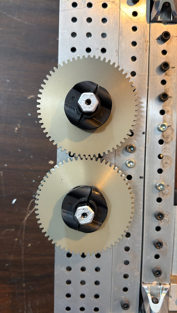

Run the Elevator up and down by hand a few times to confirm that everything is running smoothly. You can also drive it using a drill with a 1/2" hex adapter.

## It's good to relax from time to time...

It's a good idea to remove the Tensioner bolts any time the Elevator isn't in use (ie: overnight at competitions) and store it with the Carriage in a random position. This will help prevent the belt from developing kinks.

# Optional Constant Force Springs

Some applications may benefit from adding constant force springs to offset some or all of the weight of the stages and roughly balance the amount of force needed to raise and lower the elevator; since this will increase the maximum deployment speed this can be a win in FRC applications worth the additional complexity, but given the power of current FRC motors, I would recommend using them only if testing determines the cost-benefit tradeoff is worth it.

WARNING: always wear sturdy workgloves when handling constant force springs -- those edges can you give the Mother of All Papercuts.

You can determine the weight of the carriage and carriage + inner stage using scales.

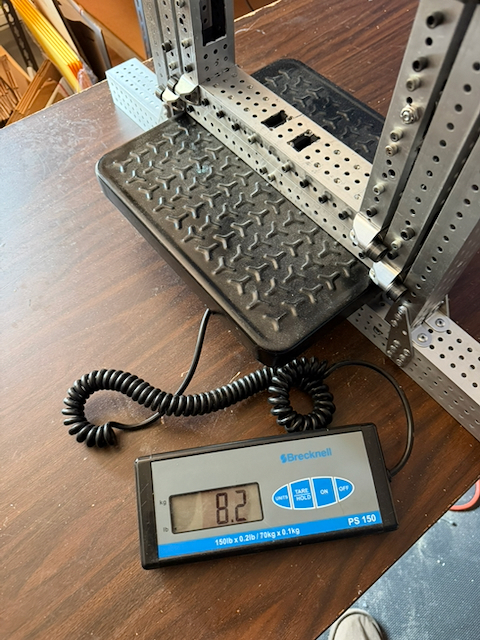

For each pair of constant force springs you can get away with a total pulling force that is slightly above the weight because of the effect of friction of from belts, motors and gearboxes. As long as nothing moves when the elevator is in its final orientation, it'll be OK, though you'll definitely have to clamp things in place when it's lying flat.

In the Internal 2-Stage Elevator Center Drive Fusion document you can adjust parameters that define the sizes of the constant force springs; in our case, we ended up with 1" wide springs connecting the outer and inner stages, and 3/4" springs between the inner stage and carriage. The CROSSBAR_OFFSET parameter must be >= the sum of these widths plus 1/4" in order for everything to fit.

The printed Spool Mounts and Tip Mounts should be printed with "strong" settings as they will actually be enduring some mechanical stress. The easiest way to print the Carriage Spool Mount is with Organic Tree supports, and everything should be oriented so that the direction of expected stress from the springs puts the layer lines into shear (because the bolts will distribute the forces to each layer). Note that you will need to print mirrored pairs of each item.

The Tip Mounts are installed by removing the two corner bolts that lock tubing segments to Tube Inserts, adding the tip mounts, and then resecuring with bolts that are 1/4" longer. The constant force springs can then be attached using 10-32 bolts and nuts, with the coil on the inside.

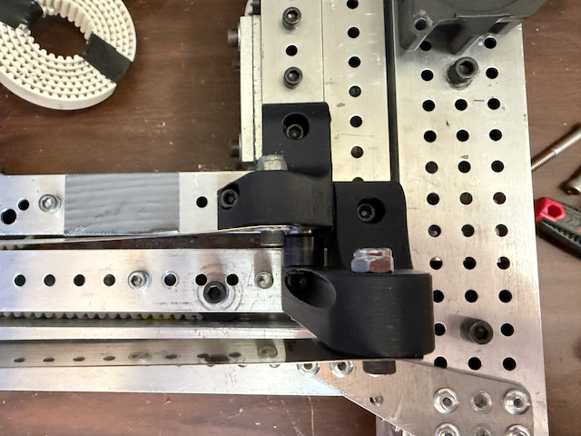

The Inner CFS spool brackets are riveted to the top and bottom faces of the crossbar. There is a bevel on one corner that should be on the outside, and the outermost rivet goes into the third hole in from the edge. There is a slight cutback on each bracket to provide slop for the spool that needs to be pointing inwards (so the outside surface is completely flat), and the bottom brackets have countersinks for flathead bolts. 

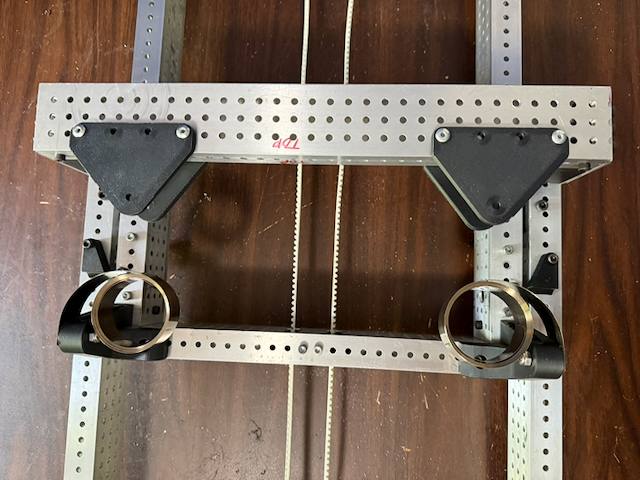

The Inner CFS Spools are prepared by pressing in a couple of bearings (the same as with all the belt idlers), then they are inserted into the constant force springs, moved into position between the brackets, and locked into place from underneath with 1/4-20 flatheads. Using a little pressure, you will be able to form threads into the plastic of the top brackets which will act as a locknut, and if your flatheads are a little too long, you can add bolts. Don't overtighten as this will pinch the spool and cause it to bind.

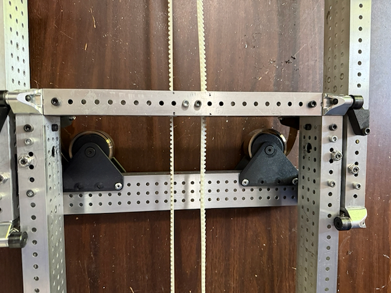

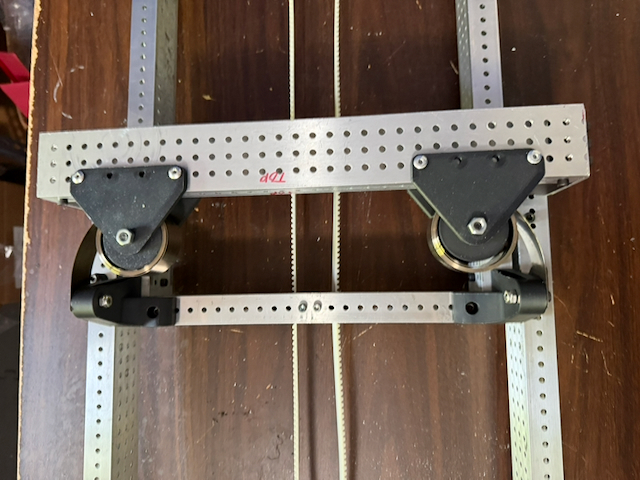

The Carriage CFS Spool Mount is attached in a similar way to the Tip Mounts; the corner bolts are removed, and the Mount is placed in the corner and reattached with 1/4" longer bolts. There are also two other mounting holes that can accept rivets (though in our case we only used one, and used bolts because we'd added Nut Capture Inserts to the Inner Stage Top Tube to make design iteration faster).

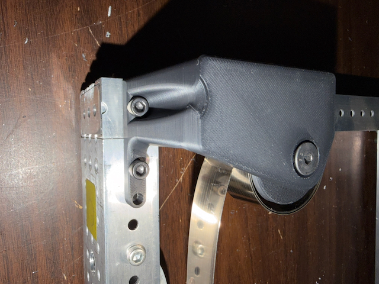

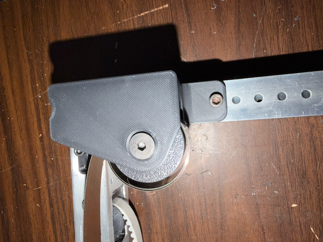

The Carriage CFS Spools are assembled and mounted in exactly the same way as the Inner CFS spools except the flatheads point in the opposite direction (so as to maximize clearance).

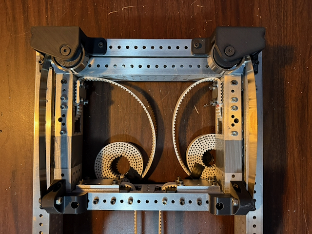

We hope this design and assembly guide will be useful to you in your FRC efforts. Let us know if you have any feedback / suggestions for improvements!
