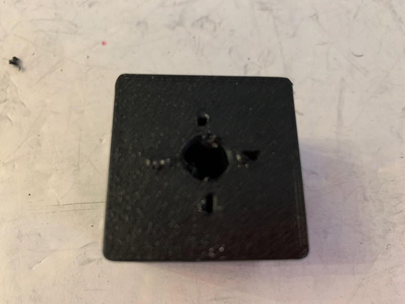
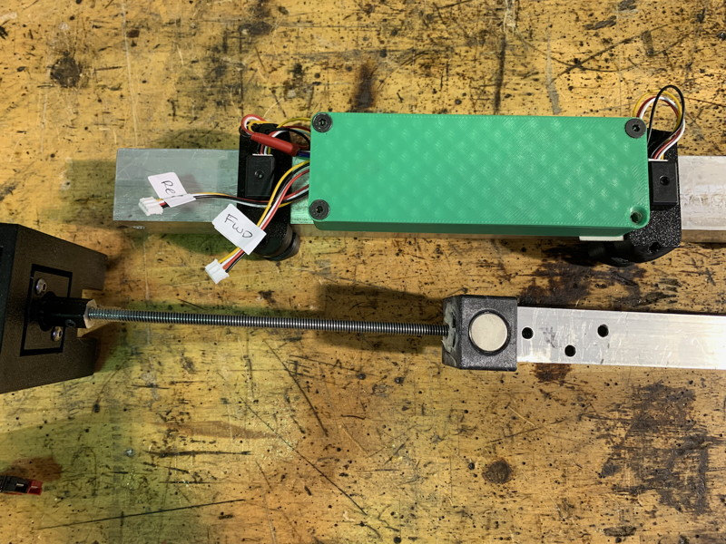

The CheapActuator was inspired by a fellow 4534 mentor who expressed an interest in avoiding pneumatics in the robot if at all possible ("it's just one less system that can go wrong"). Since we mostly use pneumatics for linear motion, the obvious substitute is a linear actuator, but finding a COTS actuator of the right length, speed and torque can be difficult.

My attempt to solve this problem involved mating a MaxPlanetary gearbox to a simple linear actuator built using threaded rod and printed slide bearings, allowing the actuator to be powered by a NEO or NEO-550. If you omit reduction stages when assembling the gearbox, you can get impressive speeds -- with light loading, over 7"/sec with a 550. In most use-cases, you won't need any reduction, so the MaxPlanetary is just being used as a convenient way to mount the NEO that provides a hex-shaft output.

I also created a variant that uses a 775 motor. A [775 Redline motor](https://www.andymark.com/products/andymark-775a-redline-motor?sku=am-3775a) will give you truly impressive actuation speeds, faster even than a NEO-550.

Realistically, for most applications the 775 is a better choice; it's slightly faster, can attach directly to the device, and is a lot cheaper. The MaxPlanetary/NEO combination lets you add gear reduction for extra force, and the motor/base mount is a bit more robust, but if you gear things down and ramp up the actuation force too much you start running the risk of breaking the printed parts.

[CheapActuator Demo](https://youtube.com/shorts/NUQg79O8sjk?feature=share)

# Getting Started / General Notes

* Fusion 360 Project, 3MFs and STEP files are [here](Files/). The project is fully parametric so it's easy to tweak to your requirements.

* Please keep in mind that this design has gone through several iterations, so some of the photos may show previous incarnations of the parts. However, the features relevant to the particular assembly step will be present and their relationship to the current design should be obvious.

* The Inner Bearing can hold a pair of 10 or 18mm magnets and you can attach [Rev Magnetic Limit Switches](https://www.revrobotics.com/rev-31-1462/) to sense them. There are sensor mounts for 1.5" tube in the [Useful Parts](/Useful/Useful.md) section of the repository.

* The stroke of the actuator is about 2.5" less than the cut length of the outer 1.5" tube.

* All printed parts were designed with 0.6mm nozzle in mind, but should work fine with 0.4mm nozzle.

* You shouldn't need to use any fancy filament. Standard PLA is fine.

* Everything can be printed without support.

* Tools required: Some sort of saw for cutting tubes and threaded rod, Hand electric drill, assorted T-handles, pliers, hand file, deburring tool, vise.

* Miscellaneous parts required: Generic Grease, CA glue (gel is best), non-permanent threadlock, ~1-1.5" chunk of hex shaft with central hole suitable for tapping #10-32, #10-32 x 3/8" (4-10), 3/4" (2), 1" (2) socket or buttonhead, #10-32 x 1/2" (2) flathead bolts, 2 1/4-20 x 1/2" T-nuts, 2 x 18 or 10mm magnets.

Note: if you are using a 775 motor, you will find that different brands of hex shaft have slightly different central hole sizes. As long as it provides at least a tight fit on the 775 motor, it'll be fine, but slightly undersized is better. In my case, the shaft with black coating seemed to work best.

# 1: Tube and Rod Cutting

Decide on the length of the outer 1.5" x 0.0625 tube; it should be at least 2.5" longer than your minimum required stroke; in general, try to make it as long as possible to minimize the lever-arm between the two tubes when at maximum extension. Because the actuator uses simple printed slide bearings, it's best for situations where the forces are axial.

The inner 1.0" x 0.0625 tube should be the length of the outer tube + some extra to fit your linear actuator. If it is the exact same length as the outer tube, at full retraction it will project 0.4" from the top surface of the Outer Bearing.

Cut a length of 1/4-20 threaded rod to the same length as the outer 1.5" tube. Make sure to clean up the cut ends so they will thread smoothly onto a 1/4-20 nut.

Note: after doing any cutting or drilling operation, use a deburring tool and/or file to make sure the end result is smooth.

# 2: Tube Preparation

Place the Inner Bearing on one end of the Inner Tube and use a drill to make position divots in the two #10-32 flathead bolt locations. Ignore all the extra holes in my Inner Tube, I was using a bit of scrap for prototyping.

Place the Outer Bearing on one end of the Outer Tube and use a drill to make position divots in the four #10-32 bolt locations.

Place the MaxPlanetary Mount on the other end of the Outer Tube and use a drill to make position divots in the two #10-32 bolt locations.

Remove all the printed parts and drill out all the divots to #10-32 loose-fit.

Replace the printed parts and check that the holes line up. If they don't, remove the printed parts and drill them out. Hole alignment isn't all that important, the bolts just pin the parts in place.

# 3: Inner Bearing Assembly

We next need to install the two T-nuts into the top and bottom of the Inner Bearing. Prepare the T-nuts by using some pliers to ensure that the 4 sharp fangs are straight and pointing straight down (they are often a little curved).

Do a test fit to ensure that the fangs will go into the little slots in the bearing (but don't insert things too far or they might be hard to remove).

Place dots of CA glue in each of the fang-slots on one end of the Inner Bearing, as well as a couple of dots on the inner edge of the main hole.

Insert a T-nut into the Inner Bearing, align the fangs to the fang slots, and then use a vise to press the T-nut into the bearing.

Insert the threaded rod into a drill; you will need it very soon.

Repeat the process to insert second T-nut into the bearing.

Now thread the threaded rod into one of the T-nuts, and use the drill to drive it through the bearing and out the other side. This will slightly shift the seating of the T-nuts to align the threads.

Spin the threaded rod back and forth through the bearing a few times, then remove the threaded rod. Set the bearing aside until the glue dries (several hours at least; CA gel completely cures in about 24 hours). Once the glue has dried, check that you can easily thread the threaded rod through the bearing; if there is a tight spot, try running a 1/4-20 bottoming tap through the bearing block from both sides.

# 4a : Shaft Coupler (MaxPlanetary)

The 1" chunk of hex shaft is used as an coupler to connect the threaded rod to the MaxPlanetary gearbox. You should be able to directly tap one half of the shaft as 10-32, and drill and tap the other half as 1/4-20. Side note: I seem to remember you can buy these 1/4-20 to #10-32 couplers somewhere but I can't remember where!

For best results, use a drill press to drill holes in the coupler so the alignment is better.

Use CA glue or permanent threadlock to join the 1/4-20 end of the coupler to the threaded rod, then set aside until the glue dries. If you do not want a permanent connection, you can grind a flat groove into the rod and add a small threaded hole to the side of the hex shaft and use a small bolt or set screw to secure it in place. See the next section for some helpful tips.

# 4b : Shaft Coupler (775)

Drill and tap two small set-screw holes in opposing faces of the hex shaft (I used #5-40 in my first iteration but later on changed to #10-32). You may want to extend the hole into the other side of the hex shaft (through the central hole) if you don't have a bottoming tap. One hole should be about 3/16" from the motor-side end of the shaft, the other about 3/8" (rod-side end).

For best results, use a drill press to drill holes in the coupler so the alignment is better.

Drill and tap the rod-side end down to about 3/8" from the motor-side end.

Thread the rod into the coupler as far as it will go, then use a sharpie to mark the rod using the set-screw hole.

Gently remove the rod (hopefully without scraping off the sharpie mark) and use a dremel or the side of a file to make a flat notch in the rod at the marked point.

Place the motor-side end of the coupler next to the face of the motor and make a mark on the motor shaft at the same offset as the set-screw hole. Then clamp the shaft using pliers or a vise-grip on the small nub of shaft that projects from the rear of the motor so it can't rotate, and use a dremel or hand-grinder to cut a notch in the motor shaft.

If the coupler is a tight press fit on the shaft (don't force it!), line up the set-screw hole and the notch, press the coupler onto the motor shaft, and lock in place with a set-screw (in the picture below, I didn't have one handy so I just used a far-too-long #5-40 bolt; you can use a bolt instead of a set-screw as long is it doesn't project too far when fully tightened). Don't forget to use threadlock.

If the fit is too tight, hold the coupler with some pliers and use a torch or a lighter to heat up the coupler -- since metal expands when heated, it will make it easier to press on the coupler. If the fit is still too tight, use the tip of a round file to slightly increase the hole diameter and repeat the heating trick.

Insert and tighten the set-screw while the coupler is still hot so that it helps seat the coupler in exactly the right position. After it has cooled, remove the set-screw and re-install with threadlock.

Install the threaded rod and secure it with a set-screw and threadlock.

# 5a : MaxPlanetary Mount Installation

Insert a MaxPlanetary Output Stage into the recess in the rear of the MaxPlanetary Mount.

Secure the Output Stage to the Mount using two #10-32 x 1" bolts. Since these bolts transmit all of the load from the Output Stage into the Mount, you should (unlike me) add some washers to help distribute those loads.

Seat the Coupler hex shaft into the MaxPlanetary Output Stage, then secure it in place with a #10-32 x 3/8" bolt. Don't forget a dab of non-permanent threadlock!

If you are feeling paranoid, you may also use up to 6 #10-32 x 1/2" bolts to secure the Output Stage to the Mount on two sides. But to be honest, these bolt holes are only here because if I didn't add them, someone would ask me why they are missing. :P

# 5b : 775 Mount Installation

See the photos in the previous section for the general idea.

Install the 775 motor + coupler + shaft into the 775 Mount and secure with 2 M4 x 16mm bolts. When the actuator is pushing against something, all of the load is going through those bolts, so add some washers to help distribute it a bit where it transfers into the mount. 

# 6 : Final Assembly

Make sure you give the glued parts 24 hours to fully cure.

Rotate the threaded rod and check for excessive wobble of the tip. If it's more than about 1/4", use a couple of vise grips to bend the rod where it exits the coupler to improve the alignment. It's not critical, but less wobble = less friction. On the other hand, more wobble = a more intimidating "BRRAAAATTT" sound when you run the actuator at full speed. Never underestimate the power of psychological warfare!

Secure the Inner Bearing to the Inner Tube using two #10-32 x 1/2" flatheads.

If needed, install sensor magnets in the Inner Bearing. The 18mm size are a bit thinner, so you can glue them into the recess; the 10mm ones can either be glued in the recess directly to the tube, or installed without glue (there is enough attraction to the T-nuts to keep them in place and once installed they are constrained by the bearing and tube wall).

Apply grease to the threaded rod and T-nuts, then spin the Inner Bearing onto the threaded rod by hand until it is far enough down it that it'll be below your endstop sensor location.

(pay no attention to the big green box in the above photo; it just contains extra lengths of sensor cables)

Give the inside of the outer tube a quick spray of silicone lubricant.

Insert everything into the outer tube (making sure to rotate the Inner tube so the magnet is on the same side as your sensors) and secure the motor mount with two #10-32 x 3/4" bolts.

Slide the Outer Bearing onto the end of the Outer Tube and lock in place with 4 #10-32 x 38" bolts.

And with that, just add your endstop sensors and you are ready to roll. Note the tiny pairs of holes on the MaxPlanetary Mount and Outer Bearing; those are for threading zip-ties as needed. 

Another thing I am playing with is adding a cheap low-force gas spring as a shock absorber so that any impact forces on the mechanism are at least partially damped. I [found some on Amazon that seem promising](https://www.amazon.com/gp/product/B094ZDY7Y8/ref=ppx_yo_dt_b_asin_title_o05_s01?ie=UTF8&th=1) (though I'm going to experiment with shorter ones, [6 inches seems to be the lower limit for cheap ones](https://www.amazon.com/s?k=6in+gas+strut&crid=37OHG1NPY0CUZ&sprefix=6in+gas+strut%2Caps%2C149&ref=nb_sb_noss_1)); they have a 15mm shaft and M6 threads on both ends (the typical socket mounts are detachable). The Gas Strut Mount is a simple insert that goes into the end of the inner tube, supports the gas strut, and transmits the forces from the strut into the tube. Also included is a printable drill guide for the #10-32 mounting bolt holes.

McMaster also has a wide selection of [small gas springs](https://www.mcmaster.com/products/gas-springs/extended-length~less-than~10~um-4/compressed-length~less-than~5~um-4/).

Keep in mind that adding an insert like this reduces the travel of the actuator, and if you want full retraction, you'll have to reduce the length of the threaded rod.
