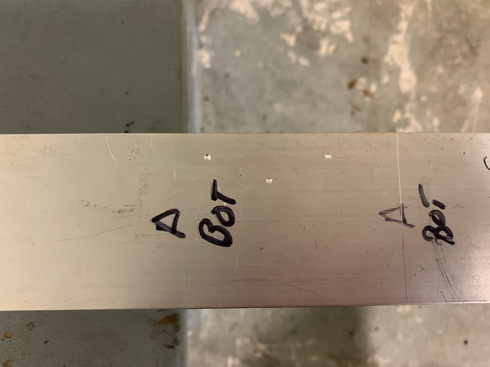
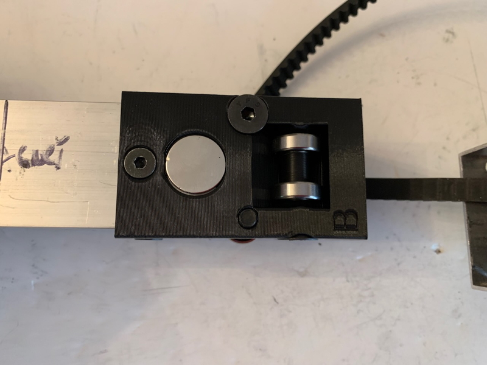
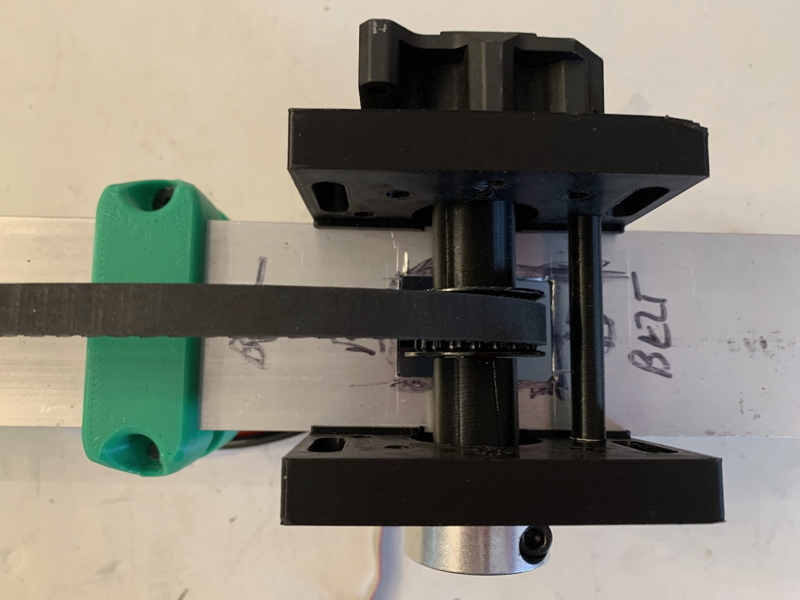

The CheapArm is a tube-in-tube device that can be both extended and retracted by a motor with the arm in any desired orientation (although you should, if possible, orient it so that the belt runs along the top when mounted). It is designed to allow you to extend and retract some sort of manipulator, but isn't designed to take high loads -- if you want to do something like lift the robot off the ground, use the [CheapLifter](/CheapLifter/CheapLifter.md) instead. I'm currently working on a heftier version using 4" tubing, stay tuned for that.

PHOTO HERE.

# Getting Started / General Notes

* Printed part files are [here](Files/). These include the Fusion 360 project, and .step and .3mf files (autoconverted) for each part. I recommend using the .step files if your slicer supports them, the quality will be slightly higher.

* Please keep in mind that this design has gone through several iterations, so some of the photos may show previous incarnations of the parts. However, the features relevant to the particular assembly step will be present and their relationship to the current design should be obvious.

* Make a copy of the [CheapArm Tube Calculator](https://docs.google.com/spreadsheets/d/1VOG0gnfYL6V5msWSxYC2G1td_zIxUzftG4l3cEdhwwI/edit?usp=sharing) Google Sheet. It contains both a calculator that lets you compute the tube lengths you will need and a complete parts list, both of printed parts and miscellaneous hardware, with links to common sources.

* The CheapArm is designed to work with the MaxPlanetary gearbox but should be easily adaptable to other drive systems as long as they can drive a 1/2" hex shaft. Additional gearbox mounts will be added to the repository when they become available -- feel free to contribute.

* When using the calculator, give some thought to how you are going to mount the CheapArm to the robot and your end-effector to the CheapLifter. For example you can, extend the outer 2" tube below the gearbox to provide an additional mounting location. You may also find the [C-Bolt Adapter]() useful.

* While you can design the CheapArm so that it's max extension is just where you *think* you want it, it is probably best to set it up so that it can over-extend and use a limit-switch, odometry or an internal interference to stop it. Another consideration is that the shorter the distance between the bearings on the Upper Bearing Block and the Inner Bearing Block at maximum extension, the greater the potential bending stresses on the device. Finally, if you are using magnetic limit switches, it is difficult to place the sensor so that you get full extension. So in general, you want to make the Outer tube as long as possible, and the extension amount as small as possible, to maximize the overlap between the tubes at maximum extension.

* The CheapArm is designed to hold magnets and be used with the [Rev Magnetic Limit Switches](https://www.revrobotics.com/rev-31-1462/). I also have some handy mounts for the switches (link needed) and some tips on connecting them directly to the limit switch inputs on the SparkMax (link needed).

* If your arm is extending just a bit too far and you want prevent this, you can replace the #10-32 x 0.375" buttonheads that secure the Upper Bearing Blocks with 0.5". This will create an interference that will slighly reduce the distance the Inner Bearing Blocks can travel.

* All printed parts are designed with an 0.4mm nozzle and 0.2mm layer height in mind, but seem to work fine with an 0.6mm nozzle and 0.3mm layer height (though some horizontal non-threaded holes may be a bit tight and require screwing in the bolt).

* You shouldn't need to use any fancy filament. Standard PLA is fine.

* Everything can be printed without support; see the Calculator Parts List tab for special instructions on particular parts. Printing with your regular wall and infill settings should be fine for everything but the MAXPlanetary Motor Mount part; that you might want to print with stronger settings. It's the only part that might conceivably get significantly stressed; if you are paranoid, use it as a template to make a replacement out of polycarbonate or aluminum (the raised ridge is to help position the part when you are using it as a drill template and is not needed otherwise, so you can replace it with a flat plate).

* The Fusion 360 project is ridiculously parametric, should you want to make changes, but keep in mind that I've been iterating it for quite some time so there is a bit of cruft in it. My apologies. Also, it just contains a skeleton for designing the parts, and is not a full model of the final assembled device.

* Tools required: Some sort of saw for cutting tubes, Hand electric drill, 13/64" drill bit, 5/32" drill bit, 1/4" (or "D") drill bit, Dremel with cutoff wheel (heavy-duty is best), assorted T-handles and wrenches, tweezers or small forceps, hand file, deburring tool, wire cutters or box cutter, small clamp, leather punch ([example](https://www.acehardware.com/departments/tools/hand-tools/punches/20416)).

* Only one bolt will require Threadlock; it is specifically noted. One of the nice things about printed 3D threads is that they work quite well as lock-nuts!

* In this documentation, a "bolt" is any sort of cap screw (regular or buttonhead).

# 1: Tube Cutting

Use the CheapArm Tube Calculator to determine the tube lengths needed. The printed parts assume you are using 0.0625" wall tube in 2" and 1.5" sizes. If you wish to use different sizes or wall thickness, you will have to open the Fusion 360 document, change the appropriate parameters, and deal with any conflicts that arise. However, because of the thickness of the belt, you won't be able to increase the wall size of the outer tube; 0.0625" is the maximum it can be. You can increase the wall thickness of the inner tube without any issues.

Cut your tubes to the required sizes, then mark each tube as follows: two opposite faces should be marked as the "A" sides, and the other two opposite faces as the "B" sides. Mark one B-side as "B-Belt" and the other as "B-Magnet". Make these notations on both the top and bottom of the tubes, so "A top", "B-Belt Bottom" and so on.

Note: after doing any cutting or drilling operation, use a deburring tool and/or file to make sure the end result is smooth.

# 2: Tube Preparation

Slide the Upper Outer Drill Guide on to the top of one side of the upper end of the Outer 2" Tube, then use a 13/64" drill bit to make 3 small divots in the tube; don't drill all the way through, just make marks so that you know where to drill. The first time you do this you will probably drill out a little plastic from the guide; this is normal since they tend to print a little undersized.

Make the same 3 divots on the other 3 sides of the upper end of the Outer 2" Tube. Then drill through all 12 divots so you now have 12 holes in the tube. After you break through the wall of the tube, give the drill a little wiggle so the hole is slightly oversized.

Test fit the Outer Tube Bearing Block to ensure the holes in the tube line up with the holes in the Bearing Block. If not, drill out the holes in the tube so they do. It isn't pretty, but you can use the edge of a drill bit to "saw" the inside surface of a hole to extend it in any desired direction -- and when the Arm is assembled, no one will be able to see that you messed up.

Next, scribe a line on all 4 bottom faces of the tube that marks the bottom edge of the Motor Mount; this is the "Additional outer tube below base for mounting purposes" in the calculator. In my case, this was 2".

Clamp a Motor Mount Plate to one of the A-sides of the tube, with the bottom edge on the scribed line. There is a ridge on the Plate that orients it relative to the adjacent B-Belt side. When correctly oriented, the bottom edge of the plate will be parallel to the B-Magnet side, the large bearing hole in the plate will slightly overlap with the A-side that the plate is clamped to, and the two vertical slots will be above the B-Belt side.

Double-check that everything is aligned properly -- it is easy for the plate to slip relative to the scribed line while tightening the clamp. Then use the 13/64" drill bit to drill 3 divots using the 3 holes directly below the large bearing hole.

Remove the clamp and Plate, and drill out the three divots. Don't expand these holes after drilling.

Replace the Plate, and use a couple of #10-32 bolts to help reposition it -- just stick them through the Plate and the newly drilled holes. You may have to screw them in with a T-Handle if the fit is a little tight, or even slightly expand the holes. Then clamp it in place so that you have unobstructed access to the 3 holes at the bottom of the plate (closest to the B-Magnet side).

Make 3 more divots, remove the clamp and Plate, and drill out the divots. Then slightly expand all 6 holes. Use 6 #10-32 bolts to check the fit of the Plate; as long as all 6 bolts can be inserted easily, and can wiggle the Plate just a little bit, it'll be fine.

Now repeat this process with the other Motor Mount Plate on the other side of the tube.

The next step is to cut an access hole for the Lower Pulley. Turn the 2" tube so that the B-Belt side is facing upwards. Then carefully scribe two lines along the tube, 0.5" in from the edges of the tube, one line across the tube 0.75" up from the gearbox scribe line, and another one 2.25" up from the gearbox scribe line. If you don't have marking fluid to make the lines easier to see, you can just use a Sharpie before scribing.

Use a Dremel with a cutoff wheel to cut out the access hole. Use a deburring tool and file to ensure there are no sharp edges.

Next, slide the Inner Tube Bearing Block onto the bottom of the Inner 1.5" tube, taking care to orient it correctly. One of the B-sides of the Bearing Block has a long slot where the belt is going to be attached; that goes on the B-Belt side. When fully seated, you should see the bottom of the tube projecting into the bearing mount area on the A-sides.

Turn the Tube so an A-side is upwards. There is one countersunk hole near the upper edge of the Bearing Block. Take the Lower Inner Drill Guide Countersink and place it on top of the Bearing Block; it has a projection that fits into the countersink. Use the drill guide and a 13/64" drill bit to make a divot.

(The two diamond-shaped holes are a leftover from an earlier iteration of the design; they are not used)

Repeat this process for the other A-side, and the B-Magnet side.

Drill out all 3 divots.

# 4 : Inner Tube Bearing Block

Refer to the Parts List in the Calculator document for details on the required parts for each components.

**Please note that there are some extra drilled holes in the tubing in the photos below; this is because during the iteration process, mistakes were made...**

Turn the Inner Tube and Inner Tube Bearing Block to the B-Magnet side; on the Bearing Block, it's the side with the large round cavity for the magnets.

Insert a 18mm Rare-Earth Magnet into the magnet cavity and press them down. It will end up underneath the tube. There is space for additional magnets in the unlikely event you need more to get a reliable reading by the Hall-effect sensor.

Slide the Bearing Block onto the Inner Tube and secure it with a #10-32 x 0.5" flathead bolt. Slide an additional 18mm Rare-Earth Magnet into the outer part of the magnet cavity; it will lock into place with the other magnets. Don't just drop it in, this can shatter the magnet!

Use two more #10-32 x 0.5" flathead bolts to secure the A-sides of the Bearing Block to the Inner Tube.

Mount a single R4-2RS Bearing into one of the A-sides using a 1/4-20 x 1.75" flathead bolt. Repeat this on the other A-side.

Mount two R4-2RS Bearings into the B-Magnet side using a 1/4-20 x 1.75" flathead bolt and a Double Bearing spacer.

The B-Belt bearings will be installed when the belt is installed (Step 7 below).

# 5 : Motor Mount

These instructions will assume you are mounting the MaxPlanetary Gearbox on the right side of the tube as seen when looking down from the bottom with the B-Belt side upwards. Everything is symmetric so you can mount it the other way if you so desire.

Mount a Motor Mount Plate and MaxPlanetary Output Stage to the right side of the Outer Tube (an A-side) using two #10-32 x 1" cap screws (buttonheads are also fine) in the positions shown below. The Output Stage will be oriented so the long flat sides are vertical (the ridge on the Plate helps ensure this), and one of the two as-yet-unused threaded mounting holes will be aligned with the hole in the "A" position on the Mount Plate.

Loosely mount the second Motor Mount Plate on the left side of the Outer Tube using a #10-32 x 0.75" cap screw and a low-profile locknut using the hole at the 6-oclock position on the circle of 8 holes surrounding the large Bearing Mount hole. It is the one directly opposite the hole marked with the "A". The locknut should be on the outside of the assembly.

Insert a Thunderhex bearing in the left-side Motor Mount Plate (the one without the output stage) from the outside, then push the Output Shaft through the bearing and into the Output Stage.

Insert a few #10-32 bolts into some of the other holes in the left-side Motor Mount Plate and through the Outer Tube to serve as a rough positioning guide. Then, while checking that the shaft can rotate freely, tighten the #10-32 x 0.75" cap screw at the 6-oclock position to secure the Motor Mount Plate.

Double-check that the shaft can rotate freely and adjust until it can. If necessary, drill out some holes on the left-side to permit you to shift the Motor Mount Plate as needed.

Next, remove the Thunderhex bearing and insert the Lower Flanged Bearing Spacer into the right-side Bearing Mount Plate next to the Output Stage. It will just loosely hang out there at this point. This spacer is used to make the two Mount Plates symmetric.

Slide the Output Shaft through the large hole in the left-side Motor Mount Plate, then slide on the WCP-0604 Drive Pulley and a Lower Pulley Spacer. Then slide the Output Shaft through the Lower Flanged Bearing Spacer and into the Output Stage

Slide a second Lower Pulley Spacer onto the exposed end of the Output Shaft. Then add the Thunderhex Bearing to the Output Shaft and slide it into the left-side Motor Mount Plate.
 

Secure the Output Shaft to the Output Stage using a #10-32 x 0.5 cap screw. Do NOT use threadlock at this point.

Add a shaft collar to the end of the Output Shaft to secure the Thunderhex bearing.

Insert a Cross-Tube Inside Spacer into the tube and align it with the uppermost of the 3 lower holes in the Mounts and tube (the one that is raised relative to the others). Tweezers or forceps will be helpful in getting the Spacer to the correct position, and once you get it close, inserting a T-handle from the outside of the Bearing Mount on the left side, threading it through the Spacer and out the Output Stage Bearing Mount and wiggling will bring it into final alignment.

Place the tip of a #10-32 x 3.00" cap screw against the tip of the T-handle and use the T-handle as a guide as you fully insert the cap screw through the Output Stage Motor Mount, tube, Inside Spacer, tube, and other Bearing Mount. Secure the cap screw with a low-profile locknut.

The purpose of the spacer is to help protect the tube against being deformed by over-tightening the bolt. While I know no teenager has ever overtightened a bolt, this device might be assembled by a Mentor, in which case, all bets are off.

You could also add 2 more cap screw and spacers in the unused holes at the bottom of the motor mounts if you feel the need.

Add the other two #10-32 x 0.75" cap screws to fully secure the Output Stage to the Motor Mount Plate. My apologies for not having a good photo of this. The bolt that is inside the tube can easily be accessed by using a T-handle through the matching hole in the opposite motor mount.

Add another #10-32 x 3.00 cap screw to the upper part of the Motor Mount assembly as shown, using a Cross-Tube Outside Spacer and a low-profile locknut. In this case, the locknut will go on the Output Stage side. Don't tighten this completely yet. 

# 6: Outer Tube Bearing Block

**NOTE**: The Outer Tube Bearing Block design has iterated since some of these photos were taken, so they don't quite match in some minor ways that do not affect the assembly process.

Looking into the Outer Tube Bearing Block from below, you will see some strings of filament bridging the slot where the belt will travel. This is an artifact of a 3D Printing design trick used to create the large shelf that the Outer Tube will rest on without having to print (or remove) any support. I learned this trick from the [Maker's Muse YouTube Channel](https://www.youtube.com/watch?v=KBuWcT8XkhA).

Cut and remove these filaments. The side that had these filaments is the B-Belt side of the Bearing Block.

Looking down on the Bearing Block with the B-Belt side facing towards you, start with the A-side to the right and mount a R4-2RS bearing into its bearing mount slot using a 1/4-20 x 1.75" flathead, but do not fully tighten it. Instead, tighten it until you can just see the tip of the bolt appear in the bolt access hole for the bearings on the B-Belt side.

Move on to the B-Belt side, and mount two R4-2RS bearings into its bearing mount slot with a 1/4-20 x 1.75" flathead. Do not use a Double Bearing Spacer. Again, do not fully tighten the bolt.

Continue by adding a single R4-2RS bearing to the remaining A-side, and two R4-2RS bearings to the B-Magnet side; this time, include a Double Bearing Spacer.

Finally, fully tighten all 4 flatheads. The final results will look like this:

Check that the Thunderhex bearings fit properly into the large bearing mounts of the Upper Bearing Block, flange to the outside. You may have to use a knife to scrape a bit of drooping filament from inside top of the bearing mounts to get a good fit. Then remove the bearings.

# 7 : Installing the Belt

**NOTE**: Some of the photos from this point on include other hardware such as Hall Effect Sensor Mounts; this is because they were taken during reassembly of the arm after a design iteration.

Cut a length of 9mm timing belt as directed by the results of the Calculator. On both ends, cut flush against the bumps. I found that using wire nippers worked very well.

Remove the Lower Pulley Assembly from the Motor Mount and set the parts aside. Then thread the timing belt into the slot in the tubing and up through the tube.

Remove the two R4-2RS bearings on the Outer Tube Bearing Block on the B-side that features the pulley support arms and set them aside.

Insert the Inner Tube up and into the Outer Tube Bearing Block, oriented so the B-Belt side of the Inner Tube Bearing Block is facing the pulley support arms (the side where you just removed the bearings).

Thread the end of the timing belt that is on the outside of the Outer Tube down through the gap between the Outer Tube Bearing Block and the Inner Tube. It will help in the subsequent steps if the two tubes are oriented perpendicular to each other, as this will give you more slack on the belt.

Partially insert a 3/4" 10-32 bolt into the threaded hole in the bottom of the Inner Tube Bearing Block. Leave about 50% of the threads visible -- the tip of the bolt will not protrude into the interior slot in the Bearing Block through which the belt is going to be inserted.

Next, pinch the two ends of the timing belt together so the teeth interlock.

Insert the timing belt ends into the slot in the bottom of the B-Belt-side bearing bucket, taking care to ensure that the teeth remain interlocked.

Push the ends through the bearing block as far as they will go; they will end up pressing against the Double Bearing Spacer on the other side of the Inner Tube Bearing Block.

You will use the tiny yet important Inner Tube Bearing Block Belt Clamp to lock the belts into position. Note that one end of the top edge of the Belt Clamp has a small bevel on it.

Press the Belt Clamp down between the two belts with the bevel facing towards the bottom of the Inner Tube Bearing Block. It should click into place with the top surface of the Belt Clamp even with, or very slightly above, the surface of the Bearing Block.

Mount the two remaining R4-2RS bearings into the Inner Tube Bearing Block using a 1/4-20 x 1.75" flathead. The Belt Clamp will act as a bearing spacer, and the bolt will lock the Belt Clamp (and thus the belt ends) in place.

Note: if the Belt Clamp can't be pushed down far enough to thread the bolt through it, then gently pull on one of the timing belt ends while maintaining gentle pressure on the Belt Clamp to keep it in position until the timing belt ends "click" upwards by one tooth's distance. Then it will go together easily.

Tighten up the 10-32 x 0.75" bolt on the bottom of the Inner Tube Bearing Block to add some extra paranoid clamping to the belts. Don't tighten it all the way, just until you feel the additional resistance that means the bolt is pushing into the belts.

# 8 : Final Assembly

Insert the Inner Tube into the Outer Tube, then seat the Outer Tube Bearing Block into the Outer Tube. Secure the Outer Tube Bearing Block to the Outer Tube using 10-32 x 3/8" buttonheads. On three sides, 2 buttonheads should be sufficient although there is provision for a third, but on the belt side you can use only one.

The loops on two sides of the Outer Tube Bearing Block can be used to zip-tie wires. You can also attach a cable chain using one of the unused threaded holes.

These buttonheads actually thread into the Bearing Block, not the tube itself, and act as locator pins and interference locks. They can slightly protrude past the inner wall of the Outer Tube, which isn't a problem with the exception of the single bolt on the belt side, which may rub against the belt. For this reason, when installing this bolt, add a thin washer to provide additional spacing.

Remount the Drive Pulley to the Motor Mount. This time, use threadlock on the cap screw that secures the hex shaft to the Output Stage.

Reinstall the two bearings previously removed from the Upper Bearing Block, trapping the belt below the bolt.

Install the Upper Pulley using two ThunderHex bearings, two shaft collars, and a 4" length of 1/2" hex shaft. Thread the hex shaft through the bearing mounts on the Upper Bearing Block and capture the belt and pulley in position, then add the Thunderhex bearings and shaft collars.

**Note**: if the belt seems to be too tight and you are having trouble installing the Upper Pulley, then backtrack to the installation of the Belt Clamp and loosen it by one "click" to lengthen the belt.

While holding a washer against the slot on the Output Stage side of the Motor Mount, insert a 1/4-20 x 3.25" cap screw through the washer into the slot, then add a Tensioner Spacer, two R4-2RS bearings, and a second Tensioner Spacer. The fit will be quite tight but this is intended. Push the bolt through the slot on the other side and secure with a second washer and a locknut, but do no tighten the locknut.

Gently push down on the Tensioner Spacers to remove the slack in the belt, then tighten the bolt. You don't need a lot of tension on the belt, just enough to ensure it can't slip. Mine vibrates for a few seconds if I pluck it. Also tighten the nearby #10-32 x 3" cap screw.

If you can't tighten the belt to remove the slack, then your belt is too long; backtrack to the Belt installation step and trim one end of the belt by a tooth or two, then reassemble.

Test the arm by smoothly moving it up and down as far as it will go. It should slide with little friction. If you feel extra friction just before it reaches full extension, you probably didn't fully tighten one of the bolts that holds the belt to the Inner Bearing Block. If this offends you, you'll have to remove the pulleys and the Outer Bearing Block to get access to the Inner Bearing Block and adjust the bolts.

If you somehow strip the threads on any of the #10-32 bolts in the Inner Bearing Block, you can try using a slightly longer bolt. The B-Belt side bolts can be .75" (upper) or 1.5" (lower) long, and the bolts on the other sides can be as long as 0.625".

Congratulations! Your CheapArm is fully assembled.

# 9 : Maintenance

A quick spray of silicone lubricant down into the tube through the Upper Bearing Block with the arm fully extended before each competition should be all that is required, if anything.