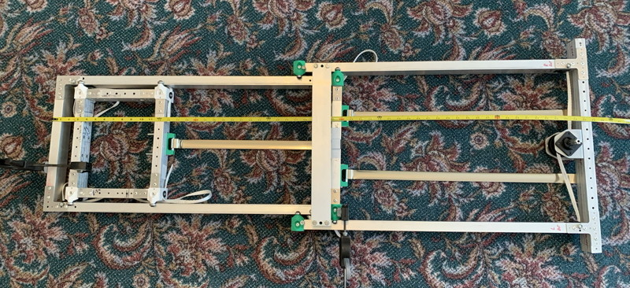

The CheapElevator is my take on the classic multistage elevator, and was inspired by the GreyT design as well as Team 4414's [belt in tube](https://www.chiefdelphi.com/t/team-4414-hightide-2023-robot-tsunami/428584/154) design. Since elevators vary widely in size, number of stages, and so on, this particular design is presented as a set of components that can be packaged together to provide the desired configuration and a number of printable templates to make the tube preparation and construction easier.

Key Design Points:

* Dirt-cheap; the major cost will be the 2x1 0.0625-wall tubing; you can also use 0.100 tubing if you prefer, but IMHO it's overkill. Parts that are affected by a change in wall size have a -0.100 variant (but I haven't tested them, so caveat constructor).
* Very flexible; drive motor can be placed inside or outside the mechanism.
* Simple drive mechanism; active in one direction, passive in the other with optional constant-force springs if gravity isn't your friend.
* Uses Pull Tape as the drive belt; can be driven on one or both sides. Note: this is not going to be as accurate as using a toothed belt because the tape can stretch.
* Easy to build with broad tolerances.

As with my other designs, the photos may not have caught up with the current iteration of the design, and since I was using tubing scraps (and updating the design as I went) there are random slots and holes in the tubing that would not appear in a final build.

Finally, this design is one of my earliest experiments in incorporating 3D printing into the construction process and the first elevator I ever built; while there are elements that you may wish to use or can serve as design inspiration, I wouldn't consider it robust enough for a competition robot.

# General Design Notes

An elevator consists of an Inner Carriage that supports your mechanism, a Base Frame that encloses and constrains the carriage, and zero or more Outer Frames that allow the elevator to telescope. If you just need something that moves up and down but does not need to extend past the starting height of the robot, you won't need a design with an Outer Frame.

Lengths of pull tape run from the bottom of the carriage up to a Triple-Bearing Pulley Assembly (TPA) at the top of the base frame and down inside the base frame tubing. If there are outer frame(s) as well, the tape is redirected by another TPA and then runs up between the tubes, through another TPA at the top of the next outermost frame, and down inside the tubing again.

Eventually the tape(s) get to your winch motor; you can use TPAs at the bottom of the elevator to direct the tape in any direction you want; in my example build, the winch is located centrally, but you could mount it external to the elevator if you so desired.

* Printed part files are [here](Files/). These include the Fusion 360 project, and .step and .3mf files (autoconverted) for each part. I recommend using the .step files if your slicer supports them, the quality will be slightly higher.

# Dimensions

Your first decision is how wide and tall your inner carriage should be, which will depend in large part upon what you're going to attach to it. Each additional stage will add 3" to the total width of the device, so if you have a 12" wide carriage, a base frame and an outer frame, the total width will be 18". The mininum height and width of the carriage is 6", though you could reduce this as low as 3" with custom gussets.

Use the [CheapElevator Calculator](https://docs.google.com/spreadsheets/d/1SxL0iE9zIfQeAu0bF7MAiIEZN1gicfAuSZnt3R_fJng/edit?usp=sharing) to the lengths of the tubes you will need based on the desired collapsed and extended lengths and position of the winch. It also has a parts list and shopping list links.

Note that the Inner Carriage and the Base Frame are always constructed with the horizontal cross-tubes extending for their full width, because their open ends are a useful place to tuck bearings.

My carriage was 10" high and 12" wide, and the max extension was 58". After accounting for the placement of the winch spools, this resulted in Base and Outer Frame vertical tube lengths of 30".

Note that the vertical tube lengths provided by the calculator are just the minimum needed to get the required max height and/or stroke lengths. You should strongly consider making them longer and use a mechanical stop on the Outer Frame to limit how far the Base Frame can extend (such as adjusting the position of the Outer Frame Cross Brace, which limits the travel of the device). By keeping the Outer / Base Bearing Mount bearings as far apart from each other as possible, you reduce the potential for bent tubes due to unexpected impacts.

# Inner Carriage Construction

Parts Required:

* 4 Corner Bearing Mounts (printed)
* 1 Corner Alignment Template (printed)
* 1 CFS Mount Hole Template (printed)
* 1 Corner and T Guide (printed, optional)
* 1 Large Corner or Edge Guide (printed, optional)
* 4 lengths of 2x1 0.0625 square tubing
* 8 WCP-0858 Gussets
* 8 1/4-20 x 0.5" Buttonheads
* 8 1/4-20 x 0.75" Buttonheads
* Pop Rivets

The Inner Carriage is constructed from 4 lengths of 2x1 tubing. As mentioned above, 0.0625 tubing should work fine. You will need two horizontal tubes the width of your carriage, and two vertical tubes that are length-2". You will also need 8 WCP-0858 gussets and 4 assembled Corner Bearing Mounts.

The horizontal tubes will need 3 13/64" rivet holes drilled on each end of the 1" sides of the tube (12 holes total per tube), centered between the faces, and 0.5", 1.0" and 1.5" inset from the end of the tube. You may find my Corner and T Guide makes this easier; it and many of the other more generic drill guides are in the Miscellaneous section of this repository. The vertical tubes will need 2 rivet holes, similarly positioned, 0.5" and 1.0" from the end of the tube (8 holes total per tube).

You should also drill any other mounting holes you will need at this time. You may find the Large Corner or Edge Guide helpful for this.

Each Corner Bearing Mount requires 4 R4-2RS bearings and 2 0.5" and 2 0.75" 1/4-20 buttonheads. Because of the constrained area where two of the bearings are mounted, you will also need to take an old allen wrench that fits the bolts and cut it down to form a "shorty" tool that is more of a "J" than an "L" (see photo).

Start by hand-threading just a bolt into one of the four bearing mount holes as much as you can (it won't be much) and then use your new J-wrench to tighten the bolt by a few turns to fully cut the first few threads. Check as you go that the bolt is corrrectly threading by looking at it from multiple directions, and use the J-wrench to gently bend it into the correct orientation.

Remove the bolt and repeat the process for the other three holes. Then slide a R4-2RS bearing onto each bolt and mount it to the Bearing Mount, using the 0.5" bolts for the two mount holes that face each other (and need the J-wrench), and the 0.75" bolts for the other two bearings. In the photo below, we're halfway through the process.

I apologise for not having good photos of this next part, but the photos in the next section (which has an almost identical assembly process) should be informative.

Assemble the tubes using corner clamps and check that they are square, and that the open ends of the horizontal tubes are accessible (in other words, the vertical tubes are clamped between the horizontal tubes, so their open ends are blocked). I find using an additional clamp between the horizontal tubes can help get everything nice and tight.

Drill out 5 holes in each WCP-0858 gusset so they can accept a rivet. Place a WCP-0858 gusset in each corner, and use the Corner Alignment Template to hold it in the correct position. Mount each gusset using 4 rivets (0.25" clamping length should be fine), omitting the corner rivet hole.

Unclamp the Inner Carriage, flip it over, reclamp, and repeat the process with 4 more WCP-0858 gussets.

Now mount a Corner Bearing Mount in each corner and secure with two rivets (slightly longer ones in this instance). Each of them has two cone-shaped cutouts to permit access by your riveting tool. They can only be installed one way; the surface that contains 6 drill guide holes will be flat against the horizontal tube, and two of the bearings will partially tuck into the open end of a horizontal tube.

Each corner bearing mount has 6 drill guide holes on its endplate. For the two Corner Bearing Mounts on the bottom of your Carriage, drill a rivet hole in the most centrally located guide hole (the one down the centerline of the horizontal tube). These will later -- much later -- be used to mount the Pull Tape to the Carriage, and will herinafter be referred to as the Forgotten Carriage Holes. The others are just there in case you need them for some reason (such as adding extra rivets).

It's probably a good idea at this point to mark the Carriage so you know which is the top, bottom, front and back.

Finally, use the CFS Mount Hole Template to drill two holes into the top and bottom faces of the bottom horizontal tube, centered between the vertical tubes. These holes are where the Square U-bolt that holds the Constant Force Spring will mount. The holes you drill are the opposed pairs; the 5 other holes are there to make it easier to align the holes with any existing marks or holes on the tube. Note that the drilled holes are offset from the centerline of the tube; this is so the tab of the CF Spring can be riveted directly to the side of the matching tube. You can mount the spring towards the front or rear of the Inner Carriage, whichever makes more sense. You could even mount them to the top and configure the elevator to be passive-extend, active-retract (though if you find an application for this, let me know!)

Once the holes are drilled with the template, widen them out to accept the large square U-bolts using a 3/8" drill bit; the bolts are 5/16 but you will want a very loose fit.

The following photos show the template with rivets being used as alignment pins, and the final assembly (which gets done later).

# Base Frame Construction

Parts Required:

* 2 Corner Bearing Mounts (printed)
* 1 Corner Alignment Template (printed)
* 1 Tape Pulley Slot Template (printed)
* 1 Large Corner or Edge Guide (printed, optional)
* 4 lengths of 2x1 0.0625 square tubing
* 8 WCP-0858 Gussets
* 4 1/4-20 x 0.5" Buttonheads
* 4 1/4-20 x 0.75" Buttonheads
* Pop Rivets

The Base Frame is a 4-sided frame that completely encloses the Inner Carriage. The tubes are prepared in much the same way; the horizontal tubes will be 3" longer than those in the Inner Carriage, and the vertical tubes will be whatever length you decide upon based on your application.

Use the Corner and T Guide to drill the rivet holes in exactly the same way as you did for the Inner Carriage (3 on each end and each side of the horizontal tubes, 2 on each end and side of the vertical tubes). Then use the Tape Pulley Slot Template to mark a rectangular slot on the inside top and outside bottom of the 2" wide faces of the vertical tubes. You may want to mark the tube sides as "Inside Top" and "Outside Bottom" when you do this.

The Pulley Slot Template has a lip that rests on the edge of the tube to get the positioning correct; for the next step, you may want to clamp it in place. The template has two wings that clasp the 1" sides of the tube, each with a hole in it. Use these holes to make dimples with a 13/64" drill bit, then expand them to a 1/4-20 loose fit by using a .25" drill bit and a little wiggling.

Use a dremel or other slitting tool to cut out the slots you marked in the previous step. I found that reinforced cutting wheels made reasonably short work of this.

The Pull Tape will wrap around a Tape Pulley Hood that fits inside the slot; it will be installed in a later slot.

The Base Frame is clamped together and riveted in exactly the same way as the Inner Carriage, with one important addition -- the Inner Carriage is fitted inside it before it is riveted together! When you are done, the Inner Carriage will slide smoothly up and down.

Be very careful that the slots are in the correct positions; inside-top and outside-bottom.

Eagle-eyed readers will notice that the slots don't seem to be in the right position in the above photograph; this is because I later iterated the design to move the slots more toward the ends of the tubes to provide a slightly longer travel distance. For this reason, in some of the later photographs, you will see somewhat extended slots.

Next, assemble 2 Corner Bearing Mounts in the same way as you did when building the Inner Carriage and rivet them to the bottom corners of the Base Frame. Note that the top corners don't have Bearing Mounts; you can just rivet the remaining 4 holes in the top corners.

# Outer Frame Construction

Parts Required:

* 2 EndCap Bearing Mounts (printed)
* 1 Corner Alignment Template (printed)
* 2 Cross-Brace Crush Blocks (printed)
* 1 Cross-Brace Alignment Template A (printed)
* 1 Cross-Brace Alignment Template B (printed)
* 1 Tape Pulley Slot Template (printed)
* 1 Large Corner or Edge Guide (printed, optional)
* 4 lengths of 2x1 0.0625 square tubing
* 4 WCP-0858 Gussets
* 4 1/4-20 x 0.5" Buttonheads
* 4 1/4-20 x 0.75" Buttonheads
* Pop Rivets

Your elevator can have anywhere from zero to any number of Outer Frames, depending on how many stages you want, but in almost all cases, a single one will be enough. An Outer Frame is very similar to a Base Frame, but has an open top so that the Base Frame can move up past the top of the Outer Frame, the top horizontal tube is offset so that this is possible, and the Bearing Mounts are located at the top of the Outer Frame (thus, the Base Frame is supported by its two Bearing Mounts and the ones on the Outer Frame).

If for some reason all sanity eluded you and you decided you need more than one outer frame, then you'd install two Corner Bearing Mounts in the bottom corners of the sliding Outer Frame(s).

The tubes are prepared in much the same way; the horizontal tubes will be 3" longer than those in the Base Frame, and the vertical tubes will be whatever length you decide upon based on your application. As in my test build, your lower horizontal tube may be longer than needed to provide a more secure mount for the device.

Use the Corner and T Guide to drill the rivet holes in exactly the same way as you did for the Inner Carriage (3 on each end and each side of the horizontal tubes, 2 on each end and side of the vertical tubes). Then use the Tape Pulley Slot Template to mark a rectangular slot on the inside top of the 2" wide faces of the vertical tubes. The location of the slots on the bottom of these tubes depends on where you decide to mount the winch pulley; for example, if you mount it centrally as I did in my test build, then the slots will be on the inside. Basically, you cut out a slot anywhere you need to run the tape.

Refer to the Base Frame instructions for details on how to mark and cut the slots and axle holes for the pulleys.

Assemble two Endcap Bearing Mounts (in the same way as with the Corner Bearing Mounts) and rivet them to the top of the vertical tubes. Make sure they are pointing in the correct direction -- bearings towards the inside.

Temporarily install the Base Frame/Inner Carriage Assembly into the Outer Frame and clamp them together so that when you rivet the two vertical tubes to the bottom horizontal tube, everything is nicely aligned and spaced.

Remove the Base Frame/Inner Carriage Assembly from the Outer Frame.

Place the Cross-Brace Alignment Template A on the outside of the vertical tube as shown below, then mark and drill 3 1/4" holes on each of the 1" faces. Note that these holes are offset towards the inside of the tube so as not to interfere with the tape.

Use the Cross-Brace Alignment Template B to mark and drill matching holes in the ends of the top horizontal tubes.

Insert a Cross-Brace Crush Block into each end of the top horizontal tube with the embossed "B" facing out and wiggle it into position using a t-handle and a 1/4-20 bolt so that the bolt holes are all lined up. This will be a tight fit, so remember: "If brute force isn't working, you're not using enough!"

Set these parts aside for later assembly.

Figure out where you're going to mount the Winch and add whatever mounting brackets are needed so that the winch hex shaft can be mounted in place. In my case I had some spare L brackets that provided a 2" bolt circle which I riveted to the bottom horizontal tube of the Outer Frame, and I printed a pair of ThunderHex mounts (files in Miscellaneous) so I could temporarily mount the hex shaft.

# Triple-Bearing Pulley Assembly Installation

For each pulley slot, you will need a Triple-Bearing Pulley Assembly.

Parts Required (per Pulley Assembly):

* 2 Triple-Bearing Pulley Caps (printed)
* 1 Triple Bearing Pulley Mount (printed)
* 2 Triple-Bearing Pulley Spacers (printed)
* 1 Triple-Bearing Webbing Guard (printed)
* 3 R4-2RS bearings
* 1 1/4-20 x 2.5" Bolt and Locknut (3.5" for the two assemblies used on Outer Frame Endcap pullies)

Note: The Pulley Mount, Spacer and Webbing Guard are all sized for 0.625" wall tubing, but have been exported as multi-body STEP files; you can delete one of the bodies in each to resize them to fit 0.100" wall tubing.

Press-fit two Pulley Caps onto two R4-2RS bearings. To install a Pulley Assembly into a slot in one of the vertical tubes, you will need tweezers, a few bolts to temporarily hold things, and a bit of patience; it isn't hard but it does take a little practice. The final assembly process is simpler if you pre-install the Pulley Assemblies, since all you'll have to do is remove the center bearing to thread the Pull Tape through the assembly

Orient the elevator so that the slot being installed into is facing upwards; this makes gravity your friend.

First, slide a Webbing Guard onto the edge of the slot furthest from the end of the vertical tube; this will prevent the Pull Tape from rubbing on the tube at this point.

Insert the two Pulley Spacers into the slot and slide them to the 1" tube faces, flat side down, and the weird clip side up and lined up with the axle holes that were previously drilled. Partially insert a couple of bolts into the axle holes and into the spacers to hold them in place. You will note that their bizarre shape provides clearance for any nearby rivets.

Insert the Pulley Mount into the slot, open side facing away from the end of the vertical tube (and thus, towards where the Pull Tape is coming from and going to). Wiggle the 1" bolts a little deeper so they hold the Mount in position. Note that there is a slot in the back of this Mount that will come in handy if you decide you need to mount your motor externally and run two Pull Tapes; it will let you merge the two tapes on the pulley.

Wrap a scrap of Pull Tape around the three R4-2RS bearings (with Pulley Caps on the outside, of course) and pinch the tape to hold them in place. Lower them into the Pulley Mount, then wiggle one of the bolts entirely through the assembly and out the other side of the tube, displacing the other temporary bolt. Secure with a locknut, but just finger-tighten; you'll be partially removing them during final assembly.

All the bolts should go through the tubes in the same direction, so all the nuts end up on the same side; this will make final assembly easier.

The entire assembly, sans tube and Pull Tape, looks like this:

# Pull Tape Preparation

Parts Required:

* 2 Tape Spool Halves (printed, per discrete Pull Tape)
* Pull Tape length(s)
* Hex Shafting

You can configure the Elevator with either a single Pull Tape on one side, or a pair of Pull Tapes on both sides. In the latter case, you can either use two individual Pull Tapes and two Tape Spools (as I did in my test build) or a single combined Pull Tape with the webbing loop sewn near the center.

For individual Pull Tapes, measure from the desired Tape Spool location to the lowermost Pulley Assembly on the Outer Frame, then add twice the sum of the Outer Frame and Base Frame vertical tube length, plus an 20-25" to permit easy assembly. Cut the needed lengths, then wrap one end around a length of Hex Shaft and sew a loop on it. The loop shouldn't be tight around the shaft; a little slack will make assembly easier.

For a single combined Pull Tape, do the same measurements and add them together, cut the required length, and mark the central point on the the tape. Note that if your Tape Spool location is not centered (as it is in my test build), the central point won't be in the middle of the tape. If the two sides are of different lengths, mark which side is which! Sew a loop at the central point so you can insert the Hex Shaft there.

Take a Sharpie and make marks on the Pull Tape(s) every 6 inches so you can distinguish the inside face of the tape from the outside; this will help you to avoid twisted Tape during assembly.

Thread the Pull Tape(s) onto the Hex Shaft, capture them with Tape Spool Halves, and temporarily install everything in your winch mount. In my case, I used two spools, and set them up so that the Pull Tapes were installed 180-degrees out of phase of each other.

These instructions assume you are installing two Pull Tapes.

# Pulling Everything Together (Literally)

Parts Required:

* 2 Tape Clamp Plate (printed)
* 2 Cross-Brace Spacers (printed)
* 4 or 6 1/4-20 x 4.5" bolts, washers and locknuts
* Rivets

Place the Outer Frame on the floor and then place the Base Frame / Carriage on the floor so that the bottom of the Base Frame is a few inches above the top of the Outer Frame. All of the Pulley Assemblies should be oriented so the locknuts are touching the floor.

Now begin the process of fishing the Pull Tape through the tubes, starting with the Outer Frame tubes, and then proceeding with the Inner Frame tubes. The easiest way I've found to do this is to find some old pocket tape measure and "liberate" the metal tape from it, cutting off both ends and putting a small gentle bend on the tip, creating a Leader Tape. You can then slide it behind the pulley in a top Pulley Assembly and thread it down and out from behind the pulley in the matching bottom Pulley Assembly; a magnet and tweezers can be helpful in grabbing the loose end.

Tape the Pull Tape to the Leader Tape and gently pull on the Leader Tape to thread the Pull Tape through the tube. Keep gentle tension on both the Pull Tape and Leader Tape to ensure that neither twists during the process (the reason for marking the tape in the previous step). Scotch tape the Pull Tape to the tube you just threaded it through at both top and bottom so that it is still under gentle tension and won't accidentally twist.

In some of the pictures below, the Pulley Assemblies are not installed and the orientation of the tubing is not as described above (I was testing the procedure). However, they should give you a general idea of the process. If you have difficultly threading the Leader Tape behind the pullies, you can thread it in front of them and once fully threaded through the tube, partially disassemble the Pulley Assemblies, remove the central bearing, thread the Pull Tape, and reassemble.

Once you have completed this process for the Outer Frame, it is time to repeat the process with the Base Frame / Carriage Assembly. The Pull Tapes will span from the inside top of the Outer Frame to the outside bottom of the Base Frame. Again, use some Scotch tape to keep the sections of Pull Tape that are inside the tubes under a little tension, leaving about a foot of loose Pull Tape between the two sections (ie: more than in the photo below!)

Once the tapes are fully threaded, slowly insert the Base Frame / Carriage Assembly into the open top of the Outer Frame. You will have to remove the temporary Scotch tape from the loose end of the Pull Tape and allow it to flow through the pullies as you move the Base Frame down to it's fully contracted position. 

While maintaining tension on the Pull Tapes, slide the Base Frame down into the Outer Frame as far as it will go. Retape the Pull Tapes to maintain tension.

Wind your Tape Spool(s) so that a couple of turns of Pull Tape are wound on them and lock them in place so they can't rotate.

Thread the Pull Tapes down between the Base Frame and Inner Carriage. Triple-check that the Pull Tapes didn't get twisted somehow, it's very easy to do.

Move the Inner Carriage as far down as it will go. Wrap the Pull Tape around the bottom of the lower Corner Bearing Assemblies of the Inner Carriage, and, with moderate tension on the tape, make a mark on the Pull Tape at the point where it crosses its associated Forgotten Carriage Hole (as mentioned in the section of Carriage Assembly, in case you forgot. The idea is to have equal tension on the two Pull Tapes when you mark them.

Thread a rivet through a Tape Clamp Plate and through the Pull Tape at the point marked and rivet it to the associated Forgotten Carriage Hole. The Clamp Plates have little ridges that help grip the Pull Tape.

Cut off the excess Pull Tape but leave a few inches hanging loose in case Mistakes Were Made™.

Mount the Outer Frame top horizontal tube to the Outer Frame, offset from the vertical frame members by the Cross-Brace Spacers, using 4-6 1/4-20 x 4.5" bolts, washers and locknuts. The Cross-Brace Spacers now have an SP embossed on them, these should be oriented so the SP faces outwards.

# Harness the Power of the Constant Force Springs

Parts Required (per spring assembly):

* CFS Spring Adapter (printed)
* 5/16 x 3L x 2W Square U-Bolt, plate and nuts
* Rivets

When performing this procedure, you may find it helpful to have the Elevator stages clamped together or oriented vertically to maintain tension on the Pull Tapes.

For each CF Spring, slide a CFS Spring Adapter into the Square U-Bolt, then slide the CF Spring onto both, with the tab of the spring oriented outwards; remember that the U-Bolt mount holes you drilled are offset towards one face of the horizontal tubes -- the CF springs will be attached to the matching parallel face of the next outermost horizontal tube.

The choice of spring strength will depend on your application.

Insert the complete assembly into the pre-drilled holes in the horizontal tube, add the included plate, and tighten the bolts until the Spring Adapter is flush with the bottom of the tube.

Center the spring on the U-Bolt, extend it, and use it to mark the matching position on the adjacent horizontal tube. Drill a rivet hole at that point and rivet the CF Spring to the tube.

# Final Tweaking

Your Elevator is now completely assembled. If you have used a temporary length of hex shaft to mount the Pull Tape Spools, you can use a drill and hex socket to test its operation. Be careful as it is easy to get pinched fingers, in particular in the vicinity of the cross brace tube. Also be careful when retracting, it can retract quite fast if there isn't anything to stop it, and you don't want the Pull Tape to go slack - if this happens, the Tape has a nasty habit of getting caught under a bearing, and it will take an annoying amount of wiggling to free it again.

If you detect excessive friction in the mechanism, the most likely cause is a slight misajustment of the cross brace. Loosen the bolts, run the mechanism back and forth a few times, then retighten.

