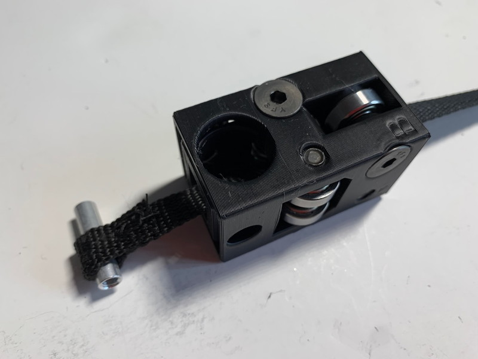
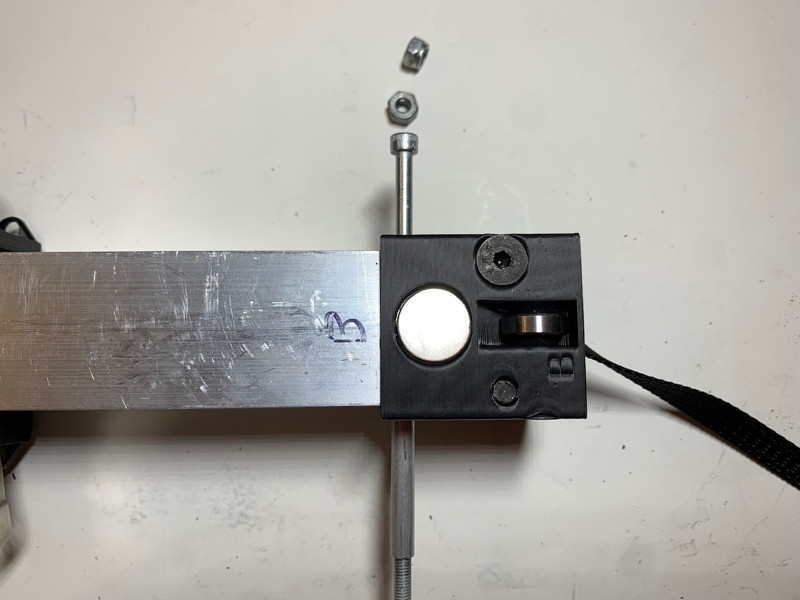
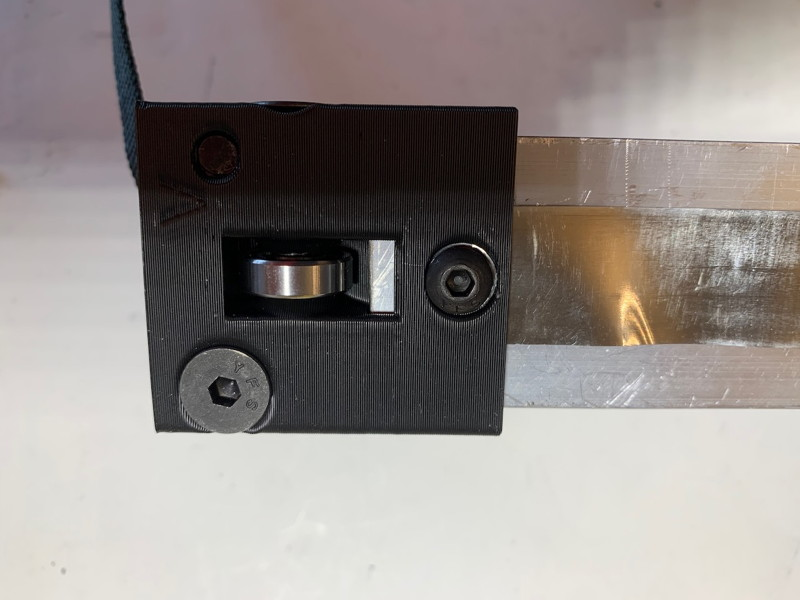
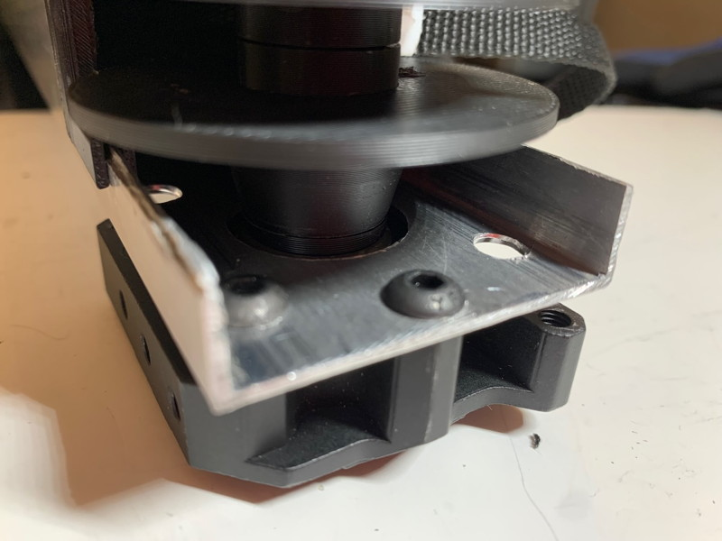

The CheapLifter is a 1- or 2-stage device that can extend, hook on something, and then lift your robot off the ground. It was inspired by the [AndyMark Climber in a Box](https://www.andymark.com/products/climber-in-a-box).

Advantages: Cheaper, easier to assemble, slides easier, can operate off-vertical if desired, better extension/retraction calibration, built-in magnetic sensor support.

# Getting Started / General Notes

* Printed part files are [here](Files/). These include the Fusion 360 project, and .step and .3mf files (autoconverted) for each part. I recommend using the .step files if your slicer supports them, the quality will be slightly higher.

* Some of the [Useful Items](../Useful/Useful.md) may come in handy, such as the CheapHook and Magnetic Sensor Mounts.

* Make a copy of the [CheapLifter Tube Calculator](https://docs.google.com/spreadsheets/d/1iEG3kZutJFlLP7Bltak_Qm8BbZuVjLVuW6xnxnCjw1k/edit?usp=sharing) Google Sheet. It contains both a calculator that lets you compute the tube lengths you will need and a complete parts list, both of printed parts and miscellaneous hardware, with links to common sources.

* The CheapLifter is designed to work with the MaxPlanetary gearbox but should be easily adaptable to other drive systems as long as they can drive a 1/2" hex shaft. Additional gearbox mounts will be added to the repository when they become available -- feel free to contribute.

* You can use pretty much any Constant Force Springs you have handy, assuming they are long enough; the [springs that AndyMark sells](https://www.andymark.com/products/0-625-in-wide-30-in-long-constant-force-spring) should work fine in both a 1-stage and 2-stage device as long as the stroke length is under 25" or so (keep in mind that you need extra length on the springs because they can't be allowed to fully unwind). You may need a heftier spring if you have a heavy end-effector or are operating off-axis. 

* When using the calculator, give some thought to how you are going to mount the CheapLifter to the robot and your end-effector (aka "The Hook") to the CheapLifter. Speaking of hooks, see the CheapHook for a simple and sturdy way of using a hardware-store U-bolt as a hook. In our 2022 robot, we extended the outer 2" tube below the gearbox to provide an additional mounting location and connected the outer tube to the robot using a hinged C-bolt halfway up (link to model here) and a sturdy bolt through the lower extension that was spring-loaded; this provided some shock-relief if the tube took a major shock, at least front-to-back.

* I recommend using a 1-stage design unless you **absolutely** need the slightly reduced minimum height of a 2-stage. The 2-stage typically will only buy you about 6-8 inches of reduced minimum height.

* While the AndyMark Climber uses a cord to retract the device, the CheapLifter uses 3/8" flat [Polyester Pull Tape](https://www.amazon.com/VEVOR-Polyester-Pull-Tape-Functions/dp/B09B3K1PRM). This means it winds very consistently onto the tape spool, and you should be able to use odometry on the winch motor to drive it to intermediate positions with reasonable accuracy. In my initial test build, I used [nylon webbing](https://www.amazon.com/VEVOR-Polyester-Pull-Tape-Functions/dp/B09B3K1PRM) instead; it is not as strong as pull tape but it can be bought in smaller lengths. This is why, in the photos, you see black nylon webbing instead of white pull tape. **Since pull tape comes in 1000-foot reels, I am not likely to run out of it anytime soon, so if you want some, contact me and I'll send you 50 feet for $10 (postage included anywhere in US).**

* While you can design the CheapLifter so that it's max extension is just where you *think* you want it, it is probably best to set it up so that it can over-extend and use a limit-switch, odometry or an internal interference to stop it. The CheapLifter is designed to hold magnets and be used with the [Rev Magnetic Limit Switches](https://www.revrobotics.com/rev-31-1462/). I also have some handy mounts for the switches (link needed) and some tips on connecting them directly to the limit switch inputs on the SparkMax (link needed). Please be aware that if you are using magnetic limit switches, it is difficult to place the sensor so that you get full extension, so you should build in a couple of inches of extra travel to accommodate this limitation. Apart from being more flexible, one quirk of the passive-extend-active-retract design is that if you keep extending past the top limit, the motor will start winding the Tape Loop back down again! This can be confusing during competition if you don't guard against it, but if you can reliably use odometry to measure your extension, then you can eliminate the need for the top limit switch. Finally, if the arm is going to experience twisting moments during a lift (because its axis doesn't pass through the CG of the robot), you want as much distance as possible between the bearings on each set of concentric tubes to reduce the pressure between the bearings and the tube walls.

* If the total travel distance of your arm (contracted to extended) is less than 30", you can use the Small Tape Spool Discs instead of the Medium ones; these fit entirely inside the 2" outermost tube. However, unless you like the challenge of performing a colonoscopy on your mechanism during assembly, I would recommend still cutting the slots in the side of the outermost tube. The normal Medium Tape Spool Discs can hold about 60" of tape.

* If you are building a 2-stage device, the magnets should only go on the innermost bearing block, and should only be used to prevent over-retraction (which will stall the gearbox and put a lot of stress on the tape). The reason for this is that when the device is extending, you can't be 100% sure which stage will finish extending last; it'll depend on the strength of the springs, internal friction, and probably also the phase of the moon. The only way to be sure would be to have two sets of magnets and two upper-limit sensors, which creates all sorts of possible failure modes. Since over-extension is not a problem (the tape just goes a little slack), and since the tape winds consistently, motor odometry will work fine for stopping extension at the top of travel.

    * If your arm is extending just a bit too far and you want prevent this, you can replace the #10-32 x 0.25" buttonheads that secure the Upper Bearing Blocks with 0.375". This will create an interference that will slighly reduce the distance the Inner Bearing Blocks can travel. If this is not enough, you can drill and tap some #10-32 holes in the tubing just below the Upper Bearing Blocks and use #10-32 x 0.375" buttonheads to reduce the travel distance even further.

* All printed parts are designed with an 0.4mm nozzle and 0.2mm layer height in mind, but seem to work fine with an 0.6mm nozzle and 0.3mm layer height (though some horizontal non-threaded holes may be a bit tight and require screwing in the bolt).

* You shouldn't need to use any fancy filament. Standard PLA is fine.

* Everything can be printed without support; worst-case you might have to enable brim on a few of the parts. Printing with your regular wall and infill settings should be fine for everything but the MAXPlanetary Motor Mount part; that you might want to print with stronger settings. It's the only part that might conceivably get significantly stressed; if you are paranoid, use it as a template to make a replacement out of polycarbonate or aluminum (the two side wings are to help position the part when you are using it as a drill template and are not needed otherwise, so you can replace it with a flat plate).

* Another idea to consider is expanding the Motor Mount so that is also serves as a mount bracket for the entire device; in this case you will probably want to mirror it on the gearbox side as well. This is fine, but you will need to add a hex shaft spacer the same thickness as your mount to the final assembly to hold the Tape Spool in the correct position.

* Part files include the Fusion 360 project, and .step and .3mf files for each part. I recommend using the .step files if your slicer supports them, the quality will be slightly higher.

* The Fusion 360 project is ridiculously parametric, should you want to make changes, but keep in mind that I've been iterating it for quite some time so there is a bit of cruft in it. My apologies. Also, it just contains a skeleton for designing the parts, and is not a full model of the final assembled device.

* Tools required: Some sort of saw for cutting tubes, Hand electric drill, 13/64" drill bit, 5/32" drill bit, 1/4" (or "D") drill bit, 1" hole saw, Dremel with cutoff wheel (heavy-duty is best), assorted T-handles, 3/8" wrench, tweezers or small forceps, hand file, deburring tool, wire cutters or box cutter, small clamp.

* Only a few bolts will require Threadlock; these are specifically noted. One of the nice things about printed 3D threads is that they work quite well as lock-nuts!

* In this documentation, a "bolt" is any sort of cap screw (regular or buttonhead).

# 1: Tube Cutting

Use the CheapLifter Tube Calculator to determine the tube lengths needed. The printed parts assume you are using 0.0625" wall tube in 2", 1.5" and 1" (2-stage only) sizes. If you wish to use different sizes or wall thickness, you will have to open the Fusion 360 document, change the appropriate parameters, and deal with any conflicts that arise (changing the wall size should not be an issue).

Note that the innermost tube (1" in a 2-stage, 1.5" in a 1-stage) can be thinner than 0.0625 if desired and the printed parts will still work. This is because no bearings need to roll on their inner surfaces. However, the thinner the tube, the more likely it will bend if it gets hit in an unexpected manner.

Cut your tubes to the required sizes, then mark each tube as follows: two opposite faces should be marked as the "A" sides, and the other two opposite faces as the "B" sides. Make these notations on both the top and bottom of the tubes, so "A top", "B Bottom" and so on. The end result should be something like this:

Note: I used pre-drilled tubing for my 1" tube during prototyping because that's what I had handy. Normally you would use undrilled tubes.

# 2: Tube Preparation

Test fit all the 3D-printed parts that attach directly to the tubes; these are the MAXPlanetary Motor Mount, Outer Tube Upper Bearing Block, Middle Tube Lower Bearing Block, and (2-stage only) Middle Tube Upper Bearing Block and Inner Tube Lower Bearing Block. You will note that all of these parts have letters embossed on them that indicate how they are oriented relative to the tubes; match "A" to A-side and "B" to B-side. Make sure the tubes are fully-seated into the parts. In the case of the MAXPlanetary Motor Mount, you will need to offset it from the end of the 2" tube by the amount you decided you needed below the gearbox for mounting purposes ("Additional outer tube below base for mounting purposes" in the spreadsheet); therefore, scribe a "gearbox bottom" line offset from the bottom of the 2" tube by this amount on all 4 sides of the tube to make positioning the mount easier. I also recommend clamping the mount while doing the drill templating operations as it will have a tendency to "walk".

Next, use the parts as drill templates to mark the locations where you are going to drill the tubes. You will need two drill-bit sizes for this; for most of the holes (including all of the countersunk holes) you can use a 13/64" drill bit, and for the other, smaller holes a 5/32" will suffice. Use your drill to make a small divot in the center of each hole location -- do not drill all the way through! If the divot ends up off-center, increase the size of the divot with some sideways pressure on the drill bit to walk the center of the divot to the center of the guide hole.

You will make the following divots:

* Upper Bearing Block(s): Place the Bearing Block on the top end of the tube and make 4 divots using the 5/32" bit, one on each side of the wall, centered.

* Lower Bearing Block(s): Place the Bearing Block on the bottom end of the corresponding tube and make 8 divots, two on each side of the wall (4 using the 13/64" bit, 4 using the 5/32" bit) plus an additional divot further up on each of the A-sides (for a total of 10).

* MAXPlanetary Motor Mount: 7 divots on each of the A-sides (you will need to use the Motor Mount as a template twice) using the 13/64" bit.

Remove the printed parts, and carefully drill through each of the divots using the 13/64" bit.

Next you are building a 2-stage lifter, very gently drill out the two holes on the lower A-sides of the 1" tube using either a "D" (.246) or a 1/4" drill bit. Otherwise, if you are building a 1-stage lifter, drill out the two holes on the lower A-sides of the 1.5" tube using either a "D" (.246) or a 1/4" drill bit. Check the size of these holes using the Round Standoff, and gently expand them (insert drill bit, drill while precessing like a gyroscope) until the fit is close but you can insert and remove the Standoff. Don't obsess if you make the holes a little bigger than you want, it isn't critical.

On the outermost 2" tube A-bottom sides, use a 1" diameter hole saw to expand the central hole. You could also chop this out by hand using a Dremel if you do not have access to a hole saw.

Finally, mark both outermost 2" tube B-bottom sides as follows: vertical lines 1/2" in from each side wall, and horizontal lines as follows:

* If the gearbox is not offset from the bottom of the tube (eg: "Additional outer tube below base for mounting purposes" is 0), scribe a single horizontal line 2.25" up from the bottom of the tube.

* If the gearbox *is* offset from the bottom of the tube, scribe horizontal lines 2.25" up from the gearbox bottom line and 0.25" below it.

Use the dremel to cut slots in both 2" tube B-bottom sides along the lines you have marked. If your gearbox is not offset, you will have to cut 3 edges, otherwise you will have to cut 4. Don't worry too much if the cuts are a bit ragged, precision is not required here.

* If the gearbox *is* offset from the bottom of the tube, you may wish to consider extending *one* of the slots to the end of the tube if it will not cause you any structural concerns. Doing so will make the installation of the tape spool and gearbox slightly easier. I would suggest only extending the slot if you are having trouble with the motor mount installation process.

The end result should look something similar to this:

Note: in some photos, you may see some extra holes; this is because I was using scraps of old tubing for my test build, and also because, as the saying goes, "mistakes were made."

# 3 : Sewing the Tape Loops

The Calculator will tell you what length of pull tape you will need. Each end of the tape needs to be sewn to create a loop. The entire robot will be hanging on these loops, so it's important to make these as strong as possible.

Cut the required length of tape and lightly flame the ends to melt the fibers; this will prevent them from fraying.

Wrap the top end of the tape around the small aluminum Round Standoff and overlap it by about 3/4" inch, then go to town with a needle and strong thread (I used nylon thread) and firmly sew the tape together to form a loop. I am no seamster, but I used a combination of horizontal, vertical and diagonal X-stitches to create a strong, if messy, connection. I found it easiest to just thread the thread through the needle and leave it doubled for the entire length (a couple of feet if memory serves), so each stitch was actually doubled. Remember to knot the ends together so they can't possibly unravel. Wrapping a bit of tape around the sewn area to secure any loose threads might not be a bad idea.

You will sew a loop on the other end of the tape when you assemble the Motor Mount.

At this point, if you are building a 1-Stage lifter, you can skip to Step 6. However, I strongly suggest you read through steps 4 and 5 as they contain many tips and suggestions that are relevant to later steps, and many of the steps are almost identical. The photographs are extremely helpful as the components in the 1-stage and 2-stage versions largely are scaled versions of each other.

In all subsequent sections, refer to the Parts List in the Calculator document for details on the required parts.

Finally, in my test build I used nylon webbing instead of polyester pull tape, so every time you see a photo of black webbing, don't believe your lying eyes, it's actually white pull tape. :)

# 4 : Inner Tube Lower Bearing Block (2-Stage Only)
t
Thread the upper Tape Loop through the center of the Bearing Block from the bottom. Note the orientation; it is parallel to the B-sides. Temporarily insert the Round Standoff into the Tape Loop to keep it from slipping backwards.

Mount the 6 R4-2RS bearings into the Bearing Block using the 4 1/4-20 x 1.25" Flathead bolts. The bearing slots on the B-sides take a single bearing, and the slots on the A-side take 2 bearings separated by an Inner Tube Lower Bearing Spacer. The separation between the double bearings provides space for the Tape Loop to pass through the Bearing Block without touching the bearings. Threads are printed into the Bearing Block so all you have to do is insert the bearings, thread the bolts through them, and *gently* tighten until the top of the flatheads is roughly even with the surface of the bearing block.

Remove the Round Standoff from the the upper Tape Loop and gently pull the tape back into the Bearing Block until it is even with the through-hole. Use a T-handle to wiggle it into the correct position.

Insert 3 18mm Rare Earth Magnets into one of the B-sides of the Bearing Block so they rest on top of the Tape Loop. These will end up inside the 1" tube. We need a total of 5 magnets to get a strong reading from the Magnetic sensor on the outside of the 2" tube; the other two will go on the outside of the 1" tube and the two sets will strongly attract each other.

You can install the magnets on either side of the Bearing Block, or even both sides if you need to mount sensors on both sides of your 2" tube for some reason.

Then gently insert the bottom of the 1" tube into the Bearing Block and wiggle it until it is fully seated. Be sure to match the sides properly; A to A, B to B. Remove the T-handle when you have to. Note that the tube will slightly intrude into the double-bearing slot; this is normal. Check that the bearings can freely rotate; if they can't, remove the tube and file down the end slightly to provide the proper clearance.

*Slide* two more 18mm magnets into the matching B-side magnet hole. Be careful as these magnets are very strong and if you just try and drop them into the magnet holes, they may shatter! Gently sliding them into the holes works best, and they should want to flip into the correct orientation. They will pull the 3 inside magnets flush against the inner side of the tube wall (and away from the Tape Loop).

Reinsert the T-handle through the Bearing Block and the Tape Loop. Wiggle it and gently tug on the Loop to make sure you have it properly captured.

Take a long #10-32 bolt (at least 2") and, using the T-handle as a guide (removing it while inserting the new bolt), thread it through the Bearing Block and Tape Loop.

Screw the Round Standoff onto the end of the bolt.

Screw another long #10-32 bolt into the other end of the Round Standoff, then gently push and pull the standoff through the Bearing Block and Tape Loop until both ends of the Standoff are flush with the outside surface of the 1.5" tube. If the two holes are slightly off-axis, you may need to put a gentle sideways torque on the Standoff with one bolt while tapping on the other one. If they are more seriously misaligned, you may have to remove the Bearing Block and drill out the holes a bit more. In the end, as long as the two ends of the standoff are definitely engaged with the wall of the tube, it'll be fine.

Remove the two bolts, and you should see something like this:

You will use flatheads to secure the spacer in a later step.

# 5 : Middle Tube Upper Bearing Block (2-Stage Only)

**Safety Note: wear gloves while handling Constant Force Springs**. The edges are sharp and they can deliver a high-velocity spring-steel paper cut.

Mount 2 of the 4 R4-2RS bearings to the B-sides of the Bearing Block using 1/4-20 x 1.25" Flatheads, but do not fully tighten the bolts; if you do, the tip of the bolt will project into the A-side bearing bolt access holes. Instead, tighten each bolt until the tip of the bolt is level with the next bolt's access hole.

Feed the two Constant Force Springs through the Bearing Block along the A-sides and past the bottom. Place #10-32 x 0.5" Buttonheads through the springs to help keep them in place and prevent them from springing backwards, which for some reason, springs are wont to do. Then insert the Inner 1" Tube with it's attached Inner Tube Lower Bearing Block into the Bearing Block, taking care to match the sides, A to A, B to B.

Use a small clamp to prevent the Upper Bearing Block from sliding and getting in the way, then extend one of the Constant Force Springs, remove the #10-32 x 0.5" Buttonhead from the spring, slide the tab of the spring into the slot on the top edge of the Bearing Block, line up the bolt holes, and after adding a dab of threadlock, fasten it using the #10-32 x 0.5" Buttonhead. Only tighten it enough to ensure it has properly engaged with the Standoff; since the Standoff can spin, you can't fully tighten it at this point.

Do not follow my bad example -- wear gloves for this step.

Repeat the process for the other Constant Force Spring. My springs are a little beaten-up, as you can see, but they work fine.

Since the two Buttonheads are threaded into the Standoff, and the Standoff can rotate, you will need to use two T-handles or two Allen Wrenches (or, if you are feeling adventurous, one of each) to tighten them. When you do, you will force the Standoff to be fully engaged with both 1" tube walls, and the tape will therefore be securely connected to the tube.

Mount the 2 remaining R4-2RS bearings to the A-sides of the Bearing Block using 1/4-20 x 1.25" Flatheads. Fully tighten all 4 1/4-20 bolts (but don't go overboard, just tighten until you feel the resistance increase).

Insert a Middle CFS Spool into the center of each of the Constant Force Springs, then attach both to the Bearing Block using a #10-32 x 1.5" Flathead.

Thread the tape down through the Middle 1.5" Tube and insert the top of the tube into the bottom of the Middle Tube Upper Bearing Block. Make sure to match sides as always.

Lock the Bearing Block into position on the Tube using 4 #10-32 x 0.25" Buttonheads. Note that the threads for these bolts are in the Bearing Block, and they just project through the Bearing Block and Tube, ending up with their tips flush with the inside of the Tube. All they do (and all they need to do) is prevent the Bearing Block from popping off the Tube!

If all has gone well, you should be able to manually collapse the 1" tube, and it should travel smoothly thanks to the bearings. **DO NOT JUST RELEASE THE 1" TUBE AND LET IT SNAP UPWARDS!** This can damage the assembly! The tube will be able to jiggle a little bit, which will mean that it will continue operating if one of the tubes gets dinged or bent in combat -- *umm, I mean, competition*.

# 6 : Outer Tube Upper Bearing Block (Initial Assembly)

Mount 2 of the 4 R4-2RS bearings to the B-sides of the Outer Tube Upper Bearing Block using 1/4-20 x 1.75" Flatheads, but do not fully tighten the bolts; if you do, the tip of the bolt will project into the A-side bearing bolt access holes. Instead, tighten each bolt until the tip of the bolt is level with the next bolt's access hole.

**Safety Note: wear gloves while handling Constant Force Springs**. The edges are sharp and they can deliver a high-velocity spring-steel paper cut.

Feed the two Constant Force Springs through the Bearing Block along the A-sides and past the bottom. Place #10-32 x 0.5" Buttonheads through the springs to help keep them in place and prevent them from springing backwards.

Slide the 1.5" tube (which will have the previously assembled initial stage attached to it if you are making a 2-stage device) down through the Upper Bearing Block. Make sure to match the A- and B-sides.

# 7 : Middle Tube Lower Bearing Block Initial Assembly

There are two variants of the Middle Tube Lower Bearing Block, the 1-stage and the 2-stage. The difference is that the 1-stage device can accept a Standoff that is used to secure the tape and the Constant Force Springs, whereas the 2-stage variant has internal threads that directly accept the bolts that secure the Constant Force Springs.

Both variants are prepared by mounting 4 R4-2RS bearings using 1/4-20 x 1.75" Flatheads. As with all bolts that are threading into printed parts, take care not to overtighten these bolts.

If you are making a 1-stage device, skip to Step 9.

# 8 : Middle Tube Lower Bearing Block Final Assembly (2-Stage)

Thread the tape from inside of the 1.5" tube down through the center of the Middle Tube Lower Bearing Block. Gently insert the bottom of the 1.5" tube into the Bearing Block and wiggle it until it is firmly seated. Be sure to match the sides properly; A to A, B to B.

Use a small clamp to prevent the Upper Bearing Block from sliding and getting in the way, then extend one of the Constant Force Springs, slide the tab of the spring into the slot on the top edge of the Bearing Block, line up the bolt holes, and secure the spring using a #10-32 x 0.5" Buttonhead. Remember not to overtighten.

Repeat the process for the other Constant Force Spring.

Now skip to step 10.

# 9 : Middle Tube Lower Bearing Block Final Assembly (1-Stage)

Thread the upper Tape Loop through the center of the Bearing Block from the bottom. Note the orientation; it is parallel to the B-sides.

Gently pull the tape back into the Bearing Block until it is even with the through-hole. Use a T-handle to wiggle it into the correct position.

Insert a single 18mm Rare Earth Magnet into one of the B-sides of the Bearing Block. It will end up inside the 1" tube. We need a total of 3 magnets to get a strong reading from the Magnetic sensor on the outside of the 2" tube; the other two will go on the outside of the 1.5" tube and the two sets will strongly attract each other.

You can install the magnets on either side of the Bearing Block, or even both sides if you need to mount sensors on both sides of your 2" tube for some reason.

Gently insert the bottom of the 1.5" tube into the Bearing Block and wiggle it until it is firmly seated. Be sure to match the sides properly; A to A, B to B. Remove the T-handle when you have to. Note that the tube will slightly intrude into one pair of bearing slots; this is normal. Check that the bearings can freely rotate; if they can't, remove the tube and file down the end slightly to provide the proper clearance.

Reinsert the T-handle through the Bearing Block and the Tape Loop. Wiggle it and gently tug on the Loop to make sure you have it properly captured.

*Slide* two more 18mm magnets into the matching B-side magnet hole. Be careful as these magnets are very strong and if you just try and drop them into the magnet holes, they may shatter! Gently sliding them into the holes works best, and they should want to flip into the correct orientation. They will pull the inside magnet flush against the inner side of the tube wall.

Take a long #10-32 bolt (at least 2") and, using the T-handle as a guide (removing it while inserting the new bolt), thread it through the Bearing Block and Tape Loop.

Screw the Round Standoff onto the end of the bolt, and screw another long #10-32 bolt into the other end of the Round Standoff.

Gently push and pull the standoff through the Bearing Block and Tape Loop until both ends of the Standoff are flush with the outside surface of the 1.5" tube. If the two holes are slightly off-axis, you may need to put a gentle sideways torque on the Standoff with one bolt while tapping on the other one. If they are more seriously misaligned, you may have to remove the Bearing Block and drill out the holes a bit more. In the end, as long as the two ends of the standoff are definitely engaged with the wall of the tube, it'll be fine.

Remove the two bolts, and you should see something like this:

Use a small clamp to prevent the Upper Bearing Block from sliding and getting in the way, then extend one of the Constant Force Springs, remove the #10-32 x 0.5" Buttonhead from the spring, slide the tab of the spring into the slot on the top edge of the Bearing Block, line up the bolt holes, and after adding a dab of threadlock, fasten using the #10-32 x 0.5" Buttonhead. Only tighten it enough to ensure it has properly engaged with the Standoff; since the Standoff can spin, you can't fully tighten it at this point.

Repeat the process for the other Constant Force Spring.

Since the two Buttonheads are threaded into the Standoff, and the Standoff can rotate, you will need to use two T-handles or two Allen Wrenches (or, if you are feeling adventurous, one of each) to tighten them. When you do, you will force the Standoff to be fully engaged with both 1.5" tube walls, and the tape will therefore be directly connected to the tube in a way that does not place any stress on the Bearing Block.

# 10 : Outer Tube Upper Bearing Block (Final Assembly)

Mount the 2 remaining R4-2RS bearings to the A-sides of the Upper Bearing Block using 1/4-20 x 1.75" Flatheads. Fully tighten all 4 1/4-20 bolts (but don't go overboard, just tighten until you feel the resistance increase).

Insert a Outer CFS Spool into the center of each of the Constant Force Springs, then attach both to the Bearing Block using a #10-32 x 1.75" Flathead.

Thread the tape down through the Outer 2" Tube and insert the top of the tube into the bottom of the Outer Tube Upper Bearing Block. Make sure to match sides as always.

Lock the Bearing Block into position on the Tube using 4 #10-32 x 0.25" Buttonheads. Note that the threads for these bolts are in the Bearing Block, and they just project through the Bearing Block and Tube, ending up with their tips flush with the inside of the Tube. All they do (and all they need to do) is prevent the Bearing Block from popping off the Tube!

If all has gone well, you should be able to manually collapse the entire assembly, and it should travel smoothly thanks to the bearings. **DO NOT JUST RELEASE THE INNER TUBES AND LET THEM SNAP UPWARDS!** This can damage the assembly! The tubes will be able to jiggle a little bit. Tolerance for imperfection is a good thing in both Engineering and Real Life.

# 11 : Tape Spool and Motor Mount

Installing these final components is not difficult but because of the need for bolt access, it has to be done in a particular order. I've included a lot of photos to help make things more clear.

These instructions assume that, looking from the top, the Motor Mount plate is always on the left, and the MAXPlanetary 1/2in Hex Socket Output Stage is on the right.

Glue the two Tape Protectors to the top edges of the slot in the tubing (CA glue works fine). These will ensure the tape never rubs on the tubing. After the glue is dry, completely collapse the device and make sure the tape is not twisted. Slowly allow the tubes to extend while maintaining tension on the tape.

Lay the tape on top of the tube and mark a point about 9 inches above the top of the tubing slot. Cut the tape to that length and flame the end to prevent fraying.

Wrap the end around some hex shaft so there is about 3/4" of overlap between the two parts of the tape and securely sew them together to form a loop. The loop should have a little slack in it, it doesn't need to be tight around the hex shaft; it should be easy to insert and remove the shaft.

Temporarily tape the tape to the B-side of the 2" tube so it wont accidentally get twisted again or get in the way.

Clip the three support struts on the Motor Mount plate and remove the central drill guide. Clean up the stubs and check that a ThunderHex gear fits snugly in the plate.

Loosely attach the Output Stage to the right A-side using four #10-32 x 0.5" buttonheads as shown. *Use a dab of threadlock on all the buttonheads that are bolted to the Output Stage.* **Do not tighten them yet.**

Loosely attach the Motor Mount plate to the left A-side using two #10-32 x 0.5" buttonheads and two #10-32 low-profile locknuts with the nuts on the outside.

Insert the ThunderHex bearing into the Motor Mount plate, then insert the hex drive shaft (should be threaded #10-32 on the Output Stage side) through it and into the Output Stage. Check that it freely rotates, and that you can adjust the Motor Mount plate and Output Stage so that the shaft is aligned perpendicular to the tube. While doing this, you can use any long #10-32 bolt to check that the other Motor Mount holes line up properly with the holes drilled in the tube.

If you can't get the alignment correct, or the holes don't line up, then you will have to disassemble the two parts and drill out the mounting holes. Since all of the stress under load is going to be pulling upwards, if you need to adjust the alignment, you should expand the mounting holes on the side that is too low, so that when that component shifts up to come into alignment, the stress will (as much as possible) be directly transmitted through the bolts into the tubing.

Hopefully, unlike me, your holes will align the first time. If you look closely at the photos you can see that I had to enlarge some of the holes on one side.

When the stars, and your hex drive shaft, align, tighten the two bolts (the ones with nuts) securing the Motor Mount. 

With the hex shaft still inserted, tighten the two Output Stage buttonheads that are easily accessible with a T-handle through open holes in the Motor Mount.

Then remove the hex shaft and tighten the other two Output Stage buttonheads with an Allen Wrench.

Use four #10-32 x 0.5" buttonheads and four #10-32 low-profile locknuts, nuts on the outside, to completely secure the Motor Mount. At this point, the Output Stage will be secured with 4 bolts, and the Motor Mount will be secured with 6 bolts.

Each half of the Tape Spool consists of two parts, the Spool Hub and the Spool Disc. The Disc has a small hole in it that permits access to the gearbox bolts using a T-handle or allen wrench, should that be required -- at the time they were designed, it was!

Snap together one of the segments, leave the other in separate parts for now.

Remove the ThunderHex bearing from the Motor Mount plate.

Insert the unassembled Spool Disc through the slot, then insert the Hex Shaft through the Spool Disc.

Recollapse the tubes and double-check that the tape hasn't gotten twisted despite your best efforts, then allow it to extend again slowly. Put the Tape Loop in the slot and push the Hex Shaft through it.

Insert the assembled Spool Half through the slot and push the Hex Shaft through it. It'll be a bit of a tight fit to get it through the slot, but with a bit of wiggling, it'll get there.

Insert the Hex Shaft into the Output Stage; rotating the output stage's exposed gear helps with this.

Wiggle the Tape Loop into the Hub of the assembled Spool Half. I find pulling it gently upwards and to the right while rotating the shaft back and forth with the wide slot in the Hub generally facing upwards works well. You can also try pushing it in with tweezers.

Slide the other Spool Hub onto the shaft, through the Motor Mount bearing opening, and through the loose Spool disc, it should click into place. Make sure that the wide slots of the two Hubs are aligned.

Then wiggle the assembled Spool Half onto the tape, completely trapping it. Note: if your 1" holes ended up a little off-center (guess whose did...) you may need to temporarily remove the Hex Shaft from the Output Stage in order to insert the Spool Hub.

Turn the assembly on its side, Output Stage down. Gently pull the shaft out of the Output Stage and insert a Tape Spool Spacer onto the end of the shaft. You should be able to just slide it into place with tweezers, then rotate the shaft a bit to get it to seat.

Reinsert the shaft into the Output Stage and secure it with a #10-32 x 0.5" buttonhead.

Add a second Tape Spool Spacer on the other end of the shaft, replace the ThunderHex Bearing, and secure it with a lock collar.

Wind the Tape onto the Spool until it becomes taut. This will distribute the stress when the tape comes under load and avoid any issues with the Tape slipping on the Hex Shaft.

Congratulations! Your CheapLifter is fully assembled.

# 12 : Maintenance

Unlike your humble author, the CheapLifter is quite low-maintenance. A quick spray of silicone lubricant down into the tubes through the Upper Bearing Blocks followed by a few manual collapse/extend cycles before each competition should be all that is required, if anything.