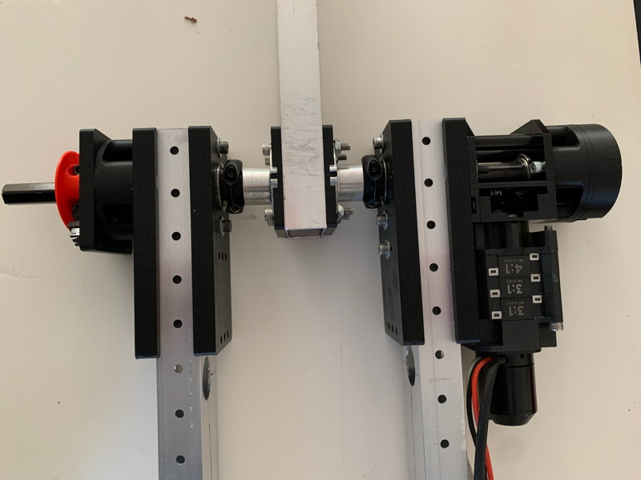

The CheapShoulder is a rotating arm sandwiched between two support tubes, with everything constructed out of 2x1 tubing. It uses a MaxPlanetary gearbox and right-angle gearbox but can be used with other drive systems. It is compatible with the offset shaft sensor mounts you can find in the [Useful Parts](/Useful/Useful.md).

The related [CheapWrist](/CheapWrist/CheapWrist.md) is a lighter-duty rotating arm that uses only a single in-line support.

# Getting Started / General Notes

* Fusion 360 project is [here](Files/).

* The Gearbox Mount Plates and other flattish parts can be made from Polycarb on a CNC router if you prefer, just export some DXFs. They are currently sized for a 3-stage MaxPlanetary gearbox but that can be parametrically adjusted using the MAXPLANETARY_NUM_STAGES constant.

* In this documentation, a "bolt" is any sort of cap screw (regular or buttonhead).

* I lost my notes about how long various bolts are, but it should be fairly obvious -- sorry!

* Please note that while I have built a prototype it hasn't been extensively tested.

# 1: Tube Cutting

Cut some 2x1 tubing for the support arms and the rotating arm. The project assumes .0625-wall tubing, you will need change the parametric settings for other sizes as this is used to size the crush blocks.

On the support tubes, use the Gearbox Mount Plate Drill Guide to make divots for two mounting bolts and the shaft hole, then drill the upper and lower holes for #10 bolts. Use a hole-saw to drill the center hex shaft hole (you can also use a step-drill but if you're hand-drilling this will tend to wander, and you'll end up having to drill oversized). Ignore the extra holes in this and other bits of tubing, I was doing my test build with scraps...

Sandwich the tubes with Gearbox Mount Plates and #10 bolts, and use them as drill guides to drill out the other mounting holes for #10 bolts as needed. On the gearbox side, you can drill up to 6 holes to completely lock in the MaxPlanetary gearbox, though 3 or 4 is probably sufficient. On the non-gearbox size 1 or 2 bolts should be enough.

For the rotating arm, use the Arm Hub Mount Drill Guide to mark 5 holes and drill the outer 4 for #10 bolts and the central one for your hex shaft.

For each of the tubes, I recommend you print the associated GearBox Mount and Arm Hub Mount Crush Blocks using strength settings. These slide inside the tubes and prevent them from deforming under stress (typically caused by overzealous bolt-tightening).

# 2: Gearbox Support Arm Assembly

Mount the Right Angle Gearbox to the MaxPlanetary with 2 #10-32 bolts. Don't forget that you need a short stub of hex shaft that gets attached to the MaxPlanetary Output Stage with a #10 bolt.

Mount the Gearbox to the Gearbox Mount Plate with 4 #10-32 bolts (two of these are temporary, just to hold things in position). Mount the MaxPlanetary to the Mount Plate using all the mounting holes that you are NOT going to later fill with through-bolts in the next step (ie: the ones you didn't drill through-holes for in the previous step).

Once everything is nice and locked in position, remove the top and bottom #10-32 bolts surrounding the hex shaft hole as these will be replaced by through bolts. Insert a Crush Block into the tubing, sandwich it with the Gearbox assembly and a second Gearbox Mount Plate, and use #10-32 through-bolts to secure everything in place. You can insert a length of hex shaft and rotate it to make sure there are no interferences.

I don't have a picture of this part of the assembly but here's a close-up of my final build (I ran out of through-bolts!).

# 3: Second Support Arm Assembly

It's basically the same as the Gearbox Support Arm except -- no gearbox! If you are mounting a shaft sensor on this side, you'll basically attach the offset mount of the sensor onto one of the plates in much the same way as you did the gearbox (so two small mount bolts on the plate, and two through-bolts.)

# 4: Pivot Arm Hub Assembly

Slide an Arm Hub Crush Block inside your tubing and sandwich it with two Arm Hub Mounts, each of which has an inset to hold an [AM-2568 500EX Hex Hub](https://www.andymark.com/products/500ex-hex-hub). Bolt the entire assembly together with 4 #10-32 bolts.

# 5: Final Assembly

Now all you have to do is thread everything onto your hex shaft, add Thunderhex bearings as desired (I used 3, one on the Gearbox side and two on the other side), and everything them in place with shaft collars and spacers (as needed). In my case, I printed some Brace Plates (in the project) to hold the two support arms at a distance just wide enough for the Pivot Arm Assembly so no spacers were needed, but in any real build the support arms are likely going to be more widely spaced.

# 6: Sensor Mounts

There are numerous sensors you might want to put on the arm, so I quickly designed some Offset Shaft Sensor Mounts (look in the [Useful Parts](/Useful/Useful.md) for the files). The basic offset mount comes in several flavors depending on whether you need to screw bolts directly into it or use through bolts, or some combination. There is enough space between the legs to snake in split shaft collars as needed.

I have included sensor mounts for a CanCoder magnetic rotation sensor (put the magnet in the end of the shaft) and the Lerdge.com optical endstops (it also has a removable protective cap), but any mount that works on the common 2" bolt circle should be compatible.

Here are some closeups of the mounts which should give you a better idea of how things work.

