The CheapTurret converts a common 12" Lazy-Susan (it's actually 300mm, btw) into a functional turret with about 330 degrees of rotation and the ability to route power and data cables through a cable chain. It also has optical endstops, is powered by any sort of motor you want (I used a NEO and a MaxPlanetary gearbox), and uses a length of timing belt to convert the Lazy-Susan into a ring gear.
 

NOTE: This is a work-in-progress and hasn't been properly tested yet. Your comments and suggestions are particularly appreciated.

# General Design Notes / Getting Started

* Printed part files are [here](Files/). These include the Fusion 360 project, and .step and .3mf files (autoconverted) for each part. I recommend using the .step files if your slicer supports them, the quality will be slightly higher.

* The 12" (300mm) Lazy-Susan can be purchased on Amazon, there are many suppliers. An example of the type you want can be [found here](https://www.amazon.com/Dailydanny-Aluminum-Rotating-Turntable-Dining-Table/dp/B07T2D8D71). The key dimensions are an external diameter of 300mm and an internal diameter of about 246-247mm. They tend to vary in the number of mounting holes on the inner and outer rings, the one we had lying around the build space from a previous project had 4 on the inner ring, but 3 and 6 are also common.

* If you can't find a match to the bearing I used, the included Lazy Susan Fusion 360 file can be modified to adjust it to your exact bearing size. When you update the main Fusion 360 file you'll probably have to correct a lot of things, but you should be able to adapt it to fit your circumstances. The same applies if a completely different size is needed (which will depend on the game, of course).

* If an upcoming game has a use for a turret of a different size, I will adapt this project to match (and provide a firm link to the correct lazy-susan part on Amazon).

* The endstops use [Adafruit Beam Break Sensors](https://www.adafruit.com/product/2167) which are dirt-cheap ($3 each at time of writing) and easily to interface. You will need to connect a 10k pull-up resistor between the white (or yellow) signal line on the receiver and the red +V line. See their [tutorial page](https://learn.adafruit.com/ir-breakbeam-sensors/arduino) for more details. The sensor is active-low (0 = beam has been interrupted by something).

* As this is a work-in-progress the instructions are not as comprehensive as some of the other projects.

# The Base Plate

The base mount for the turret is a 16"x16" square of polycarbonate. There are 3 mount plates (Motor Mount Plate, Opposite Corner Mount Plate, and Short Corner Mount Plate) that serve as drill / cutout guides -- they have small tabs that can be used to align them on the edges of the polycarbonate square. In my initial test build I just used them directly, but I do not recommend this in an actual robot. In addition to the holes and slots actually needed for the build, these plates all have a grid of holes just in case mount points were needed during development.

Also included is a chain mount plate which is just a grid of holes that can be used as a drill guide. In a real build, you will need to extend the front of the mounting plate a few inches to provide a deck where the cable chain can curl up. In the photo at the top of this document you can see my final test build; in that case I just CNC'd a 16"x6" plate with a grid of holes.

# Constructing the Ring Gear

Converting the Lazy-Susan to a Ring Gear is pretty straightforward. First, you drill out the holes in the Lazy-Susan so they accept 10-32 bolts (some of them come threaded, and the outer ring holes do not go all the way through the aluminum).

Before:

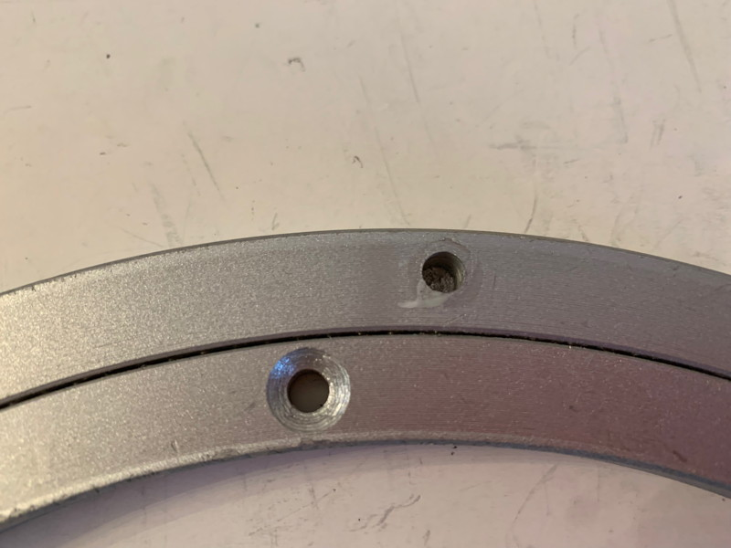

After:

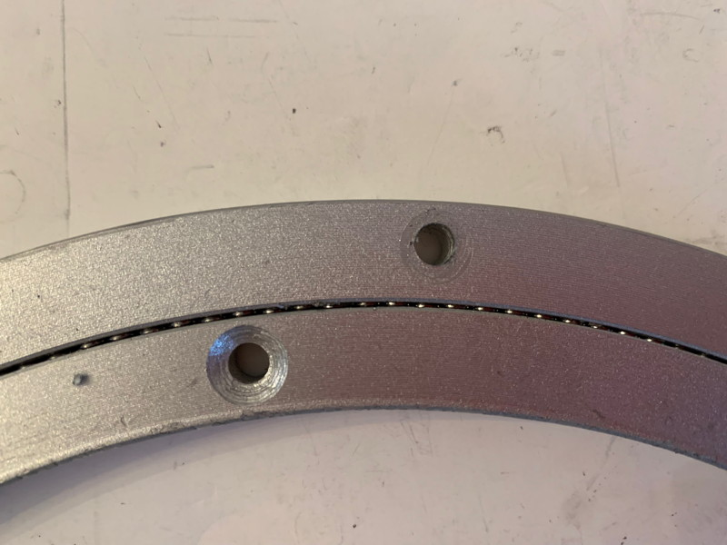

Next, cut a length of 9mm timing belt long enough to wrap around the outer perimeter of the ring, but not quite meet; there should be about 1/2" of gap between the ends.

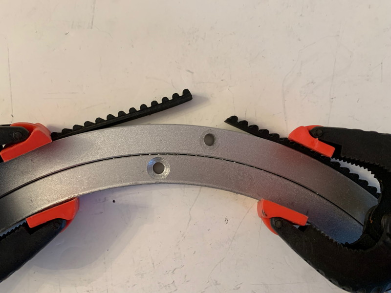

Prepare the Timing Belt Clamp by screwing in two long bolts from the ends so the tips are just visible; these will help clamp the belt into place during gluing. Contrary to several of the photos below, the third bolt should be a #10-32 x 0.625" flathead; take care when installing it not to overtighten and strip the threads in the other side of the Belt Clamp -- this bolt is just used to properly position the Belt Clamp on the Lazy-Susan and doesn't need to clamp it in place. Some of the photos below feature a version of the Belt Clamp before I added the cable chain, but the important parts are all the same.

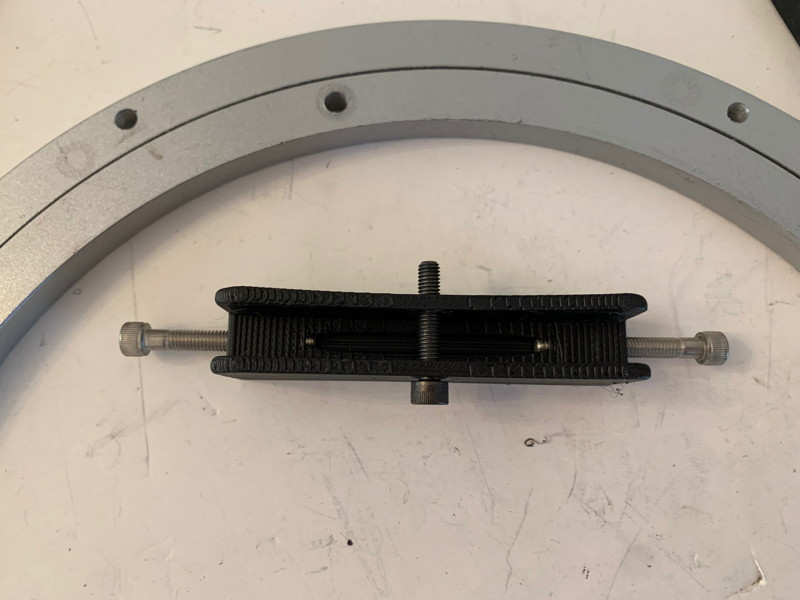

Wrap the timing belt around the Lazy-Suzan and then install the Timing Belt Clamp using the 10-32 flathead (no need for a nut as shown in the photo, just gently pin it in place using the flathead). I also made marks equidistant from the ends of the timing belt so I could center the belt in the clamp.

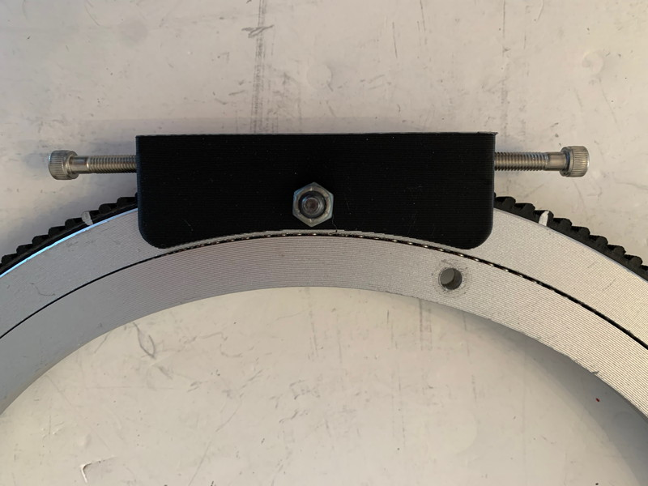

Screw in the clamp bolts and test that they are in fact putting the belt into tension. Make a note of where the belt enters one side of the clamp so you can position the belt properly in the next step.

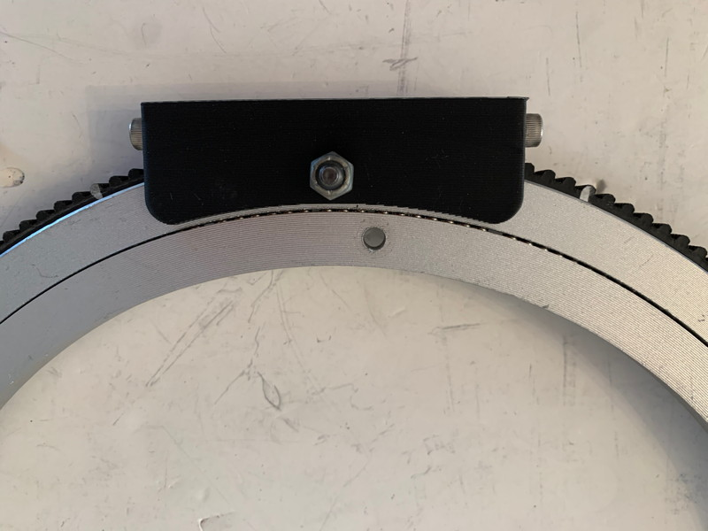

Disassemble the Belt Clamp and prepare the glue the belt into place. Use a file or sandpaper to scuff the outer edge of the Lazy-Suzan to increase the effectiveness of the glue. Next, use tape to secure one end of the belt in its final position (as you marked in the previous step).

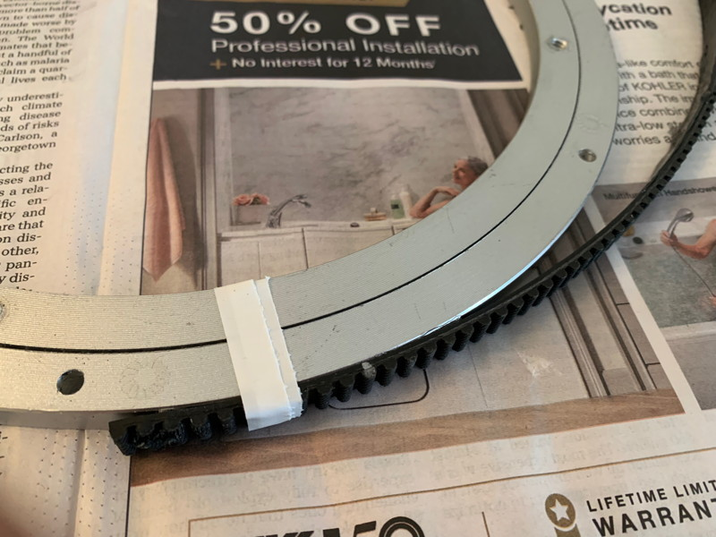

Apply a bead of flexible adhesive suitable for gluing rubber and metal to the flat edge of the belt. You can get E6000 at auto-parts stores, or use "Shoe-Goo".

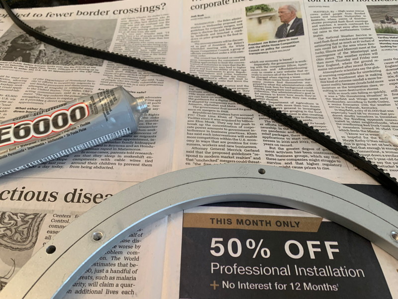

Wrap the belt around the Lazy-Susan and lightly secure it with tape.

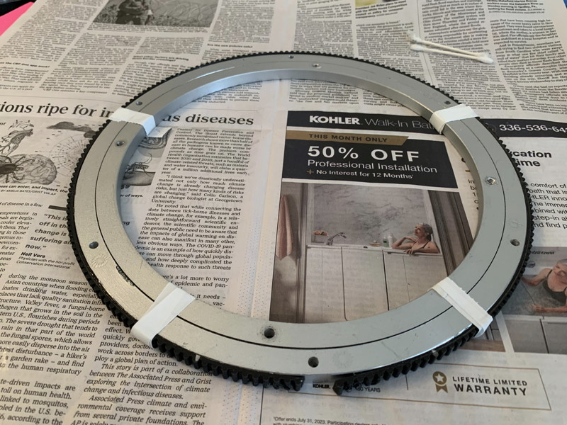

Reinstall the Timing Belt Clamp using the #10-32 x 0.625 flathead (again, gently, don't strip the threads in the Belt Clamp!) and tighten the clamp bolts a few turns at a time, alternating sides. Tighten until you start to feel significant resistance; you want to put the belt in tension but not risk having the bolts chew up the teeth on the ends.

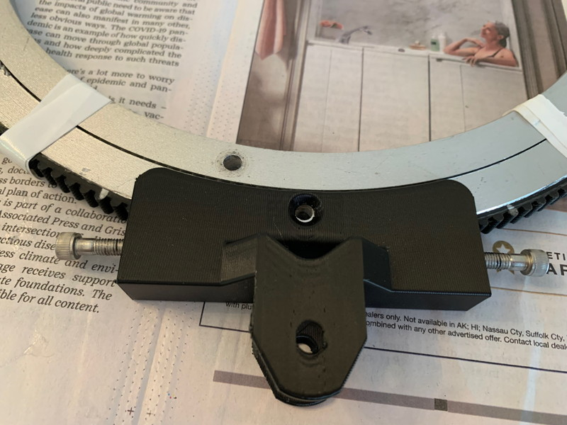
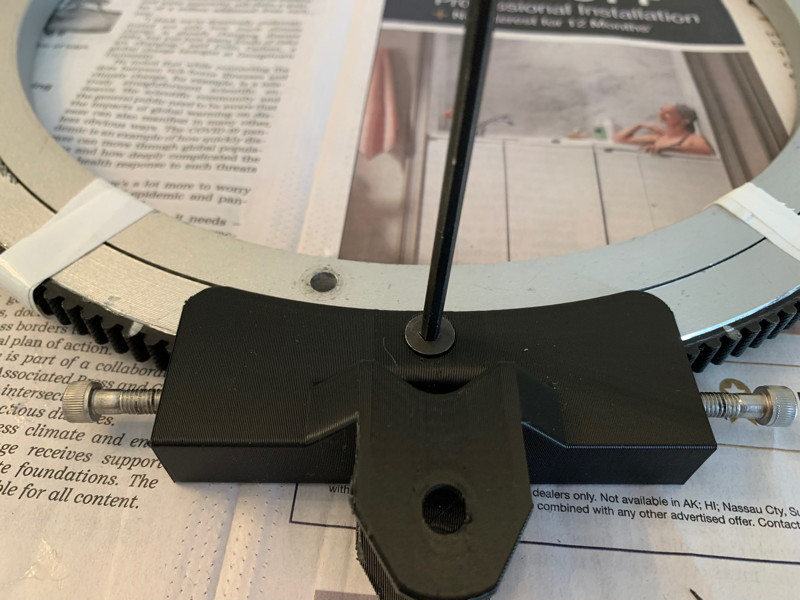
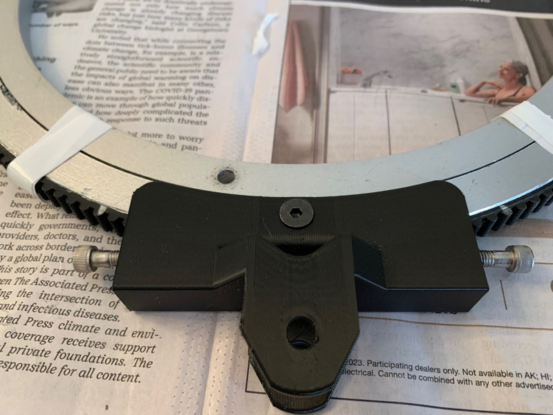

With the belt now in tension, you can adjust it by hand so it is nicely centered between the top and bottom planes of the Lazy-Susan, and if you are paranoid, add some clamps to ensure it doesn't wander during gluing.

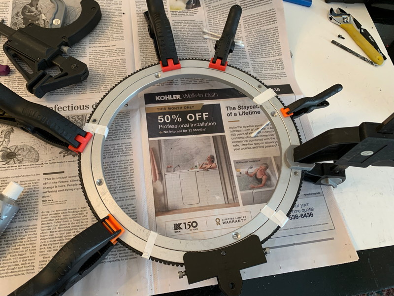

After letting the glue dry overnight, you can fully tighten the clamp screws.

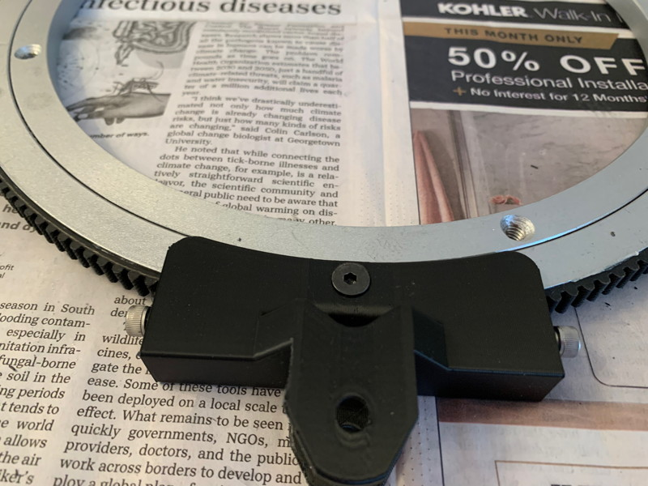

Your new ring gear can be attached to the Base Plate using #10-32 flathead bolts and printed Ring Spacers.

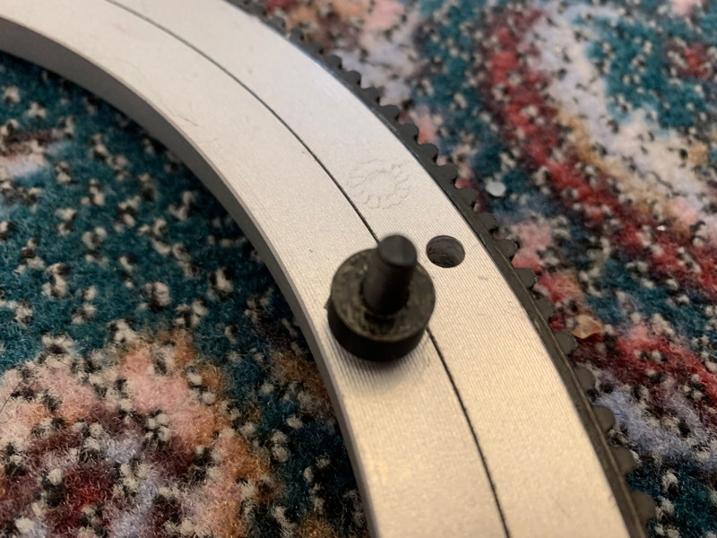

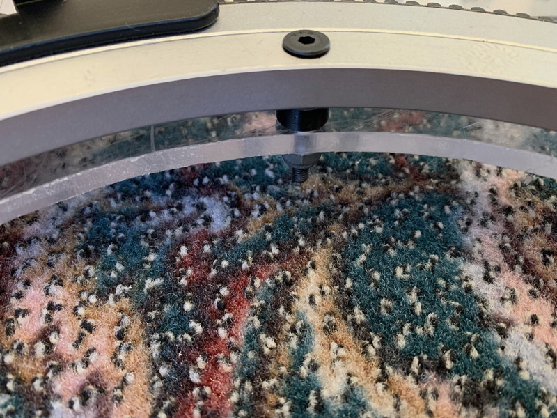

# Drive Motor and Endstop Sensors

Install the drive motor is very straightforward. The plate has the usual ring of mounting holes suitable for a gearbox like the MaxPlanetary, the drive pulley is a WCP-0608, and you can use a Pulley Hex Spacer to position the pulley at the correct height. When properly installed, the pulley will nicely interlock with the belt glued to the Lazy Susan and control its rotation.

Each of the sensors requires a Sensor Mount Top and a Sensor Mount Bottom. Each Adafruit TOF sensor half mounts to its respective mount using a 4-40 bolt and washer, and the Top and Bottom Mounts clamp together through the Base Plate using two #10-32 bolts running from the Bottom Mount to the top one. There is a slot in the Base Plate that lets you pass a sensor half through it so you can assemble using a fully wired sensor, and a small feature on the back of the Sensor Mount Top that accepts a ziptie for cable cleanup (you will notice these ziptie features on some of the other parts as well).

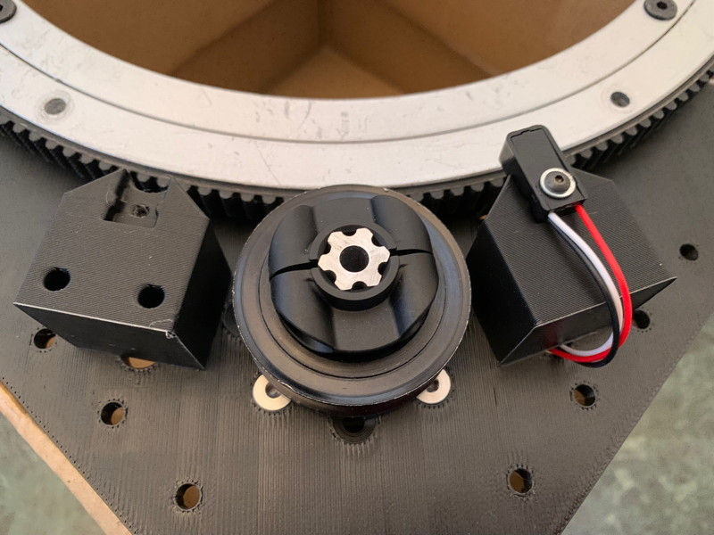

Side note: when doing a project like this, it always helps to have a senior mentor check your work...

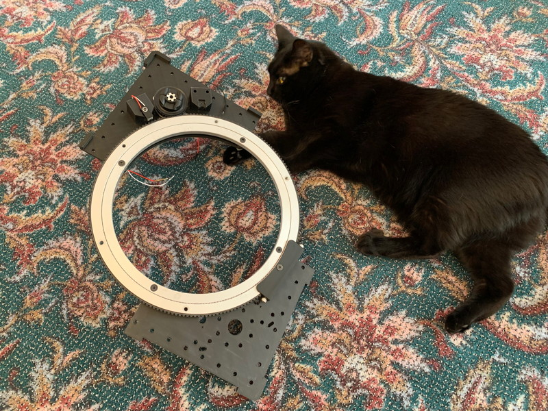

# The Cable Chain

After reviewing similar projects by other builders, I initially thought that managing the cable chain and preventing it from jamming up was going to be one of the most challenging aspects, but it turns out not to be the case. You can get away with a very simple rig using a constant force spring.

You can print cable chain links using the files in the [Useful Parts](/Useful/Useful.md) section of the repository. These links just snap together. The provided chain has enough space for several sets of power and data cables. If you are routing ethernet through the chain, I would recommend getting a flat ethernet cable, which will be more flexible and take up less space in the chain.

You can use Cable Chain Axle Mounts to position the axles for both the end of the Cable Chain and for its constant force spring. You'll also need a couple of CFS Spool Halves. These can be mounted to the base plate using #10-32 bolts and the grid of holes in the base plates.

The axles are #10-32 x 1.5" bolts that mount from below the base plate and secure to threads in the Axle Mounts. The CFS Spool Halves are just convenience parts that help the CFS spring extend and retract a bit more smoothly.

Similarly, the Cable Chain Mount Spacer is a convenience part that clips into the first Cable Chain element and prevents the cables from chafing against the axle bolts.

The exact position of the Axle Mounts will depend on your particular geometry; you can see one that worked for me in the photos below. The general idea is to help the Cable Chain wrap around the Lazy-Susan and ensure that when it retracts, it does so into a consistent state.

The constant force spring attaches to any of the cable chain links with a small #10-32 bolt and locknut.  If you have a larger Base Plate area available, you may be able to do without the constant force spring, the constraint of the flexibility of the chain imposed by the cables inside it may be enough to ensure it never tangles.

Also available to help constrain the cable chain are the Cable Chain Guide and Cable Chain Edge Guide. These can be placed on top of or on the edge of the Base Plate to help guide the cable chain. The Cable Chain Guide has a series of holes spaced so it can be mounted to the Base Plate in a variety of orientations.

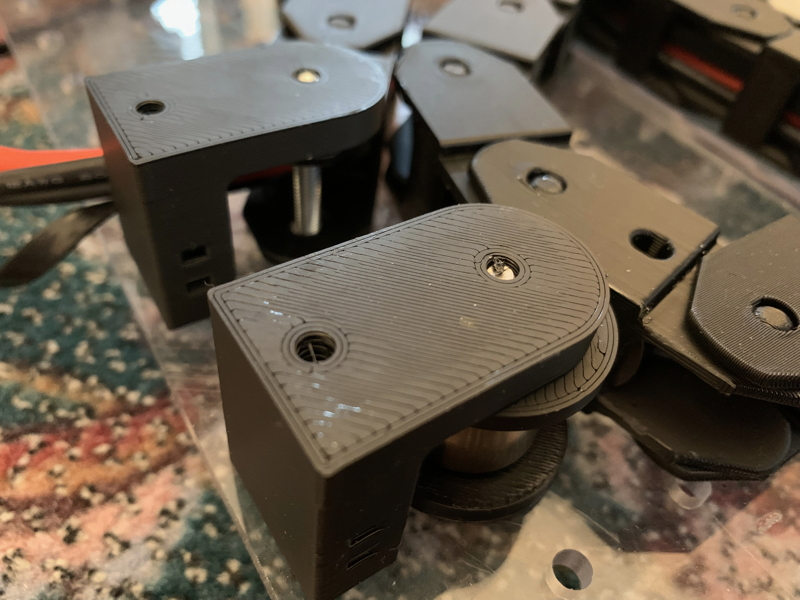
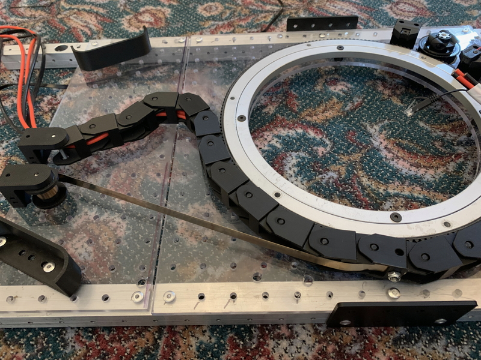
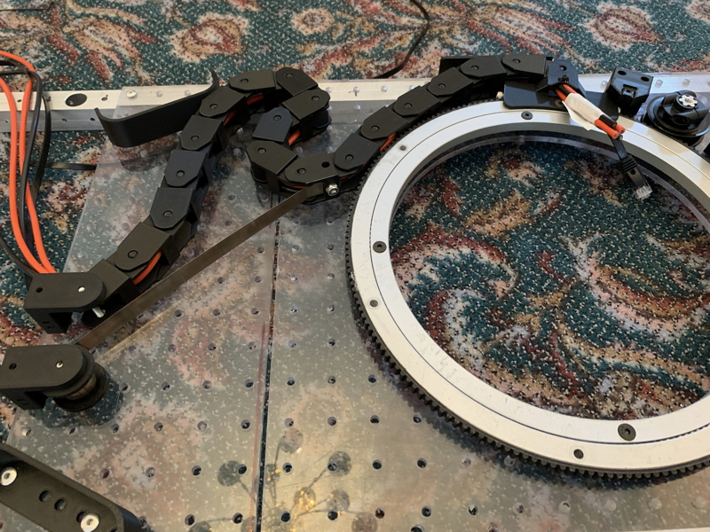

# That's All Folks

That's all I have so far. Of course, what you attach to the turret is entirely up to you!
