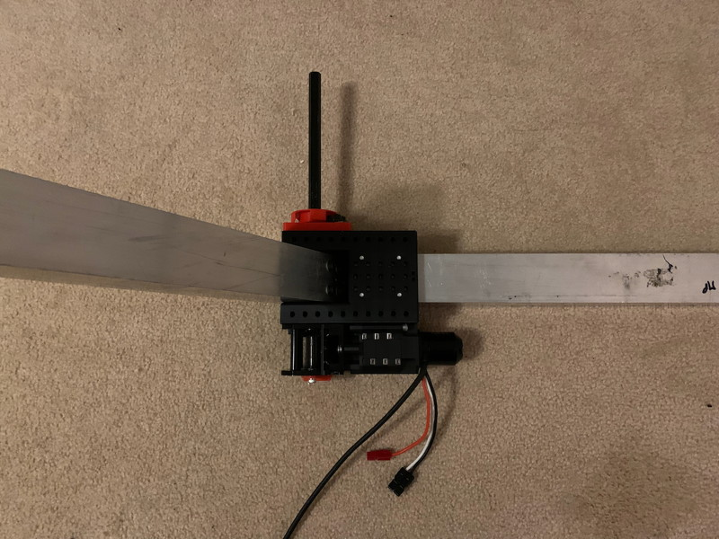

The CheapWrist adds a pivoting joint between two lengths of 2x2 tubing. It uses a MaxPlanetary gearbox and right-angle gearbox but can be used with other drive systems. It is compatible with the offset shaft sensor mounts you can find in the [Useful Parts](/Useful/Useful.md).

The related [CheapShoulder](/CheapShoulder/CheapShoulder.md) is a heavier-duty arm using 2x1 tubing and two supporting members.

# Getting Started / General Notes

* Fusion 360 project is [here](Files/).

* The Upper Arm Mount could be split into side plates and CNC'd out of Polycarb in an actual competition bot; if so the thickness of the mount could be reduced to 0.5" and each side could be a sandwich of two .25" Polycarb plates for ease of machining. The current design is intentionally chunky so that it can be tested in PLA, but it could also be printed in a stronger plastic like CF-Nylon.

* In this documentation, a "bolt" is any sort of cap screw (regular or buttonhead).

* I lost my notes about how long various bolts are, but it should be fairly obvious -- sorry!

# 1: Tube Cutting and Drilling

Cut some 2x2 tubing for the Upper (fixed) and Lower (pivoting) arms. The project assumes .0625-wall tubing, you will need change the parametric settings for other sizes as this is used to size the crush blocks. It'll probably work for tube sizes down to about 1", but I haven't tested this.

Use the Lower Arm Drill guide to drill 6 holes for #10 bolts on one face of the Lower Arm Tube and 5 holes in the other side. On the other two sides, mark only the center hole position and use a hole saw to expand it to permit the hex shaft to pass through freely. Ignore extra holes in the photos below, as usual I'm building with tubes from the junk box.

Fully seat the Upper Arm Mount on the Upper Arm Tube and drill 4 #10 through-holes on two opposing sides of the tube as marked. Take care to notice that on one side of the mount, these 4 holes are threaded; use the unthreaded holes as drill guides and rotate the Mount 180-degrees to drill out the opposing side. All the other holes are threaded and are just there as convenient mounting points for anything else you might need ("better to have and not need than need and not have"). There's also a little tunnel for threading a zip-tie.

On the other two sides, drill #10 through holes for mounting the MaxPlanetary gearbox. Which holes you drill will depend on how many reduction stages you are using. 

# 2: Lower Arm Assembly

Insert a #10-32 bolt into the Lower Arm Internal Mount as shown and partially tighten it; this bolt is used to clamp the Internal Mount onto the hex shaft. After insertion, the head of the bolt will be slightly below the face of the Internal Mount.

All of the extra indentations in the Internal Mount are for optional magnets. When I was designing it, I thought there might be a need to install magnetic endstops on the arm as opposed to optical endstops on the shaft. So they are there if you need them but almost certainly you won't.

Insert the Lower Arm Internal Mount into the Lower Tube so that the #10-32 bolt is visible through that extra 6th hole, then insert a length of hex shaft through the side of the tube to help you get the position just right (so you can access and tighten the #10-32 bolt through the extra hole). Then fasten the Internal Mount to the tube using some #10-32 bolts and washers (up to 5 on each side).

# 3: Upper Arm & Gearbox Assembly

I don't have a lot of good pictures for this because I was messing around getting the right sequence, but it turns out to be relatively straightforward.

Configure your Right Angle Gearbox + MaxPlanetary + NEO as desired.

Mount the Gearbox Assembly to one side of the Upper Arm Mount using short #10-32 bolts. You can use 4 of them to mount the Right Angle Gearbox and (optionally) extra short bolts in any mounting holes inside the Upper Arm Mount that you aren't using for through bolts.

Insert the Upper Arm Crush Block into the Upper Tube and wiggle it into the correct position using the long #10-32 bolts you are soon going to use to assemble everything.

Slide the Upper Arm Mount onto the Upper Tube and insert 4 long #10-32 bolts to pin it in position. The other side of the Mount has threaded holes that these bolts will engage (or you can use longer bolts and add nuts -- if you are making these parts out of Polycarb you'll end up making the exit holes unthreaded). Add washers to your bolts whenever possible, don't follow my bad example in these photos. You definitely want to enlarge the contact point between the bolts and the plastic. Don't tighten these bolts yet, just engage them, you want to have a little play to make the next step easier.

Add bolts to the through holes you drilled for securing the MaxPlanetary gearbox and thread them into the gearbox. Now your mount is pinned in place through the tube in both X and Y axes. Once all the bolts are engaged, you can tighten them all up.

# 4: Joining Upper and Lower Arm

The exact length of hex shaft you will need will depend on what sensors you end up using. See the [CheapShoulder Build Guide](/CheapShoulder/CheapShoulder.md) for details on how to attach sensors to the shaft.

The Lower Arm is sandwiched inside the Upper Arm Mount by two Thunderhex bearings.

Insert the hex shaft through the right-angle gearbox and the first bearing.

Insert the second bearing and slide the Lower Arm between them (you will have to retract the hex shaft so it is flush with the first bearing). Insert a second length of hex shaft from the other side (I like the lighter-weight more corrugated shaft because it's slightly undersized so it's easier to work with) through the second bearing and into the Lower Arm. You may want to aggressively taper the tip of this shaft as this will help align things.

Use the second length of shaft to guide the real shaft through the Lower Arm and out the other side. Add another Thunderhex bearing to the outside.

Once the shaft is in the correct position, lock it in place by clamping the Lower Arm Internal Mount onto it.

Secure that last Thunderhex with a shaft collar, add your sensors, and you're done.