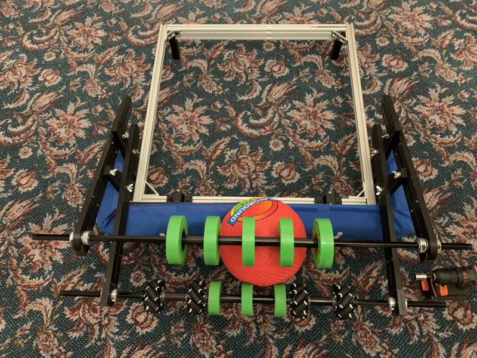

The IntakePrototype is a quick-and-dirty 3D-printed prototyping system for intakes. It consists of some T-slot mounting posts and adjustable arms that can quickly be repositioned to test intake geometries. It is a remix of @AndrewCard's [OTB Intake Prototyping System](https://www.chiefdelphi.com/t/otb-intake-prototyping-system/445544) and I am indebted to him for the excellent design upon which it is based.

Everything can be printed on a reasonably-sized printer (250mmx250mm bed) and the long arm segments can be either bolted or riveted together. The ends of the arms have hooks that can capture pairs of thunderhex bearings, and a bearing cap holds everything in place; this means the roller segments can be quickly removed and modified -- just remove the cap and lift them off. The caps are secured by #10-32 bolts and have printed threads.

The vertical supports have countersinks in the holes so the 1/4-20 mount bolts won't interfere with the arms as much.

The bearing pairs on the rollers will need to be clamped onto the sides of the arm by shaft collars; the roller then structurally connects the two arms. It is far from heavy-duty but then it doesn't have to be! The arms also have measuring grooves every inch.

Notes:

* [Files are here](Files).

* The Arm object should be split into individual bodies after being loaded into your slicer. It can be assembled using standard 3/16x0.5" pop rivets.

* You will need to rotate the vertical supports by 45-degrees when printing to get them to easily fit on the printbed.

* You may find some of the [TSlot objects](/Useful/TSlot/) handy -- there are legs to raise up the T-slot and mounting brackets for bumpers.

