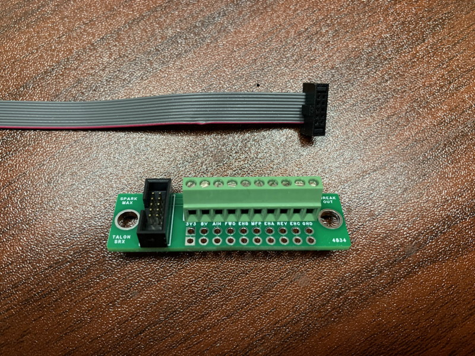
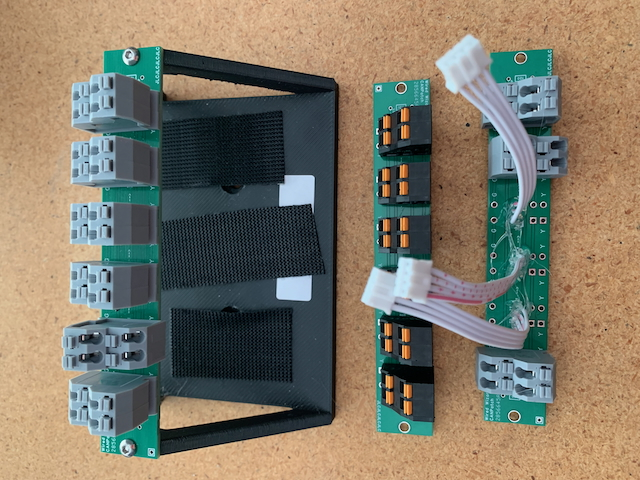

# Miscellaneous Stuff

I may have some extra bare boards and components for these devices available; contact me for more details.

A simple breakout board for the SparkMax data port - the commercially-available one uses pads instead of through-holes, which are difficult to solder. This one has both pads and provision for screw connectors. The [project page at EasyEda](https://oshwlab.com/madoverlord/sparkmax-data-port-breakout-board) has the BOM for the parts, and you can get 10 boards for under $10 including shipping at [JLCPCB](https://jlcpcb.com). For convenience I've [included the gerber files in this repo](Files/Breakout_Gerber_PCB1_2024-01-26.zip). You will need some ribbon cable to connect the breakout board to the SparkMax; the cables are [available on Amazon](https://www.amazon.com/gp/product/B07FW14TCF/ref=ppx_yo_dt_b_asin_title_o00_s00?ie=UTF8&th=1).

A compact 6-unit canbus patch panel; each unit can be configured as a stub, and it accepts 3 different styles of connector. The first and last unit can be looped together, and it'll even accept terminating resistors. I originally designed these to fit above a row of three Sparkmaxes in a very compact configurating. The [EasyEda project page](https://oshwlab.com/madoverlord/canbus-patch-panel-final) has more details.
