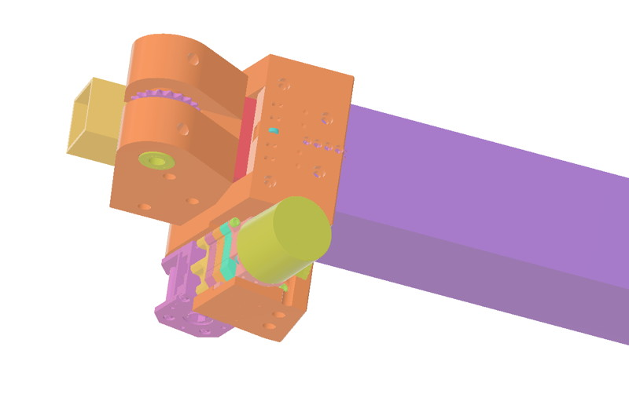

The MultiArm is a conceptual design based on the chain variant of the [StrongArm](/StrongArm/StrongArm.md). It moves from a 4"-2" tube design with the bearings directly supported by the tubes to a 4"-3"-2" design with an integrated cascade chain powering the innermost tube. It can also accept internal constant-force springs to help with retraction by mounting them to the tube connection bolts and running them through the central holes in the lower mount blocks. I mostly CAD'd it up to see if the packaging would work.

***As this is a conceptual design, I have not actually built and tested it, and it is likely to evolve when I get the time to do so.***

One minor concern I have with this design is that because of the reduced separation between the tubes, the bearings can't be mounted between tube faces and thus the bearing mount bolts can't pass through (and be supported by) the tube walls; everything has to be supported by the plastic mounts. This means that they are under some bending stress and are more succeptible to damage if they get seriously banged up. For this reason, in an actual competiton build, a higher-strength engineering filament might be a better choice than PLA. Another possibility would be slicing the mounts into segments and CNC'ing some polycarb or aluminum flat parts that are then sandwiched to provide more strength.

[Fusion Project](Files/MultiArm-Chain.f3z)

