# FRC3DP - Common First Robotics Mechanisms implemented using extensive 3D Printing

This is an ongoing series of design experiments I am undertaking to reimplement many of the most common FIRST Robotics mechanisms
with an emphasis on using basic 3D-printed parts wherever possible. The goal is to provide the community with a set
of customizable designs that are inexpensive and easy to assemble, using parts that can be printed in PLA on an
inexpensive 3D printer and combined with aluminum tubing and commonly-available parts such as brackets and bearings using hand tools, as well as serve as starting points for iteration.

Whenever possible, the 3D-printed parts are used to locate other parts and do not conduct significant stress loads; when
this is unavoidable, a flat plate of polycarbonate or aluminum can be used to replace or reinforce the plastic part (which can be used
as a template to cut out the plate), or if a higher-end printer is available, the part can be printed out of more resilient materials
like CF-reinforced nylon (but honestly, this is probably overkill).

I also have a [repo dedicated to parts that can be manufactured in a 3-axis CNC mill](https://github.com/RJWoodhead/FRC3AM). Currently most of them are related to elevator construction.

Your comments, suggestions (both for improvements and for new mechanisms to develop), and typo-reports are much appreciated. I can be emailed directly at trebor@madoverlord.com.

# Currently Available Designs

[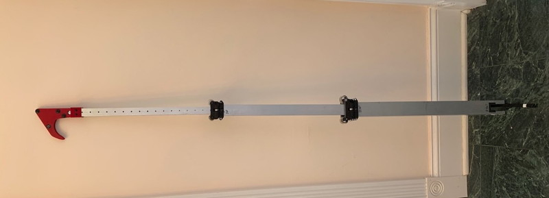](CheapLifter/CheapLifter.md)

[CheapLifter](CheapLifter/CheapLifter.md) - a 2-part tube-in-tube arm that passively extends using constant-force springs and retracts using a spool driven by a MaxPlanetary gearbox. Useful when you want to lift your entire robot off the ground (as in the 2022 game).

[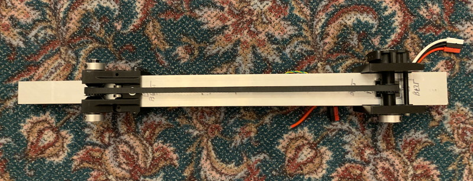](CheapArm/CheapArm.md)

[CheapArm](CheapArm/CheapArm.md) - a 2-part tube-in-tube arm that actively extends and retracts using a 9mm timing belt driven by a MaxPlanetary gearbox.

[StrongArm](StrongArm/StrongArm.md) - the body-building brother of the CheapArm, it's simpler to build and can easily lift 10kg straight up. Now has two versions, one using a HTD belt as the rack gear, the other 35-series chain.

[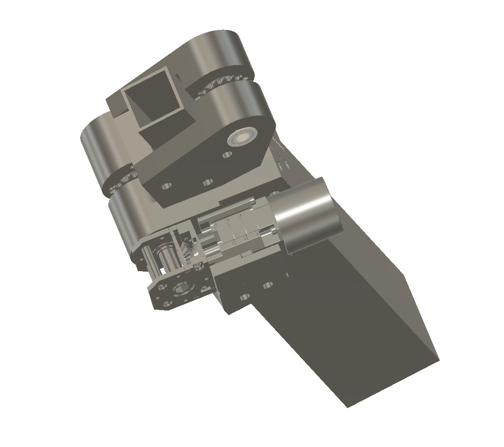](MultiArm/MultiArm.md)

[MultiArm](MultiArm/MultiArm.md) - a work-in-progress conceptual design of a multistage (4/3/2" tube) arm with integrated cascade.

[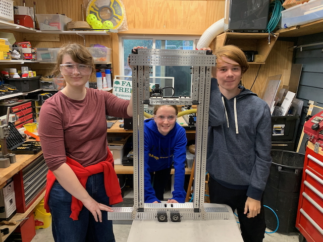](BeltInTube/BeltInTube.md)

[Belt In Tube Elevator](BeltInTube/BeltInTube.md) - a parametric belt-in-tube elevator designed to be as easy to manufacture as possible.

[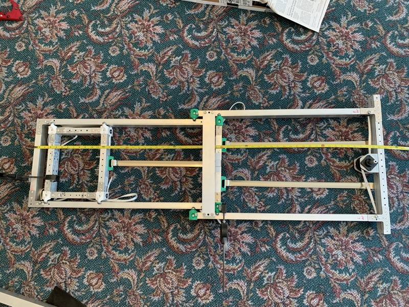](CheapElevator/CheapElevator.md)

[CheapElevator](CheapElevator/CheapElevator.md) - One of my earliest experiments, not viable for use on a real robot but helped me understand the limitations of 3D printing.

[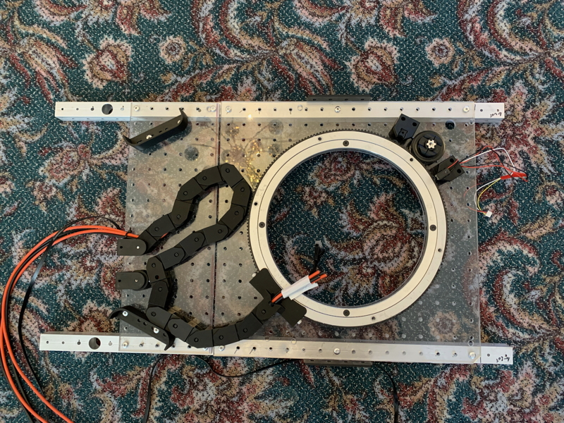](CheapTurret/CheapTurret.md)

[CheapTurret](CheapTurret/CheapTurret.md) - a ridiculously cheap turret that has over 300 degrees of rotary motion and a simple cable chain that routes power, canbus, and ethernet to whatever is mounted on it.

[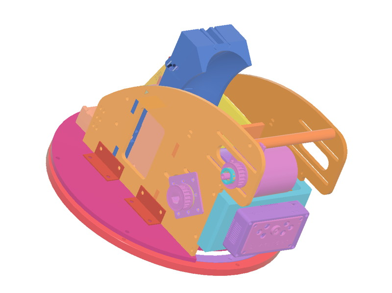](CheapShot/CheapShot.md)

[CheapShot](CheapShot/CheapShot.md) - a simple shooter with an adjustable hood, with bonus wiffle-ball air-conveyor feeder.

[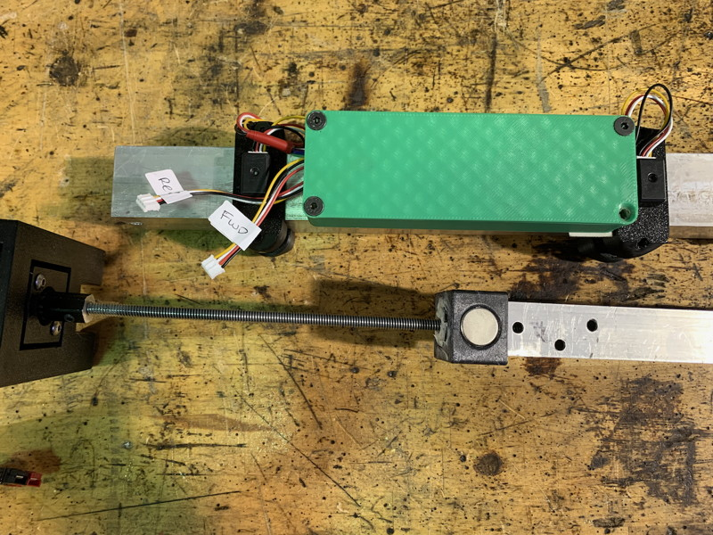](CheapActuator/CheapActuator.md)

[CheapActuator](CheapActuator/CheapActuator.md) - a simple linear actuator powered by either a NEO500 or a 775. Can move at over 6 inches/second or geared down for more strength.

[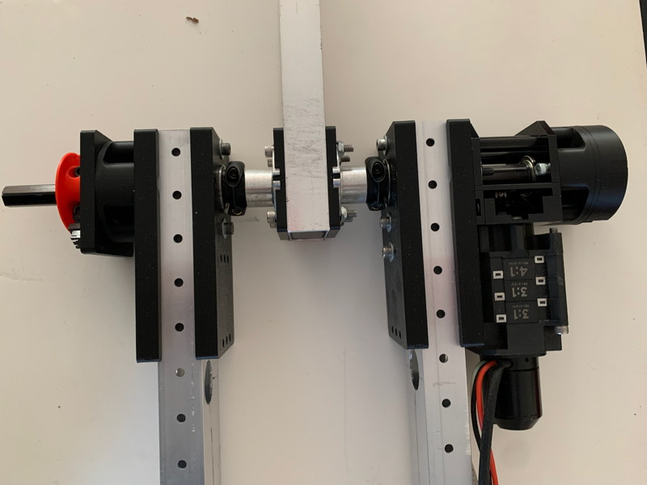](CheapShoulder/CheapShoulder.md)

[CheapShoulder](CheapShoulder/CheapShoulder.md) - a pivoting arm supported by two tubes on either side, powered by a NEO + MaxPlanetary + Right-Angle Gearbox. Can easily mount various sensors.

[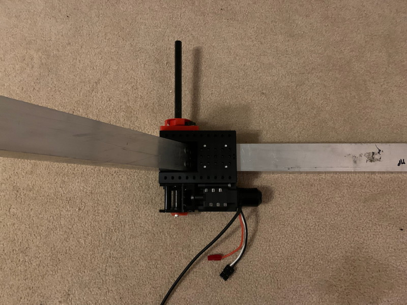](CheapWrist/CheapWrist.md)

[CheapWrist](CheapWrist/CheapWrist.md) - a lighter-weight inline pivoting arm, perhaps suitable for mounting an end-effector.

[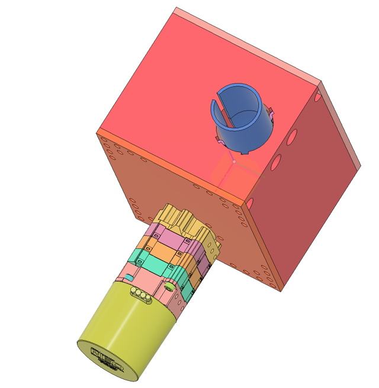](Misc/Files/CheapBoatHook)

[CheapBoatHook](Misc/Files/CheapBoatHook) - this is a skeleton Fusion project for a simple rollable boat hook climber, inspired by the designs of Teams 233 and 509. I haven't actually built this, I just put it together to understand the geometry a bit better. You may find it useful since the more complex geometries are already modeled. Fully parametric, but it doesn't have more advanced features like a ratchet lock. 

[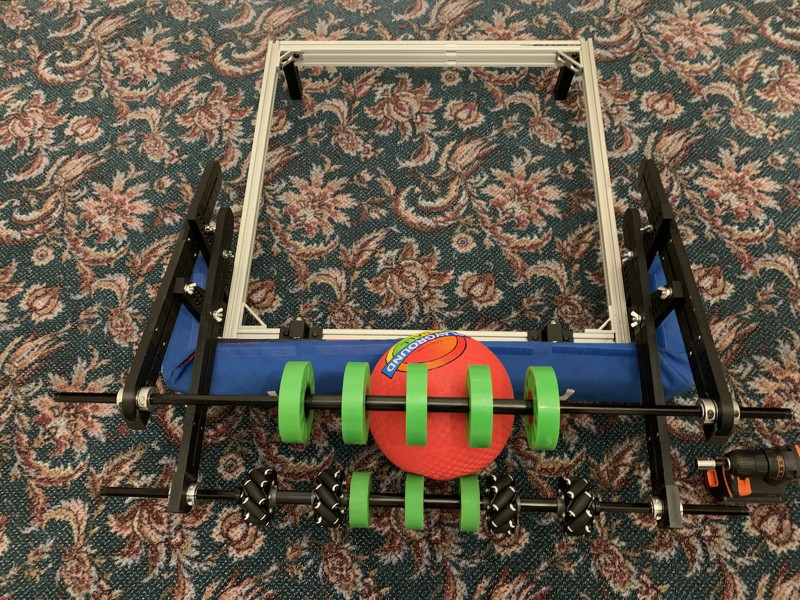](IntakePrototype/IntakePrototype.md)

[IntakePrototype](IntakePrototype/IntakePrototype.md) - a simple 3D-printable prototyping system for testing intake geometries.

[Compendium of Useful Parts](Useful/Useful.md) - a variety of miscellaneous small parts that you may find useful. Latest additions center around the Mk5n swerve module and Kraken motors.

[Miscellaneous Electronics](Misc/Misc.md) - Some boards that might be helpful; currently includes a Sparkmax data port breakout board and a Canbus patch panel.

# File Notes

Included with most designs are:

* The Fusion360 Project File
* STEP files for each printable component (I find these print slightly better than 3MF assuming your slicer accepts them; I use a Bambu X1C which does, but Cura does not).
* 3MF versions of the STEP files (autoconverted).
* DXF files for flat plate parts that could be produced on a CNC router or waterjet.

# Printing Tips

Most parts can be printed with whatever typical settings your printer uses. They should work just fine with a .4mm or .6mm nozzle and layer heights from .2 to .3mm. I do my prototyping using a .6mm nozzle and .3mm layers.

All of the parts are designed to be printed in basic PLA with typical "strength" infill settings (ie: 50% infill, gyroid pattern). All of my protyping was done with "speed" settings (10% infill) and the parts seemed plenty strong. It really is remarkable how tough printed parts are as long as you don't put them in shear along the layer lines.

Almost all of the parts can be printed without support; there may be cosmetic issues on overhangs and bridges, but these will not affect the usability of the print; at worst you will have to do a little cleanup with a deburring tool and/or razor knife.

The included Fusion 360 files are parametric (overly so, perhaps) and include parameters for printer nozzle size, layer height, and overall printer tolerances. As I am in no way a 3D modelling guru (part of the reason for this project is to get some skills in this area) the Fusion files are not as tidy as I would like. *Moshiwake gozaimasen...*

# Caveat Constructor

These designs have not yet been tested in the crucible of competition. Your mileage may vary. Batteries not included. Terms and conditions may apply. Void where prohibited by law. You get what you pay for. And, of course, "some assembly required."

# License

The materials in this repository (except for those provided by outside sources) are licensed under the [Creative Commons Attribution-NonCommercial-ShareAlike 4.0 International (CC BY-NC-SA 4.0)](https://creativecommons.org/licenses/by-nc-sa/4.0/).
