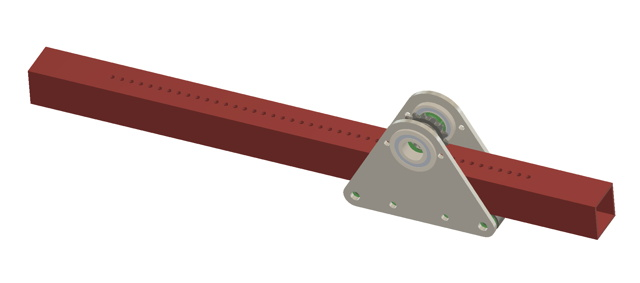
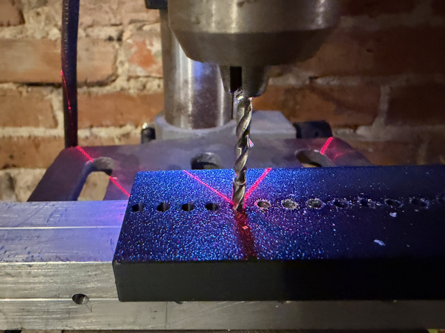
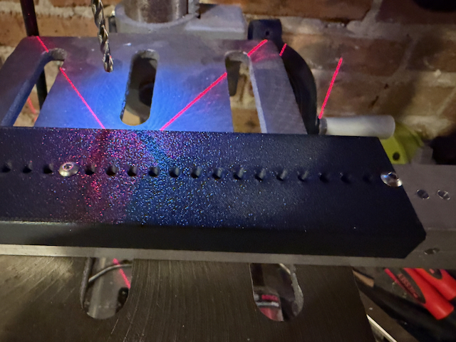
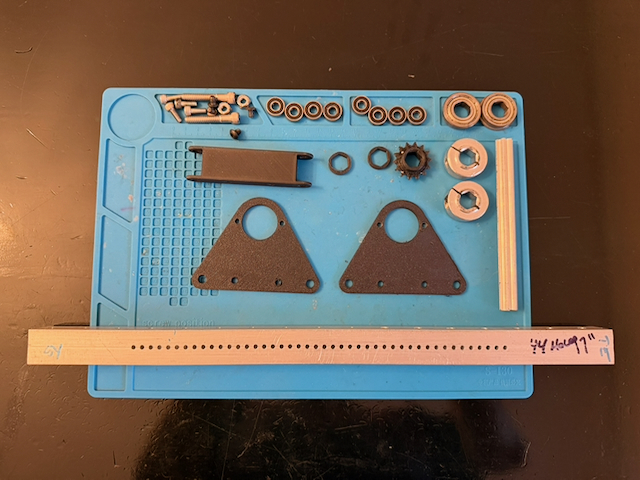
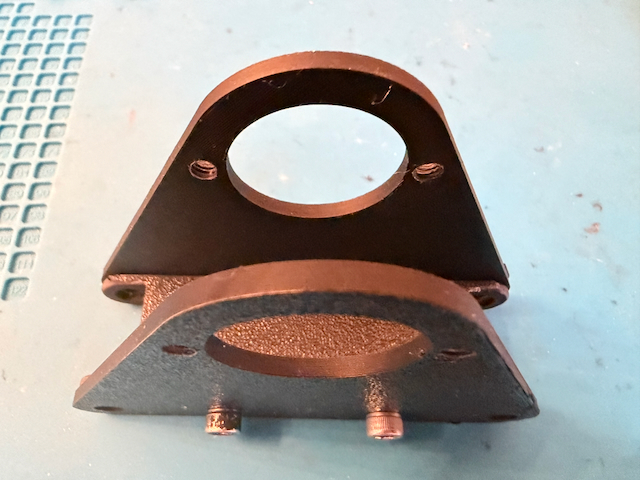
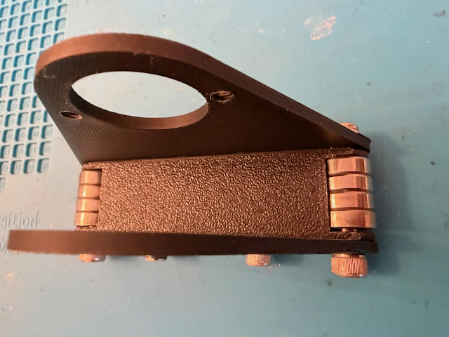
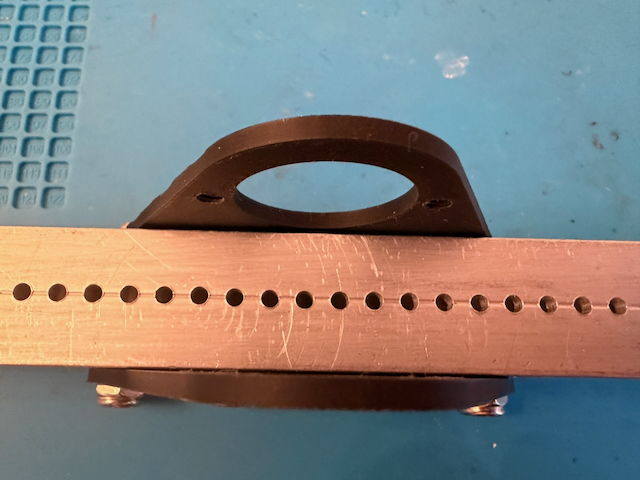
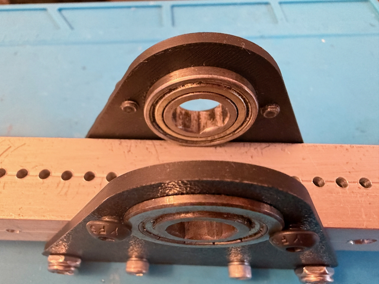
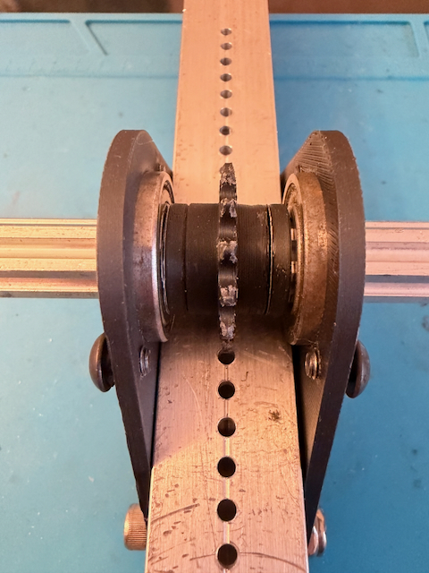
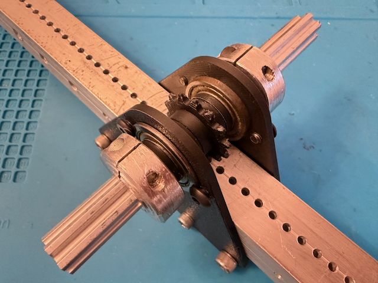

The Sprockulator is a very minimalist linear actuator that uses a #25 sprocket to drive a tube that has 1/8" holes drilled into it. The basic idea is that the drive shaft can be externally supported so the entire device can also pivot on the shaft, which would be ideal for deploying an intake.

The included [Fusion 360 Project](Files/) is as parametric as possible, and can use square tubing down to 3/4". It could also easily be adapted to use rectangular tubing or to directly accept a gearbox mount.

If you have a CNC router, there are DXF sketches for the Brackets and Tube holes.

# Preparing the Tube

After setting the TRAVEL parameter in the Fusion file, the _INNER_LENGTH parameter will indicate how long of a tube you need.

If you are manually drilling all the holes, the Actuator End Drill Guide gets you started drilling the 1/8" holes that the #25 sprocket engages. Use a drill press and locate the drill bit by rotating the drill bit backwards by hand while slowly inserting it into each hole until it touches the tube.

You can extend the line of holes using the Actuator Extension Drill Guide; use a couple of #5 bolts or 1/8" dowel pins to lock the guide into the correct position. The _TOOTH_COUNT parameter will tell you how many holes need to be drilled.

# Preparing the Brackets

Make sure you set the PLATE_THICKNESS parameter to the actual thickness of the plates you will be using, as this affects the size of the Top Hex Spacer. If you don't have a CNC, you will need to print a pair of plates to use as templates for making the brackets out of aluminum or polycarb. The hole sizes are .257 (F), .196 (9) and .159 (21). The bearing hole is 1.125.

You will need to tap the two small holes near the bearing hole as #10-32.

In my test assembly, I just used printed versions of the brackets (and the #25 sprocket).

# Assembly

Mount the Brackets to the Bottom guide using 4 #10-32 bolts (1/2" or 3/4").

Assemble the Bearing Stacks out of R4-2RS bearings, and lock them in place using 1/4-20 bolts and locknuts.

Insert the Tube between the brackets, holes facing up.

Insert the two Thunderhex bearings with flanges on the outside of the brackets and lock them in place with short #10-32 bolts using the threaded holes in the brackets.

Mount the [AM-4773 14T #25 sprocket](https://andymark.com/collections/sprockets/products/25-series-symmetrical-hub-sprockets?variant=44495486648492) using some 1/2" hex shaft and two Top Hex Spacers (not needed if using 3/4" tubing).

Secure the shaft in some manner (it'll depend on your application, of course).

Enjoy your newfound linear motion.