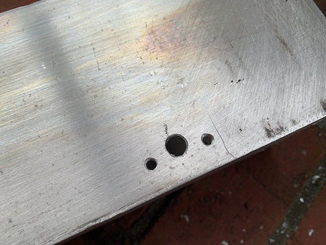
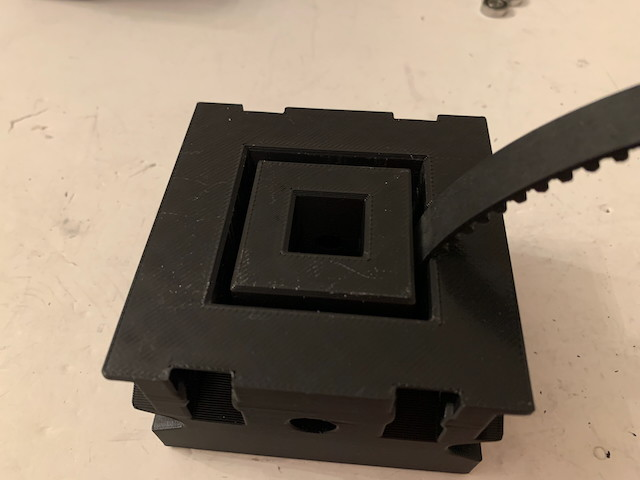

The StrongArm is an evolution of the [CheapArm](/CheapArm/CheapArm.md) designed for heavy loads. It uses a 4" outer tube and a 3" inner tube (0.125" wall) and a rack and pinion gear system built using a length of HTD belt. It is easily capable of lifting 10kg vertically using a NEO 550 and can handle substantial bending loads.

I have also included a variant, StrongArm-Chain, that uses 35-series chain and an [18-tooth sprocket](https://www.andymark.com/products/35-series-symmetrical-hub-sprockets) as the rack and pinion. ***However, this is just a design variant, I have not yet built and tested it, so there may be unexpected issues with it; caveat constructor***.

# Getting Started / General Notes

* Fusion 360 Project is [here](Files/). Sorry, too lazy to export part files this time. The project is fully parametric so it's easy to tweak to your requirements.

* Please keep in mind that this design has gone through several iterations, so some of the photos may show previous incarnations of the parts. However, the features relevant to the particular assembly step will be present and their relationship to the current design should be obvious.

* The StrongArm is designed to work with the MaxPlanetary and Rev Max 90-degree gearboxes, but there are mounting holes for other gearboxes and if they don't work, the Fusion 360 project should be relatively easy to modify.

* There are wide gaps between the tracks where the bearings contact the tubes; these could be drilled or CNC'd out to reduce weight.

* The Inner Tube Mount can hold magnets and you can attach [Rev Magnetic Limit Switches](https://www.revrobotics.com/rev-31-1462/) to sense them (note: not tested yet), or you can use IR beam-break sensors; Adafruit has some [very cheap ones](https://www.adafruit.com/product/2167) that work well with SparkMaxes, and printed mounts and drill guides for them are included in the project. Read the [tutorial](https://learn.adafruit.com/ir-breakbeam-sensors) to learn how to use the sensors; they can be wired to be a replacement for the Rev limit switches, but you need to include a 10k resistor in order to do so.

* The Outer Tube Mount projects 2.655" above the top of the outer tube and 1.5" below it. The Inner Tube Mount projects 2" above the bottom of the inner tube and .25" below it. Thus the maximum stroke is 3.75" less than the length of the outer tube.

* While you can design the StrongArm so that it's max extension is just where you *think* you want it, it is probably best to set it up so that it can over-extend and use a limit-switch, odometry or an internal interference to stop it. Another consideration is that the shorter the distance between the bearings on the Outer and Inner Tube Mounts at maximum extension, the greater the potential bending stresses on the device. Also, keep in mind that this arm will have inertia, so it will continue moving a bit past the limit-switch if you're really driving it.

* All printed parts are designed with an 0.4mm nozzle and 0.2mm layer height in mind, but seem to work fine with an 0.6mm nozzle and 0.3mm layer height (which is what I used when prototyping it).

* You shouldn't need to use any fancy filament. Standard PLA is fine.

* Everything can be printed without support.

* The Fusion 360 project is ridiculously parametric, should you want to make changes, but keep in mind that I've been iterating it for quite some time so there is a bit of cruft in it. My apologies. Also, it just contains a skeleton for designing the parts, and is not a full model of the final assembled device.

* Tools required: Some sort of saw for cutting tubes, Hand electric drill, 13/64" drill bit, 5/32" drill bit, 1/4" (or "D") drill bit, assorted T-handles and wrenches, tweezers or small forceps, hand file, deburring tool, wire cutters or box cutter, small clamp.

* Threadlock bolts that don't screw into plastic!

* In this documentation, a "bolt" is any sort of cap screw (regular or buttonhead).

# 1: Tube Cutting

I haven't had time to make a tube calculator for this device yet, sorry! You'll have to do the calculations yourself using the dimensions given above.

Note: after doing any cutting or drilling operation, use a deburring tool and/or file to make sure the end result is smooth.

# 2: Tube Preparation

Place the Outer Tube Mount onto the Outer Tube and firmly seat it. When properly seated, a sliver of the top of the tube will be visible in the gap where the drive pulley will later be mounted. Mark this side of the tube as the Front.

Locate the 8 bearing mount bolt holes (two per side; 1/4" with counterbores for the heads of the bolts) and use a 1/4" drill bit to make divots in the tube. Remove the Outer Tube mount and drill out the 8 divots to 1/4-20 free-fit.

If you want to use beam-brake sensors, use the IR Sensor drill guide to make matching sets of divots on two opposing faces of the Outer Tube where you want to place a sensor. Drill and tap the outer two holes for 10-32, and drill out the center hole to .375. There are two variants of the IR Sensor Mount, one that runs the connecting wires towards the center of the face of the tube, and one that runs them away from the tube; pick the one that makes the most sense for your build.

Place the Inner Tube Mount onto the Inner Tube and firmly seat it. 3 of the 4 sides of the mount have 1/4" counterbored holes; the one that doesn't marks the Front side of the tube. Use a 1/4" drill bit to make divots, then remove the Inner Tube mount and drill out these holes to 1/4-20 free fit.

# 3A: Inner Tube Assembly (Belt)

Cut a length of 15mm HTD timing belt approximately the length of your Inner Tube. Insert one end of the belt into the Inner Bearing Mount and wiggle it so it slips into the locking ridges inside the mount. Insert the Inner Tube into the Inner Bearing Mount so the front of the tube locks the belt firmly in place. Secure the Inner Bearing Mount to the Inner Tube using 3 1/4-20 x 1.125" bolts.

Smooth the belt down against the Inner Tube. Place the Inner Tube Belt Clamp on the belt just below where you're going to attach your end-effector to the arm so that it clicks into the teeth of the belt. Put a little tension on the belt with the clamp, then use a small drill bit to make divots in the Inner Tube.

Drill and tap the two divots for 10-32 x 0.375" bolts. You could also drill these holes for #10-32 loose fit and use locknuts on the inside of the tube.

Apply flexible adhesive (Sho-Goo or E6000 for example) to the back of the belt, then reinstall the Inner Tube Belt Clamp and use it to tension the belt. Check that the belt is correctly centered on the tube along its complete length. You may want to clamp the belt softly at various places, or wrap it in twine.

Allow the glue to set overnight.

Mount 8 pairs (16 total) of R4-2RS bearings into the Inner Bearing Mount, 2 pairs per side, using 1/4-20 x 1.25" bolts (cap screws or buttonheads).

Two of the sides of the mount have large recesses that will accept stacks of 18mm disc magnets. If you are using magnetic limit switches, glue in a single magnet on the side(s) you will be mounting the sensors on, then fill up the stack with more magnets.

# 3B: Inner Tube Assembly (Chain)

There are 4 vertically-oriented holes in the Inner Bearing Mount for bolts that will hold the lower section of chain in place; use the Inner Bearing Mount as a drill guide to drill these to accept #8 bolts (#16 drill bit) -- you probably only need 2 bolts but there's room for 4. Insert the chain into the slot (the end of the chain should be a large link; the slot has curves that help position the chain) and insert the Inner Tube into the Inner Bearing Mount. Secure the chain to the Inner Tube using #8 bolts and then secure the Inner Bearing Mount to the Inner Tube using 3 1/4-20 x 1.125" bolts.

Smooth the chain down against the Inner Tube. Place the Inner Tube Chain Clamp on the chain just below where you're going to attach your end-effector to the arm so that it clicks into the links of the chain (like the slot, it's keyed for the large and small links). Put a little tension on the chain with the clamp, then use a small drill bit to make divots in the Inner Tube.

Drill and tap the two divots for 10-32 x 0.375" bolts. You could also drill these holes for #10-32 loose fit and use locknuts on the inside of the tube.

# 4: Outer Tube Assembly

Insert the Outer Tube into the Outer Tube Mount. Install 8 pairs of 2 R4-2RS bearings into the Outer Bearing Mount (you'll insert them from the top into the little alcoves they fit into) and secure with 1/4-20 bolts. The 2 pairs that fit into alcoves on the front face of the mount (and thus, the bolts are inserted from the left and right; one of them goes deep inside the gearbox mount) require 2.25" bolts; the others will accept 2" bolts.

These bolts also secure the Outer Tube Mount to the Outer Tube.

# 5A: Tube Integration (Belt)

Remove the Inner Tube Belt Clamp from the Inner Tube, then insert the Inner Tube into the Outer Tube from the bottom, up through the Outer Tube Mount. Reinstall the Inner Tube Belt Clamp; it now forms a hard-stop that prevents the Inner Tube from falling out of the Outer Tube. You may want to reposition it to adjust this hard stop, you'll just have to drill some more 10-32 tapped holes.

Trim the excess belt if it is getting in the way of anything.

# 5B: Tube Integration (Chain)

Remove the Inner Tube Chain Clamp from the Inner Tube, then insert the Inner Tube into the Outer Tube from the bottom, up through the Outer Tube Mount. Reinstall the Inner Tube Chain Clamp; it now forms a hard-stop that prevents the Inner Tube from falling out of the Outer Tube. Use the clamp to retension the chain, then drill 2 or 3 #8 holes using the Chain Clamp as a drill guide and install #8 bolts with locknuts on the inside of the tube to secure the chain in place.

# 6: Motor and Gearbox

The Outer Tube Mount uses a Rev Right Angle Gearbox to make the packaging much less prone to getting hit and damaged. If you look in the slot where the drive pulley will be installed you'll see there are 3 countersinks which will hold mounting bolts and access holes for a long T-handle opposite them; they are sized to accept 0.625" #10-32 bolts. A Right-Angle Gearbox + MaxPlanetary setup will drop right into the mount, the Gearbox can be secured with the 3 bolts, and you can additionally secure the MaxPlanetary to the Mount with some additional 10-32 bolts using the provided holes.

Thread a length of 1/2" Hex Shaft through the opposite side of the mount, capture a WCP-0611 Pulley (or 18-tooth 35-series hub) in the central slot, and insert the end of the shaft into and through the gearbox. Add a Thunderhex bearing to the loose end of the shaft, then secure with two shaft collars.

Done!