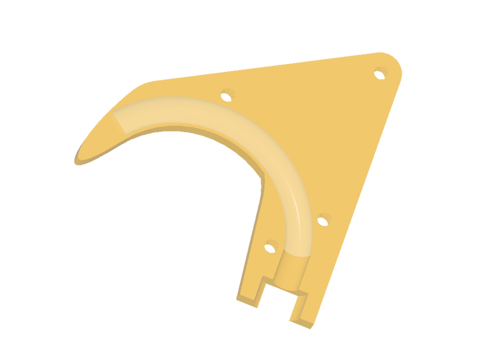
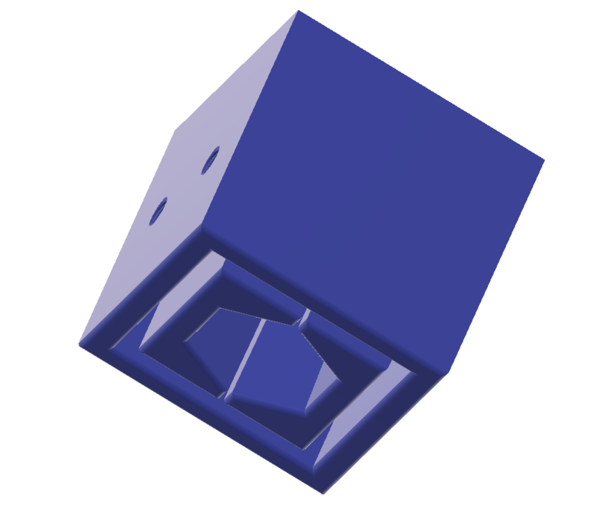

The Cheaphook adapts a common U-bolt into a secure hook that will easily support the weight of your robot. The spear tip allows the hook to deflect if it happens to hit the hanging bar when being raised.

* Printed part files are [here](Files/). These include the Fusion 360 project, and .step and .3mf files (autoconverted) for each part. I recommend using the .step files if your slicer supports them, the quality will be slightly higher.

Print out the Spear A and B halfs as well as a Mount (there are variants for 1" and 1.5" tubing) ([Files here](Files)) and then head off to the hardware store and pick up a U-bolt that fits (if memory serves, it's the 2" one).

Cut off one tip of the bolt so that it fits snugly inside the spear halves.

Place the Mount onto the end of your tubing. Use the holes in the side of the tubing as guides to drilling holes suitable for #8 bolts in two opposing faces. Since one side of the Mount has printed threads, use the other side as the guide and just rotate the Mount 180 degrees per pair of holes.

Take one of the large nuts that came with the U-bolt and thread it onto the bolt, all the way up. Insert the U-bolt into the Mount and thread the other large nut onto the bolt as far as it will go. Tug on the U-bolt to engage the nut into the Mount.

Place the Mount onto the end of your tubing. Insert two #8 bolts into the holes in the side of the mount and tighten them (you may want to use slightly longer bolts and add locknuts on the other side).

You can now tighten the lower bolt by tightening the upper bolt against the Mount, and then rotating the U-bolt, which will cause the lower bolt to be drawn further inside of the Mount, which will be forced to expand and lock against the inner sides of the tubing. At the same time, the #8 bolts provide the main path for the weight of the robot to be transferred from the tube to the U-bolt.

Finally, use some 1/4-20 flatheads to secure the Spear A and B halves to the U-bolt (which to be honest, is more like a J-bolt at this point).
