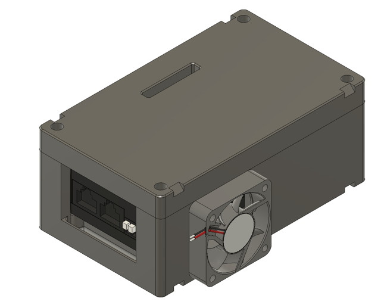
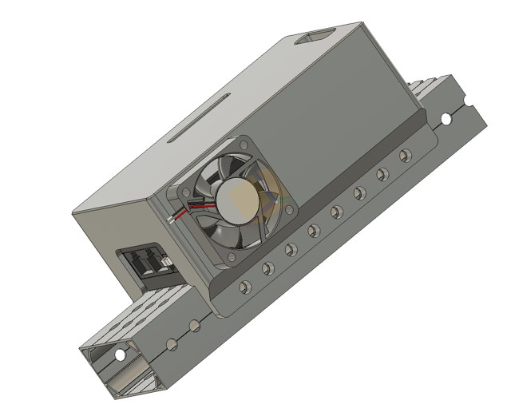

# Useful Parts

These are some minor parts that you may find useful in your projects. The Fusion360 projects are included so you can modify them as needed, and are usually parametric.

# Latest Additions

 

* [VH-109 Cases](Misc). The new VH-109 robot radios can get a little toasty, so these cases suspend it from the corners so it's properly exposed for air circulation and have internal ducting that guides the air around all parts of the radio. The base variant allows air to circulate around all sides of the radio and stabilizes at a slightly lower temperature; the alternate single-part variant clamps the radio to 2x1 box tubing as recommended by the manufacturer. They require a 40mm fan (M3 bolts) and assemble/mount using 10-32 bolts.

*Note: this is very much a work-in-progress and will be significantly iterated over the next few weeks.*

# Parts complicated enough to require some explanation

* The [CheapHook](CheapHook/CheapHook.md) converts a common U-bolt into a hook that attaches to the end of a 1" square tube.

# Parts simple enough to (hopefully) require no explanation

* [REV-21-2120 CANCoder Holder](SensorMounts). A small mount for attaching a CANCoder directly to a REV right-angle gearbox. Can be adapted for similar uses.

* [Sensor Mounts for Square Tube](SensorMounts). Print two of the specialized holders (Hall Effect or IR sensor) and clamp them together with a couple of flathead bolts and you can securely attach your sensor to 1.5", 2" or 4" square tube. I didn't add all of the possible type/size combinations, but the Fusion file is parametric so you should be able to adapt as needed. I've also included a template mount so you can adapt it to hold other sensors.

* [Shaft Sensor Offset Mount](SensorMounts). A simple mount that surrounds a shaft and can be used to offset sensor mounts so there is space underneath them to add a shaft collar. Comes in two-thread, two-hole (2T) and four-thread variants and mounts on a 2-inch #10-32 bolt circle. There is a discussion of these mounts and how to use them in the [CheapShoulder](/CheapShoulder/CheapShoulder.md) build guide.

* [Offset CANCoder Mount](SensorMounts). A variant of the CANCoder mount for use with the Shaft Sensor Offset Mount. Includes a protective cap.

* [Lerdge.com Optical Endstop Mount](SensorMounts). These are [$1 optical endstop sensors](https://shop.lerdge.com/products/lerdge-optical-endstop). Includes the mount, a snap-on cover, and an interruptor that clamps onto the shaft. Parametric so you can specify the start and end of travel. Fits on the Shaft Sensor Offset Mount. [Also available on Amazon](https://www.amazon.com/gp/product/B07MFT8NWJ/ref=ppx_yo_dt_b_search_asin_title?ie=UTF8&th=1) for $10 for 5. These sensors are normally-closed vs. the more typical normally-open polarity. The Fusion Project is set to produce endstop interruptors that provide 180-degree travel from straight down to straight up, but you can parametrically change this as needed. Typically you're going to want to use these endstops as direct inputs to the SparkMax and use a CANCoder to get a direct reading on the current rotation.

* [E18-D80NK Proximity Sensor Mounts](SensorMount). Handy mounts for attaching the ubiquitous E18-D80NK proximity sensor.

* [Cable Chain](CableChain). Comes in two variants, a basic cable-chain link and an axis-shift variant that lets you change the plane in which the chain is bending (this latter requires support to print). You have to thread your wires through the chain links (they don't snap open) but this tradeoff means they are easier to print and assemble. I use them in the [CheapTurret](/CheapTurret/CheapTurret.md) Project. Also includes some variants with integrated mounting tabs.

* [2-inch Square Bolt Spacer](Misc). A little part that slides onto a 2-inch square u-bolt and lets it clamp flatly on 2-inch square tubing.

* [Round Belt Pulley](Misc). A small pulley that slides onto 1/2-inch hex tubing and has a groove for round belts. Parametric so you can resize it.

* [2-Part Thunderhex Bearing Mount](Misc). A simple bearing mount that clamps a Thunderhex flanged bearing in place. Particularly handy for prototyping on T-slot.

* [Bolt Thumbscrew Wide-Flat](Misc). Print these out, press in a 1/4-20 hex bolt, and you've got a nice thumbscrew. Has sacrificial support built in, just push the bolt through it from the "wrong" side to break it off, clean up with a deburring tool, and then insert the bolt properly.

* [Hex Magnet Holder](Misc). A little hex nubbin for mounting a CANCoder magnet to hex shaft. Push the magnet in one end, and screw the other end onto the end of some threaded hex shaft with a cut-off bolt or set-screw. You can adjust the set-screw so that it touches the back of the magnet and holds it at the desired distance from the sensor. Once it's all in place, add a dot of glue to the tip of the magnet to hold it in place. It's sometimes easier than mounting the magnet directly into the hex shaft.

* [Radio Mount](Misc). Yet another mount for the Pre-2025 FRC radio, this one lets the radio drop into the mount. Lots of ways to secure it once it's in, but a zip-tie at the top is the easiest. Releases in seconds when you need to get the radio flashed at a competition. All the cables come out the bottom.

* [Parametric Hinge](Misc). A simple parametric print-in-one-piece parametric hinge. You get to specify length, width, size and # of mounting holes and more.

* [Parametric Crush Block](Misc). A simple crush block that can be used to reinforce the inside of square tubing. Modify as needed to incorporate pass-through holes, threaded mounts, etc.

* [1 x 1 Cable Duct](Misc). This 2-part duct snaps together into a 1" hole (in 1x2 tubing, for example) and lets you run wires through the tubing while keeping them protected.

* [Inline Bolt Sizer](Misc). A simple jig for visually measuring the length of bolts. Works on most sizes of inch-unit bolts, and has slots for both flathead and socket head cap screws. I got a little fancy with this, the 3MF file is composed of a lot of bodies; if you have a multi-color printer, set the first body (the base) to a contrasting color so the labels and lines are more easily visible.

* [Fisheye Mount](Misc). An integrated mount for a common fisheye USB camera (Printed-circuit-card-based) that clamps onto 1/2" hex shaft. Also fits the Arducam.

# Building Blocks

* The [HTD Flanged Pulley](Misc) is a Fusion 360 project that helps design and build HTD belt pulleys. It is fully parametric and lets you specify things like belt type, number of teeth, flange size, bolt circle, and whether or not the hex shaft has a raised hub. Due to limitations in Fusion, depending on what features you want you will have to do some timeline editing, mostly feature suppression toggling. Stepping through the timeline should make things fairly obvious. This project is an extension of Robert K's [Parametric HTD Pulleys](https://grabcad.com/library/parametric-htd-pulleys-1).

  Some notes:

  * All the parameters have comments that are hopefully helpful.
  * If you have a raised hub, the slope of the flange is limited to about 60 degrees if you want to print without support; otherwise it should be set to 80 degrees.
  * You will have to change the hole feature to alter your bolt holes. Usually you will be printing two half pulleys that differ in their bolt holes (for example, countersunk bolts on one half, threaded holes in the other). There is also a feature to expand a countersink so flathead bolts nest flush with the pulley surface (printing limitations often cause them to be a little proud if you don't add some tolerance).

* A [Corkscrew Roller](Misc) useful for making intake rollers that slide whatever they grab one way or the other. Completely parametric, slides on hex shafting.

* A Parametric [Omniwheel Pulley](Misc) that combines printed parts with R4-2RS bearings; the end result is a tough wheel you can put on an intake to position the intake at the exact height you want while still being able to slide left and right without binding. It worked like a charm on our Crescendo Quokkabot intake. Could easily be modified to be a driven wheel instead of a pulley.

# Jigs and Guides

* [Belt Welding Jig](Misc). A small jig that can hold some round tubing in place. Print two of them, slide onto a length of T-slot, and you'll be able to heat the ends of the tubing and then push them together reasonably precisely.

* [Chop Saw Guides](Misc). Handy guides for precisely cutting perforated aluminum tubing in a chop saw. Pop the guide into the holes, touch the saw guide to the end of the blade, clamp, remove guide, cut. Several lengths, and the project is parametric if you need something else.

# Brackets (aka Gussets)

* [Some simple brackets](Brackets) that fill in the gaps of the standard brackets you can get from AndyMark and Rev, with DXF files suitable for use with a CNC router. You will probably need to scale the DXFs by 25.4 after importing them because last time I checked, Fusion doesn't include the scale information in the DXF, despite that being possible. The Custom Short L-Bracket is particularly handy because you can use 4 of them to wrap around a 4-way intersection in your frame and attach a vertical strut.

# T-Slot Goodies

* [Some handy printable items that attach to T-Slot tubing](TSlot). Included are a bumper mount and a leg. I made these for the IntakePrototype project.